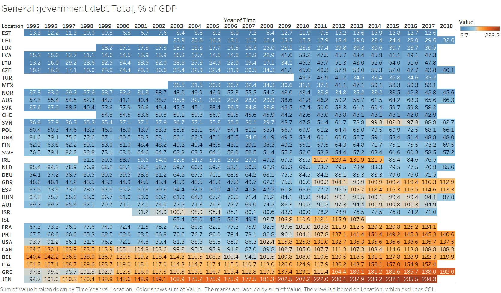

[Back](https://portfolio.jakobs.dev)

### The Organization for Economic Co-operation and Development (OECD) datasets visualizations

### Embedding the General government debt Total, % of GDP, 2015 graph:
datafile from: https://data.oecd.org/gga/general-government-debt.htm
<iframe src="https://data.oecd.org/chart/5Fwe" width="860" height="645" style="border: 0" mozallowfullscreen="true" webkitallowfullscreen="true" allowfullscreen="true"><a href="https://data.oecd.org/chart/5Fwe" target="_blank">OECD Chart: General government debt, Total, % of GDP, Annual, 2015</a></iframe>

### Improved barchart comparing 1995 debt to 2015 debt: 
I did not like the original barchart by OECD, so I decided to improve upon it. I manually edited the dataset to use the values of countries who's debt was on record in both 1995 and 2015, and used Datawrapper to visualize this. 
<iframe title="General government debt Total " aria-label="Bullet Bars" id="datawrapper-chart-JRKlv" src="//datawrapper.dwcdn.net/JRKlv/1/" scrolling="no" frameborder="0" style="width: 0; min-width: 100% !important; border: none;" height="773"></iframe>

### Beeswarm plot using the General government debt Total, % of GDP, 2015 dataset.

<svg width="900" height="1500" xmlns="http://www.w3.org/2000/svg" version="1.1"><g id="swarm-AUS" transform="translate(25,0)"><text x="-25" y="23" style="font-size: 10px; font-family: Arial, Helvetica;">AUS</text><g id="circles" class="bees"><circle id="circle" r="5.498028116313638" cx="1.9999999999999976" cy="6.140961713764019" fill="rgb(0, 0, 0)"></circle><circle id="circle" r="5.366192416101501" cx="38.08695652173907" cy="6.143045994622405" fill="rgb(0, 0, 0)"></circle><circle id="circle" r="5.308863772611355" cx="74.17391304347814" cy="6.136614749828615" fill="rgb(0, 0, 0)"></circle><circle id="circle" r="5.157018265233635" cx="110.26086956521725" cy="6.1452030218887055" fill="rgb(0, 0, 0)"></circle><circle id="circle" r="4.627994734571352" cx="146.34782608695627" cy="6.139886808297173" fill="rgb(0, 0, 0)"></circle><circle id="circle" r="4.380104364285437" cx="182.4347826086954" cy="6.137258520108821" fill="rgb(0, 0, 0)"></circle><circle id="circle" r="4.331325189761423" cx="218.5217391304345" cy="6.148260686855787" fill="rgb(0, 0, 0)"></circle><circle id="circle" r="4.2123617237230135" cx="254.60869565217362" cy="6.133716865869997" fill="rgb(0, 0, 0)"></circle><circle id="circle" r="3.9964280258534703" cx="290.6956521739126" cy="6.143955530078068" fill="rgb(0, 0, 0)"></circle><circle id="circle" r="3.7583995036111" cx="326.7826086956517" cy="6.144493684801953" fill="rgb(0, 0, 0)"></circle><circle id="circle" r="3.610179452073355" cx="362.8695652173908" cy="6.132124040763502" fill="rgb(0, 0, 0)"></circle><circle id="circle" r="3.5586711648707183" cx="398.95652173912987" cy="6.150726360836251" fill="rgb(0, 0, 0)"></circle><circle id="circle" r="3.474075582728986" cx="435.043478260869" cy="6.135602283232737" fill="rgb(0, 0, 0)"></circle><circle id="circle" r="3.60901634834124" cx="471.13043478260806" cy="6.138572911804568" fill="rgb(0, 0, 0)"></circle><circle id="circle" r="4.208696875778029" cx="507.21739130434725" cy="6.150406401260101" fill="rgb(0, 0, 0)"></circle><circle id="circle" r="4.431491019725238" cx="543.304347826086" cy="6.129110396427516" fill="rgb(0, 0, 0)"></circle><circle id="circle" r="4.73433130323039" cx="579.3913043478251" cy="6.1489156904359605" fill="rgb(0, 0, 0)"></circle><circle id="circle" r="5.627619848719371" cx="615.4782608695641" cy="6.141487366648546" fill="rgb(0, 0, 0)"></circle><circle id="circle" r="5.386868433604432" cx="651.5652173913033" cy="6.131727573121663" fill="rgb(0, 0, 0)"></circle><circle id="circle" r="5.790748084279219" cx="687.6521739130425" cy="6.154397098770466" fill="rgb(0, 0, 0)"></circle><circle id="circle" r="5.974281430233863" cx="723.7391304347815" cy="6.1303669566312236" fill="rgb(0, 0, 0)"></circle><circle id="circle" r="6.257667542580933" cx="759.8260869565207" cy="6.142196119216339" fill="rgb(0, 0, 0)"></circle><circle id="circle" r="6.073871582592893" cx="795.9130434782597" cy="6.149915539538019" fill="rgb(0, 0, 0)"></circle><circle id="circle" r="6.1247150416373035" cx="831.9999999999989" cy="6.126524603724518" fill="rgb(0, 0, 0)"></circle></g><g id="labels" class="label"><text x="1.9999999999999976" y="6.140961713764019" text-anchor="middle" fill="#000"></text><text x="38.08695652173907" y="6.143045994622405" text-anchor="middle" fill="#000"></text><text x="74.17391304347814" y="6.136614749828615" text-anchor="middle" fill="#000"></text><text x="110.26086956521725" y="6.1452030218887055" text-anchor="middle" fill="#000"></text><text x="146.34782608695627" y="6.139886808297173" text-anchor="middle" fill="#000"></text><text x="182.4347826086954" y="6.137258520108821" text-anchor="middle" fill="#000"></text><text x="218.5217391304345" y="6.148260686855787" text-anchor="middle" fill="#000"></text><text x="254.60869565217362" y="6.133716865869997" text-anchor="middle" fill="#000"></text><text x="290.6956521739126" y="6.143955530078068" text-anchor="middle" fill="#000"></text><text x="326.7826086956517" y="6.144493684801953" text-anchor="middle" fill="#000"></text><text x="362.8695652173908" y="6.132124040763502" text-anchor="middle" fill="#000"></text><text x="398.95652173912987" y="6.150726360836251" text-anchor="middle" fill="#000"></text><text x="435.043478260869" y="6.135602283232737" text-anchor="middle" fill="#000"></text><text x="471.13043478260806" y="6.138572911804568" text-anchor="middle" fill="#000"></text><text x="507.21739130434725" y="6.150406401260101" text-anchor="middle" fill="#000"></text><text x="543.304347826086" y="6.129110396427516" text-anchor="middle" fill="#000"></text><text x="579.3913043478251" y="6.1489156904359605" text-anchor="middle" fill="#000"></text><text x="615.4782608695641" y="6.141487366648546" text-anchor="middle" fill="#000"></text><text x="651.5652173913033" y="6.131727573121663" text-anchor="middle" fill="#000"></text><text x="687.6521739130425" y="6.154397098770466" text-anchor="middle" fill="#000"></text><text x="723.7391304347815" y="6.1303669566312236" text-anchor="middle" fill="#000"></text><text x="759.8260869565207" y="6.142196119216339" text-anchor="middle" fill="#000"></text><text x="795.9130434782597" y="6.149915539538019" text-anchor="middle" fill="#000"></text><text x="831.9999999999989" y="6.126524603724518" text-anchor="middle" fill="#000"></text></g></g><g id="swarm-AUT" transform="translate(25,42.285714285714285)"><text x="-25" y="23" style="font-size: 10px; font-family: Arial, Helvetica;">AUT</text><g id="circles" class="bees"><circle id="circle" r="6.320007967571556" cx="1.9999999999999976" cy="6.140961713764019" fill="rgb(0, 0, 0)"></circle><circle id="circle" r="6.357157486953535" cx="38.08695652173907" cy="6.143045994622405" fill="rgb(0, 0, 0)"></circle><circle id="circle" r="6.057253642995477" cx="74.17391304347814" cy="6.136614749828615" fill="rgb(0, 0, 0)"></circle><circle id="circle" r="6.177849462578306" cx="110.26086956521725" cy="6.1452030218887055" fill="rgb(0, 0, 0)"></circle><circle id="circle" r="6.427213926899043" cx="146.34782608695627" cy="6.139886808297173" fill="rgb(0, 0, 0)"></circle><circle id="circle" r="6.450835368113368" cx="182.4347826086954" cy="6.137258520108821" fill="rgb(0, 0, 0)"></circle><circle id="circle" r="6.523732186156912" cx="218.5217391304345" cy="6.148260686855787" fill="rgb(0, 0, 0)"></circle><circle id="circle" r="6.655897536089917" cx="254.60869565217362" cy="6.133716865869997" fill="rgb(0, 0, 0)"></circle><circle id="circle" r="6.552710262562936" cx="290.6956521739126" cy="6.143955530078068" fill="rgb(0, 0, 0)"></circle><circle id="circle" r="6.499828780401467" cx="326.7826086956517" cy="6.144493684801953" fill="rgb(0, 0, 0)"></circle><circle id="circle" r="6.809146646367178" cx="362.8695652173908" cy="6.132124040763502" fill="rgb(0, 0, 0)"></circle><circle id="circle" r="6.562741427549066" cx="398.95652173912987" cy="6.150726360836251" fill="rgb(0, 0, 0)"></circle><circle id="circle" r="6.305536552152363" cx="435.043478260869" cy="6.135602283232737" fill="rgb(0, 0, 0)"></circle><circle id="circle" r="6.666848541282492" cx="471.13043478260806" cy="6.138572911804568" fill="rgb(0, 0, 0)"></circle><circle id="circle" r="7.50566955406621" cx="507.21739130434725" cy="6.150406401260101" fill="rgb(0, 0, 0)"></circle><circle id="circle" r="7.79686221410073" cx="543.304347826086" cy="6.129110396427516" fill="rgb(0, 0, 0)"></circle><circle id="circle" r="7.861114883908205" cx="579.3913043478252" cy="6.150586642940722" fill="rgb(0, 0, 0)"></circle><circle id="circle" r="8.266360127556645" cx="615.4782608695641" cy="6.139967330655695" fill="rgb(0, 0, 0)"></circle><circle id="circle" r="8.060563331376153" cx="651.5652173913033" cy="6.131727573121663" fill="rgb(0, 0, 0)"></circle><circle id="circle" r="8.579537037634143" cx="687.6521739130425" cy="6.154397098770466" fill="rgb(0, 0, 0)"></circle><circle id="circle" r="8.505431503947419" cx="723.7391304347815" cy="6.1303669566312236" fill="rgb(0, 0, 0)"></circle><circle id="circle" r="8.542902379975528" cx="759.8260869565207" cy="6.138071279828833" fill="rgb(0, 0, 0)"></circle><circle id="circle" r="8.0987923326533" cx="795.9130434782597" cy="6.154509537695927" fill="rgb(0, 0, 0)"></circle></g><g id="labels" class="label"><text x="1.9999999999999976" y="6.140961713764019" text-anchor="middle" fill="#000"></text><text x="38.08695652173907" y="6.143045994622405" text-anchor="middle" fill="#000"></text><text x="74.17391304347814" y="6.136614749828615" text-anchor="middle" fill="#000"></text><text x="110.26086956521725" y="6.1452030218887055" text-anchor="middle" fill="#000"></text><text x="146.34782608695627" y="6.139886808297173" text-anchor="middle" fill="#000"></text><text x="182.4347826086954" y="6.137258520108821" text-anchor="middle" fill="#000"></text><text x="218.5217391304345" y="6.148260686855787" text-anchor="middle" fill="#000"></text><text x="254.60869565217362" y="6.133716865869997" text-anchor="middle" fill="#000"></text><text x="290.6956521739126" y="6.143955530078068" text-anchor="middle" fill="#000"></text><text x="326.7826086956517" y="6.144493684801953" text-anchor="middle" fill="#000"></text><text x="362.8695652173908" y="6.132124040763502" text-anchor="middle" fill="#000"></text><text x="398.95652173912987" y="6.150726360836251" text-anchor="middle" fill="#000"></text><text x="435.043478260869" y="6.135602283232737" text-anchor="middle" fill="#000"></text><text x="471.13043478260806" y="6.138572911804568" text-anchor="middle" fill="#000"></text><text x="507.21739130434725" y="6.150406401260101" text-anchor="middle" fill="#000"></text><text x="543.304347826086" y="6.129110396427516" text-anchor="middle" fill="#000"></text><text x="579.3913043478252" y="6.150586642940722" text-anchor="middle" fill="#000"></text><text x="615.4782608695641" y="6.139967330655695" text-anchor="middle" fill="#000"></text><text x="651.5652173913033" y="6.131727573121663" text-anchor="middle" fill="#000"></text><text x="687.6521739130425" y="6.154397098770466" text-anchor="middle" fill="#000"></text><text x="723.7391304347815" y="6.1303669566312236" text-anchor="middle" fill="#000"></text><text x="759.8260869565207" y="6.138071279828833" text-anchor="middle" fill="#000"></text><text x="795.9130434782597" y="6.154509537695927" text-anchor="middle" fill="#000"></text></g></g><g id="swarm-BEL" transform="translate(25,84.57142857142857)"><text x="-25" y="23" style="font-size: 10px; font-family: Arial, Helvetica;">BEL</text><g id="circles" class="bees"><circle id="circle" r="11.240342423993095" cx="1.9999999999999976" cy="6.140961713764019" fill="rgb(0, 0, 0)"></circle><circle id="circle" r="11.369818053352486" cx="38.08695652173907" cy="6.143045994622405" fill="rgb(0, 0, 0)"></circle><circle id="circle" r="10.995510125017109" cx="74.17391304347814" cy="6.136614749828615" fill="rgb(0, 0, 0)"></circle><circle id="circle" r="11.077708317469769" cx="110.26086956521725" cy="6.1452030218887055" fill="rgb(0, 0, 0)"></circle><circle id="circle" r="10.293639566290677" cx="146.34782608695627" cy="6.139886808297173" fill="rgb(0, 0, 0)"></circle><circle id="circle" r="9.869835803555944" cx="182.4347826086954" cy="6.137258520108821" fill="rgb(0, 0, 0)"></circle><circle id="circle" r="9.780056358612903" cx="218.5217391304345" cy="6.148260686855787" fill="rgb(0, 0, 0)"></circle><circle id="circle" r="9.723628895911041" cx="254.60869565217362" cy="6.133716865869997" fill="rgb(0, 0, 0)"></circle><circle id="circle" r="9.476481446903808" cx="290.6956521739126" cy="6.1437315960680055" fill="rgb(0, 0, 0)"></circle><circle id="circle" r="9.173936258641444" cx="326.7826086956517" cy="6.144731844577692" fill="rgb(0, 0, 0)"></circle><circle id="circle" r="9.024197883336939" cx="362.8695652173908" cy="6.132124040763502" fill="rgb(0, 0, 0)"></circle><circle id="circle" r="8.476198415493178" cx="398.95652173912987" cy="6.150726360836251" fill="rgb(0, 0, 0)"></circle><circle id="circle" r="8.045478919515851" cx="435.043478260869" cy="6.135602283232737" fill="rgb(0, 0, 0)"></circle><circle id="circle" r="8.55200402950135" cx="471.13043478260806" cy="6.138572911804568" fill="rgb(0, 0, 0)"></circle><circle id="circle" r="9.130618764922486" cx="507.21739130434725" cy="6.150406401260101" fill="rgb(0, 0, 0)"></circle><circle id="circle" r="9.001861868707124" cx="543.304347826086" cy="6.129110396427516" fill="rgb(0, 0, 0)"></circle><circle id="circle" r="9.18306555174973" cx="579.3913043478252" cy="6.153669169085367" fill="rgb(0, 0, 0)"></circle><circle id="circle" r="9.86535063230138" cx="615.4782608695641" cy="6.137339074867787" fill="rgb(0, 0, 0)"></circle><circle id="circle" r="9.727326225065418" cx="651.5652173913033" cy="6.131727573121663" fill="rgb(0, 0, 0)"></circle><circle id="circle" r="10.600462598939135" cx="687.6521739130425" cy="6.154397098770466" fill="rgb(0, 0, 0)"></circle><circle id="circle" r="10.373163242140077" cx="723.7391304347815" cy="6.1303669566312236" fill="rgb(0, 0, 0)"></circle><circle id="circle" r="10.45011606482045" cx="759.8260869565207" cy="6.134366996971116" fill="rgb(0, 0, 0)"></circle><circle id="circle" r="9.993430260746408" cx="795.9130434782597" cy="6.158461945274865" fill="rgb(0, 0, 0)"></circle><circle id="circle" r="9.826255695803592" cx="831.9999999999989" cy="6.126524603724518" fill="rgb(0, 0, 0)"></circle></g><g id="labels" class="label"><text x="1.9999999999999976" y="6.140961713764019" text-anchor="middle" fill="#000"></text><text x="38.08695652173907" y="6.143045994622405" text-anchor="middle" fill="#000"></text><text x="74.17391304347814" y="6.136614749828615" text-anchor="middle" fill="#000"></text><text x="110.26086956521725" y="6.1452030218887055" text-anchor="middle" fill="#000"></text><text x="146.34782608695627" y="6.139886808297173" text-anchor="middle" fill="#000"></text><text x="182.4347826086954" y="6.137258520108821" text-anchor="middle" fill="#000"></text><text x="218.5217391304345" y="6.148260686855787" text-anchor="middle" fill="#000"></text><text x="254.60869565217362" y="6.133716865869997" text-anchor="middle" fill="#000"></text><text x="290.6956521739126" y="6.1437315960680055" text-anchor="middle" fill="#000"></text><text x="326.7826086956517" y="6.144731844577692" text-anchor="middle" fill="#000"></text><text x="362.8695652173908" y="6.132124040763502" text-anchor="middle" fill="#000"></text><text x="398.95652173912987" y="6.150726360836251" text-anchor="middle" fill="#000"></text><text x="435.043478260869" y="6.135602283232737" text-anchor="middle" fill="#000"></text><text x="471.13043478260806" y="6.138572911804568" text-anchor="middle" fill="#000"></text><text x="507.21739130434725" y="6.150406401260101" text-anchor="middle" fill="#000"></text><text x="543.304347826086" y="6.129110396427516" text-anchor="middle" fill="#000"></text><text x="579.3913043478252" y="6.153669169085367" text-anchor="middle" fill="#000"></text><text x="615.4782608695641" y="6.137339074867787" text-anchor="middle" fill="#000"></text><text x="651.5652173913033" y="6.131727573121663" text-anchor="middle" fill="#000"></text><text x="687.6521739130425" y="6.154397098770466" text-anchor="middle" fill="#000"></text><text x="723.7391304347815" y="6.1303669566312236" text-anchor="middle" fill="#000"></text><text x="759.8260869565207" y="6.134366996971116" text-anchor="middle" fill="#000"></text><text x="795.9130434782597" y="6.158461945274865" text-anchor="middle" fill="#000"></text><text x="831.9999999999989" y="6.126524603724518" text-anchor="middle" fill="#000"></text></g></g><g id="swarm-CAN" transform="translate(25,126.85714285714286)"><text x="-25" y="23" style="font-size: 10px; font-family: Arial, Helvetica;">CAN</text><g id="circles" class="bees"><circle id="circle" r="10.10665837451338" cx="1.9999999999999976" cy="6.140961713764019" fill="rgb(0, 0, 0)"></circle><circle id="circle" r="10.527096531083288" cx="38.08695652173907" cy="6.143045994622405" fill="rgb(0, 0, 0)"></circle><circle id="circle" r="10.105331482555174" cx="74.17391304347814" cy="6.136614749828615" fill="rgb(0, 0, 0)"></circle><circle id="circle" r="10.072539282858868" cx="110.26086956521725" cy="6.1452030218887055" fill="rgb(0, 0, 0)"></circle><circle id="circle" r="9.40939047226698" cx="146.34782608695627" cy="6.139886808297173" fill="rgb(0, 0, 0)"></circle><circle id="circle" r="8.800844647934422" cx="182.4347826086954" cy="6.137258520108821" fill="rgb(0, 0, 0)"></circle><circle id="circle" r="8.780478238555071" cx="218.5217391304345" cy="6.148260686855787" fill="rgb(0, 0, 0)"></circle><circle id="circle" r="8.69747147131538" cx="254.60869565217362" cy="6.133716865869997" fill="rgb(0, 0, 0)"></circle><circle id="circle" r="8.397934595914512" cx="290.6956521739126" cy="6.143876109612328" fill="rgb(0, 0, 0)"></circle><circle id="circle" r="8.127114565065398" cx="326.7826086956517" cy="6.144578169823098" fill="rgb(0, 0, 0)"></circle><circle id="circle" r="8.026999875729139" cx="362.8695652173908" cy="6.132124040763502" fill="rgb(0, 0, 0)"></circle><circle id="circle" r="7.838774722741023" cx="398.95652173912987" cy="6.150726360836251" fill="rgb(0, 0, 0)"></circle><circle id="circle" r="7.548736182274319" cx="435.043478260869" cy="6.135602283232737" fill="rgb(0, 0, 0)"></circle><circle id="circle" r="7.74231244173764" cx="471.13043478260806" cy="6.138572911804568" fill="rgb(0, 0, 0)"></circle><circle id="circle" r="8.637706046031152" cx="507.21739130434725" cy="6.150406401260101" fill="rgb(0, 0, 0)"></circle><circle id="circle" r="8.797112764301964" cx="543.304347826086" cy="6.129110396427516" fill="rgb(0, 0, 0)"></circle><circle id="circle" r="8.979712448258933" cx="579.3913043478252" cy="6.152643438739225" fill="rgb(0, 0, 0)"></circle><circle id="circle" r="9.231794276735748" cx="615.4782608695641" cy="6.137950236257856" fill="rgb(0, 0, 0)"></circle><circle id="circle" r="8.953748213430899" cx="651.5652173913033" cy="6.131727573121663" fill="rgb(0, 0, 0)"></circle><circle id="circle" r="9.027535845919301" cx="687.6521739130425" cy="6.154397098770466" fill="rgb(0, 0, 0)"></circle><circle id="circle" r="9.461726684764372" cx="723.7391304347815" cy="6.1303669566312236" fill="rgb(0, 0, 0)"></circle><circle id="circle" r="9.406536272377712" cx="759.8260869565207" cy="6.136220132460916" fill="rgb(0, 0, 0)"></circle><circle id="circle" r="9.061585828617659" cx="795.9130434782597" cy="6.156341402022219" fill="rgb(0, 0, 0)"></circle><circle id="circle" r="9.021094891205507" cx="831.9999999999989" cy="6.126524603724518" fill="rgb(0, 0, 0)"></circle></g><g id="labels" class="label"><text x="1.9999999999999976" y="6.140961713764019" text-anchor="middle" fill="#000"></text><text x="38.08695652173907" y="6.143045994622405" text-anchor="middle" fill="#000"></text><text x="74.17391304347814" y="6.136614749828615" text-anchor="middle" fill="#000"></text><text x="110.26086956521725" y="6.1452030218887055" text-anchor="middle" fill="#000"></text><text x="146.34782608695627" y="6.139886808297173" text-anchor="middle" fill="#000"></text><text x="182.4347826086954" y="6.137258520108821" text-anchor="middle" fill="#000"></text><text x="218.5217391304345" y="6.148260686855787" text-anchor="middle" fill="#000"></text><text x="254.60869565217362" y="6.133716865869997" text-anchor="middle" fill="#000"></text><text x="290.6956521739126" y="6.143876109612328" text-anchor="middle" fill="#000"></text><text x="326.7826086956517" y="6.144578169823098" text-anchor="middle" fill="#000"></text><text x="362.8695652173908" y="6.132124040763502" text-anchor="middle" fill="#000"></text><text x="398.95652173912987" y="6.150726360836251" text-anchor="middle" fill="#000"></text><text x="435.043478260869" y="6.135602283232737" text-anchor="middle" fill="#000"></text><text x="471.13043478260806" y="6.138572911804568" text-anchor="middle" fill="#000"></text><text x="507.21739130434725" y="6.150406401260101" text-anchor="middle" fill="#000"></text><text x="543.304347826086" y="6.129110396427516" text-anchor="middle" fill="#000"></text><text x="579.3913043478252" y="6.152643438739225" text-anchor="middle" fill="#000"></text><text x="615.4782608695641" y="6.137950236257856" text-anchor="middle" fill="#000"></text><text x="651.5652173913033" y="6.131727573121663" text-anchor="middle" fill="#000"></text><text x="687.6521739130425" y="6.154397098770466" text-anchor="middle" fill="#000"></text><text x="723.7391304347815" y="6.1303669566312236" text-anchor="middle" fill="#000"></text><text x="759.8260869565207" y="6.136220132460916" text-anchor="middle" fill="#000"></text><text x="795.9130434782597" y="6.156341402022219" text-anchor="middle" fill="#000"></text><text x="831.9999999999989" y="6.126524603724518" text-anchor="middle" fill="#000"></text></g></g><g id="swarm-CHE" transform="translate(25,169.14285714285714)"><text x="-25" y="23" style="font-size: 10px; font-family: Arial, Helvetica;">CHE</text><g id="circles" class="bees"><circle id="circle" r="5.326783033853199" cx="146.34782608695627" cy="6.140961713764019" fill="rgb(0, 0, 0)"></circle><circle id="circle" r="5.307949461121403" cx="182.43478260869537" cy="6.143045994622405" fill="rgb(0, 0, 0)"></circle><circle id="circle" r="5.246026454225966" cx="218.5217391304345" cy="6.136614749828615" fill="rgb(0, 0, 0)"></circle><circle id="circle" r="5.674453606127576" cx="254.60869565217365" cy="6.1452030218887055" fill="rgb(0, 0, 0)"></circle><circle id="circle" r="5.621245929693048" cx="290.69565217391255" cy="6.139886808297173" fill="rgb(0, 0, 0)"></circle><circle id="circle" r="5.670849574064009" cx="326.7826086956517" cy="6.137258520108821" fill="rgb(0, 0, 0)"></circle><circle id="circle" r="5.473662371641506" cx="362.8695652173908" cy="6.148260686855787" fill="rgb(0, 0, 0)"></circle><circle id="circle" r="5.031857799096661" cx="398.95652173912987" cy="6.133716865869997" fill="rgb(0, 0, 0)"></circle><circle id="circle" r="4.691588104937095" cx="435.043478260869" cy="6.143955530078068" fill="rgb(0, 0, 0)"></circle><circle id="circle" r="4.71439682482702" cx="471.13043478260806" cy="6.144493684801953" fill="rgb(0, 0, 0)"></circle><circle id="circle" r="4.594557057224543" cx="507.2173913043473" cy="6.132124040763502" fill="rgb(0, 0, 0)"></circle><circle id="circle" r="4.485890134563906" cx="543.3043478260861" cy="6.150726360836251" fill="rgb(0, 0, 0)"></circle><circle id="circle" r="4.5127147758960895" cx="579.3913043478251" cy="6.135602283232737" fill="rgb(0, 0, 0)"></circle><circle id="circle" r="4.566949411419105" cx="615.4782608695641" cy="6.138572911804568" fill="rgb(0, 0, 0)"></circle><circle id="circle" r="4.516453570424162" cx="651.5652173913033" cy="6.150406401260101" fill="rgb(0, 0, 0)"></circle><circle id="circle" r="4.520604945420489" cx="687.6521739130425" cy="6.129110396427516" fill="rgb(0, 0, 0)"></circle><circle id="circle" r="4.5213001815194245" cx="723.7391304347816" cy="6.1489156904359605" fill="rgb(0, 0, 0)"></circle><circle id="circle" r="4.4414537668447736" cx="759.8260869565206" cy="6.141487366648546" fill="rgb(0, 0, 0)"></circle><circle id="circle" r="4.502085127349643" cx="795.9130434782597" cy="6.131727573121663" fill="rgb(0, 0, 0)"></circle></g><g id="labels" class="label"><text x="146.34782608695627" y="6.140961713764019" text-anchor="middle" fill="#000"></text><text x="182.43478260869537" y="6.143045994622405" text-anchor="middle" fill="#000"></text><text x="218.5217391304345" y="6.136614749828615" text-anchor="middle" fill="#000"></text><text x="254.60869565217365" y="6.1452030218887055" text-anchor="middle" fill="#000"></text><text x="290.69565217391255" y="6.139886808297173" text-anchor="middle" fill="#000"></text><text x="326.7826086956517" y="6.137258520108821" text-anchor="middle" fill="#000"></text><text x="362.8695652173908" y="6.148260686855787" text-anchor="middle" fill="#000"></text><text x="398.95652173912987" y="6.133716865869997" text-anchor="middle" fill="#000"></text><text x="435.043478260869" y="6.143955530078068" text-anchor="middle" fill="#000"></text><text x="471.13043478260806" y="6.144493684801953" text-anchor="middle" fill="#000"></text><text x="507.2173913043473" y="6.132124040763502" text-anchor="middle" fill="#000"></text><text x="543.3043478260861" y="6.150726360836251" text-anchor="middle" fill="#000"></text><text x="579.3913043478251" y="6.135602283232737" text-anchor="middle" fill="#000"></text><text x="615.4782608695641" y="6.138572911804568" text-anchor="middle" fill="#000"></text><text x="651.5652173913033" y="6.150406401260101" text-anchor="middle" fill="#000"></text><text x="687.6521739130425" y="6.129110396427516" text-anchor="middle" fill="#000"></text><text x="723.7391304347816" y="6.1489156904359605" text-anchor="middle" fill="#000"></text><text x="759.8260869565206" y="6.141487366648546" text-anchor="middle" fill="#000"></text><text x="795.9130434782597" y="6.131727573121663" text-anchor="middle" fill="#000"></text></g></g><g id="swarm-CHL" transform="translate(25,211.42857142857142)"><text x="-25" y="23" style="font-size: 10px; font-family: Arial, Helvetica;">CHL</text><g id="circles" class="bees"><circle id="circle" r="3.1914752392134167" cx="290.69565217391255" cy="6.140961713764019" fill="rgb(0, 0, 0)"></circle><circle id="circle" r="2.961926385891462" cx="326.7826086956517" cy="6.143045994622405" fill="rgb(0, 0, 0)"></circle><circle id="circle" r="2.6657288552520817" cx="362.8695652173908" cy="6.136614749828615" fill="rgb(0, 0, 0)"></circle><circle id="circle" r="2.4481337780765338" cx="398.95652173912987" cy="6.1452030218887055" fill="rgb(0, 0, 0)"></circle><circle id="circle" r="2.3177763184365854" cx="435.043478260869" cy="6.139886808297173" fill="rgb(0, 0, 0)"></circle><circle id="circle" r="2.398398826688875" cx="471.13043478260806" cy="6.137258520108821" fill="rgb(0, 0, 0)"></circle><circle id="circle" r="2.459342559675573" cx="507.21739130434725" cy="6.148260686855787" fill="rgb(0, 0, 0)"></circle><circle id="circle" r="2.5947726166974157" cx="543.304347826086" cy="6.133716865869997" fill="rgb(0, 0, 0)"></circle><circle id="circle" r="2.773352232674755" cx="579.3913043478251" cy="6.143955530078068" fill="rgb(0, 0, 0)"></circle><circle id="circle" r="2.8087664261676433" cx="615.4782608695641" cy="6.144493684801953" fill="rgb(0, 0, 0)"></circle><circle id="circle" r="2.8517549612552946" cx="651.5652173913033" cy="6.132124040763502" fill="rgb(0, 0, 0)"></circle><circle id="circle" r="3.0867551290388824" cx="687.6521739130425" cy="6.150726360836251" fill="rgb(0, 0, 0)"></circle><circle id="circle" r="3.226873537646389" cx="723.7391304347815" cy="6.135602283232737" fill="rgb(0, 0, 0)"></circle><circle id="circle" r="3.476891772692367" cx="759.8260869565207" cy="6.138572911804568" fill="rgb(0, 0, 0)"></circle><circle id="circle" r="3.5832193571871045" cx="795.9130434782597" cy="6.150406401260101" fill="rgb(0, 0, 0)"></circle><circle id="circle" r="3.788959484023549" cx="831.9999999999989" cy="6.129110396427516" fill="rgb(0, 0, 0)"></circle></g><g id="labels" class="label"><text x="290.69565217391255" y="6.140961713764019" text-anchor="middle" fill="#000"></text><text x="326.7826086956517" y="6.143045994622405" text-anchor="middle" fill="#000"></text><text x="362.8695652173908" y="6.136614749828615" text-anchor="middle" fill="#000"></text><text x="398.95652173912987" y="6.1452030218887055" text-anchor="middle" fill="#000"></text><text x="435.043478260869" y="6.139886808297173" text-anchor="middle" fill="#000"></text><text x="471.13043478260806" y="6.137258520108821" text-anchor="middle" fill="#000"></text><text x="507.21739130434725" y="6.148260686855787" text-anchor="middle" fill="#000"></text><text x="543.304347826086" y="6.133716865869997" text-anchor="middle" fill="#000"></text><text x="579.3913043478251" y="6.143955530078068" text-anchor="middle" fill="#000"></text><text x="615.4782608695641" y="6.144493684801953" text-anchor="middle" fill="#000"></text><text x="651.5652173913033" y="6.132124040763502" text-anchor="middle" fill="#000"></text><text x="687.6521739130425" y="6.150726360836251" text-anchor="middle" fill="#000"></text><text x="723.7391304347815" y="6.135602283232737" text-anchor="middle" fill="#000"></text><text x="759.8260869565207" y="6.138572911804568" text-anchor="middle" fill="#000"></text><text x="795.9130434782597" y="6.150406401260101" text-anchor="middle" fill="#000"></text><text x="831.9999999999989" y="6.129110396427516" text-anchor="middle" fill="#000"></text></g></g><g id="swarm-COL" transform="translate(25,253.71428571428572)"><text x="-25" y="23" style="font-size: 10px; font-family: Arial, Helvetica;">COL</text><g id="circles" class="bees"><circle id="circle" r="6.277313145547569" cx="723.7391304347816" cy="6.140961713764019" fill="rgb(0, 0, 0)"></circle><circle id="circle" r="6.589652455076447" cx="759.8260869565206" cy="6.143045994622405" fill="rgb(0, 0, 0)"></circle></g><g id="labels" class="label"><text x="723.7391304347816" y="6.140961713764019" text-anchor="middle" fill="#000"></text><text x="759.8260869565206" y="6.143045994622405" text-anchor="middle" fill="#000"></text></g></g><g id="swarm-CZE" transform="translate(25,296)"><text x="-25" y="23" style="font-size: 10px; font-family: Arial, Helvetica;">CZE</text><g id="circles" class="bees"><circle id="circle" r="2.7947656427398777" cx="1.9999999999999976" cy="6.140961713764019" fill="rgb(0, 0, 0)"></circle><circle id="circle" r="2.697268800662831" cx="38.08695652173907" cy="6.143045994622405" fill="rgb(0, 0, 0)"></circle><circle id="circle" r="2.723307673163515" cx="74.17391304347814" cy="6.136614749828615" fill="rgb(0, 0, 0)"></circle><circle id="circle" r="2.782370951453191" cx="110.26086956521725" cy="6.1452030218887055" fill="rgb(0, 0, 0)"></circle><circle id="circle" r="3.185848388003146" cx="146.34782608695627" cy="6.139886808297173" fill="rgb(0, 0, 0)"></circle><circle id="circle" r="3.224766405573174" cx="182.4347826086954" cy="6.137258520108821" fill="rgb(0, 0, 0)"></circle><circle id="circle" r="3.496569165778836" cx="218.5217391304345" cy="6.148260686855787" fill="rgb(0, 0, 0)"></circle><circle id="circle" r="3.653477595284589" cx="254.60869565217362" cy="6.133716865869997" fill="rgb(0, 0, 0)"></circle><circle id="circle" r="3.847049017120979" cx="290.6956521739126" cy="6.143955530078068" fill="rgb(0, 0, 0)"></circle><circle id="circle" r="3.8099748265012097" cx="326.7826086956517" cy="6.144493684801953" fill="rgb(0, 0, 0)"></circle><circle id="circle" r="3.7781010848322243" cx="362.8695652173908" cy="6.132124040763502" fill="rgb(0, 0, 0)"></circle><circle id="circle" r="3.7468486326790864" cx="398.95652173912987" cy="6.150726360836251" fill="rgb(0, 0, 0)"></circle><circle id="circle" r="3.6500477177905366" cx="435.043478260869" cy="6.135602283232737" fill="rgb(0, 0, 0)"></circle><circle id="circle" r="3.910486892335369" cx="471.13043478260806" cy="6.138572911804568" fill="rgb(0, 0, 0)"></circle><circle id="circle" r="4.378316515589665" cx="507.21739130434725" cy="6.150406401260101" fill="rgb(0, 0, 0)"></circle><circle id="circle" r="4.689302671756996" cx="543.304347826086" cy="6.129110396427516" fill="rgb(0, 0, 0)"></circle><circle id="circle" r="4.880693706026646" cx="579.3913043478251" cy="6.1489156904359605" fill="rgb(0, 0, 0)"></circle><circle id="circle" r="5.539419543424511" cx="615.4782608695641" cy="6.141487366648546" fill="rgb(0, 0, 0)"></circle><circle id="circle" r="5.544994562917664" cx="651.5652173913033" cy="6.131727573121663" fill="rgb(0, 0, 0)"></circle><circle id="circle" r="5.357743155121794" cx="687.6521739130425" cy="6.154397098770466" fill="rgb(0, 0, 0)"></circle><circle id="circle" r="5.134029170968141" cx="723.7391304347815" cy="6.1303669566312236" fill="rgb(0, 0, 0)"></circle><circle id="circle" r="4.835184076218402" cx="759.8260869565207" cy="6.142847228729639" fill="rgb(0, 0, 0)"></circle><circle id="circle" r="4.567629443547686" cx="795.9130434782597" cy="6.14922751290065" fill="rgb(0, 0, 0)"></circle><circle id="circle" r="4.310358914642634" cx="831.9999999999989" cy="6.126524603724518" fill="rgb(0, 0, 0)"></circle></g><g id="labels" class="label"><text x="1.9999999999999976" y="6.140961713764019" text-anchor="middle" fill="#000"></text><text x="38.08695652173907" y="6.143045994622405" text-anchor="middle" fill="#000"></text><text x="74.17391304347814" y="6.136614749828615" text-anchor="middle" fill="#000"></text><text x="110.26086956521725" y="6.1452030218887055" text-anchor="middle" fill="#000"></text><text x="146.34782608695627" y="6.139886808297173" text-anchor="middle" fill="#000"></text><text x="182.4347826086954" y="6.137258520108821" text-anchor="middle" fill="#000"></text><text x="218.5217391304345" y="6.148260686855787" text-anchor="middle" fill="#000"></text><text x="254.60869565217362" y="6.133716865869997" text-anchor="middle" fill="#000"></text><text x="290.6956521739126" y="6.143955530078068" text-anchor="middle" fill="#000"></text><text x="326.7826086956517" y="6.144493684801953" text-anchor="middle" fill="#000"></text><text x="362.8695652173908" y="6.132124040763502" text-anchor="middle" fill="#000"></text><text x="398.95652173912987" y="6.150726360836251" text-anchor="middle" fill="#000"></text><text x="435.043478260869" y="6.135602283232737" text-anchor="middle" fill="#000"></text><text x="471.13043478260806" y="6.138572911804568" text-anchor="middle" fill="#000"></text><text x="507.21739130434725" y="6.150406401260101" text-anchor="middle" fill="#000"></text><text x="543.304347826086" y="6.129110396427516" text-anchor="middle" fill="#000"></text><text x="579.3913043478251" y="6.1489156904359605" text-anchor="middle" fill="#000"></text><text x="615.4782608695641" y="6.141487366648546" text-anchor="middle" fill="#000"></text><text x="651.5652173913033" y="6.131727573121663" text-anchor="middle" fill="#000"></text><text x="687.6521739130425" y="6.154397098770466" text-anchor="middle" fill="#000"></text><text x="723.7391304347815" y="6.1303669566312236" text-anchor="middle" fill="#000"></text><text x="759.8260869565207" y="6.142847228729639" text-anchor="middle" fill="#000"></text><text x="795.9130434782597" y="6.14922751290065" text-anchor="middle" fill="#000"></text><text x="831.9999999999989" y="6.126524603724518" text-anchor="middle" fill="#000"></text></g></g><g id="swarm-DEU" transform="translate(25,338.2857142857143)"><text x="-25" y="23" style="font-size: 10px; font-family: Arial, Helvetica;">DEU</text><g id="circles" class="bees"><circle id="circle" r="5.279891224921823" cx="1.9999999999999976" cy="6.140961713764019" fill="rgb(0, 0, 0)"></circle><circle id="circle" r="5.492405411640737" cx="38.08695652173907" cy="6.143045994622405" fill="rgb(0, 0, 0)"></circle><circle id="circle" r="5.593460673870288" cx="74.17391304347814" cy="6.136614749828615" fill="rgb(0, 0, 0)"></circle><circle id="circle" r="5.72391695931754" cx="110.26086956521725" cy="6.1452030218887055" fill="rgb(0, 0, 0)"></circle><circle id="circle" r="5.717925903908324" cx="146.34782608695627" cy="6.139886808297173" fill="rgb(0, 0, 0)"></circle><circle id="circle" r="5.652766524596074" cx="182.4347826086954" cy="6.137258520108821" fill="rgb(0, 0, 0)"></circle><circle id="circle" r="5.600105500004744" cx="218.5217391304345" cy="6.148260686855787" fill="rgb(0, 0, 0)"></circle><circle id="circle" r="5.7692482880189" cx="254.60869565217362" cy="6.133716865869997" fill="rgb(0, 0, 0)"></circle><circle id="circle" r="6.002816518230923" cx="290.6956521739126" cy="6.143955530078068" fill="rgb(0, 0, 0)"></circle><circle id="circle" r="6.206398372366597" cx="326.7826086956517" cy="6.144493684801953" fill="rgb(0, 0, 0)"></circle><circle id="circle" r="6.381465871192058" cx="362.8695652173908" cy="6.132124040763502" fill="rgb(0, 0, 0)"></circle><circle id="circle" r="6.256625379522091" cx="398.95652173912987" cy="6.150726360836251" fill="rgb(0, 0, 0)"></circle><circle id="circle" r="5.975101753543441" cx="435.043478260869" cy="6.135602283232737" fill="rgb(0, 0, 0)"></circle><circle id="circle" r="6.244617698389882" cx="471.13043478260806" cy="6.138572911804568" fill="rgb(0, 0, 0)"></circle><circle id="circle" r="6.755216090251252" cx="507.21739130434725" cy="6.150406401260101" fill="rgb(0, 0, 0)"></circle><circle id="circle" r="7.375717763998901" cx="543.304347826086" cy="6.129110396427516" fill="rgb(0, 0, 0)"></circle><circle id="circle" r="7.357212458808849" cx="579.3913043478252" cy="6.1494133577884185" fill="rgb(0, 0, 0)"></circle><circle id="circle" r="7.628355228483215" cx="615.4782608695641" cy="6.141022347545022" fill="rgb(0, 0, 0)"></circle><circle id="circle" r="7.294307413646425" cx="651.5652173913033" cy="6.131727573121663" fill="rgb(0, 0, 0)"></circle><circle id="circle" r="7.299377246670074" cx="687.6521739130425" cy="6.154397098770466" fill="rgb(0, 0, 0)"></circle><circle id="circle" r="6.996591559240286" cx="723.7391304347815" cy="6.1303669566312236" fill="rgb(0, 0, 0)"></circle><circle id="circle" r="6.792694568264538" cx="759.8260869565207" cy="6.141293253772728" fill="rgb(0, 0, 0)"></circle><circle id="circle" r="6.482298602582785" cx="795.9130434782597" cy="6.1509227218243705" fill="rgb(0, 0, 0)"></circle></g><g id="labels" class="label"><text x="1.9999999999999976" y="6.140961713764019" text-anchor="middle" fill="#000"></text><text x="38.08695652173907" y="6.143045994622405" text-anchor="middle" fill="#000"></text><text x="74.17391304347814" y="6.136614749828615" text-anchor="middle" fill="#000"></text><text x="110.26086956521725" y="6.1452030218887055" text-anchor="middle" fill="#000"></text><text x="146.34782608695627" y="6.139886808297173" text-anchor="middle" fill="#000"></text><text x="182.4347826086954" y="6.137258520108821" text-anchor="middle" fill="#000"></text><text x="218.5217391304345" y="6.148260686855787" text-anchor="middle" fill="#000"></text><text x="254.60869565217362" y="6.133716865869997" text-anchor="middle" fill="#000"></text><text x="290.6956521739126" y="6.143955530078068" text-anchor="middle" fill="#000"></text><text x="326.7826086956517" y="6.144493684801953" text-anchor="middle" fill="#000"></text><text x="362.8695652173908" y="6.132124040763502" text-anchor="middle" fill="#000"></text><text x="398.95652173912987" y="6.150726360836251" text-anchor="middle" fill="#000"></text><text x="435.043478260869" y="6.135602283232737" text-anchor="middle" fill="#000"></text><text x="471.13043478260806" y="6.138572911804568" text-anchor="middle" fill="#000"></text><text x="507.21739130434725" y="6.150406401260101" text-anchor="middle" fill="#000"></text><text x="543.304347826086" y="6.129110396427516" text-anchor="middle" fill="#000"></text><text x="579.3913043478252" y="6.1494133577884185" text-anchor="middle" fill="#000"></text><text x="615.4782608695641" y="6.141022347545022" text-anchor="middle" fill="#000"></text><text x="651.5652173913033" y="6.131727573121663" text-anchor="middle" fill="#000"></text><text x="687.6521739130425" y="6.154397098770466" text-anchor="middle" fill="#000"></text><text x="723.7391304347815" y="6.1303669566312236" text-anchor="middle" fill="#000"></text><text x="759.8260869565207" y="6.141293253772728" text-anchor="middle" fill="#000"></text><text x="795.9130434782597" y="6.1509227218243705" text-anchor="middle" fill="#000"></text></g></g><g id="swarm-DNK" transform="translate(25,380.57142857142856)"><text x="-25" y="23" style="font-size: 10px; font-family: Arial, Helvetica;">DNK</text><g id="circles" class="bees"><circle id="circle" r="7.175725429046" cx="1.9999999999999976" cy="6.140961713764019" fill="rgb(0, 0, 0)"></circle><circle id="circle" r="7.007925428049968" cx="38.08695652173907" cy="6.143045994622405" fill="rgb(0, 0, 0)"></circle><circle id="circle" r="6.722786712574767" cx="74.17391304347814" cy="6.136614749828615" fill="rgb(0, 0, 0)"></circle><circle id="circle" r="6.554959067996272" cx="110.26086956521725" cy="6.1452030218887055" fill="rgb(0, 0, 0)"></circle><circle id="circle" r="6.1763643111104995" cx="146.34782608695627" cy="6.139886808297173" fill="rgb(0, 0, 0)"></circle><circle id="circle" r="5.717498810559277" cx="182.4347826086954" cy="6.137258520108821" fill="rgb(0, 0, 0)"></circle><circle id="circle" r="5.566929745601769" cx="218.5217391304345" cy="6.148260686855787" fill="rgb(0, 0, 0)"></circle><circle id="circle" r="5.557974607062997" cx="254.60869565217362" cy="6.133716865869997" fill="rgb(0, 0, 0)"></circle><circle id="circle" r="5.41434339021405" cx="290.6956521739126" cy="6.143955530078068" fill="rgb(0, 0, 0)"></circle><circle id="circle" r="5.156341688552861" cx="326.7826086956517" cy="6.144493684801953" fill="rgb(0, 0, 0)"></circle><circle id="circle" r="4.657619670807003" cx="362.8695652173908" cy="6.132124040763502" fill="rgb(0, 0, 0)"></circle><circle id="circle" r="4.337869116819892" cx="398.95652173912987" cy="6.150726360836251" fill="rgb(0, 0, 0)"></circle><circle id="circle" r="3.930206441885093" cx="435.043478260869" cy="6.135602283232737" fill="rgb(0, 0, 0)"></circle><circle id="circle" r="4.437886362527969" cx="471.13043478260806" cy="6.138572911804568" fill="rgb(0, 0, 0)"></circle><circle id="circle" r="4.944285003123703" cx="507.21739130434725" cy="6.150406401260101" fill="rgb(0, 0, 0)"></circle><circle id="circle" r="5.232734037598805" cx="543.304347826086" cy="6.129110396427516" fill="rgb(0, 0, 0)"></circle><circle id="circle" r="5.693684555357274" cx="579.3913043478251" cy="6.1489156904359605" fill="rgb(0, 0, 0)"></circle><circle id="circle" r="5.728514778170639" cx="615.4782608695641" cy="6.141487366648546" fill="rgb(0, 0, 0)"></circle><circle id="circle" r="5.460165392504122" cx="651.5652173913033" cy="6.131727573121663" fill="rgb(0, 0, 0)"></circle><circle id="circle" r="5.626699317423366" cx="687.6521739130425" cy="6.154397098770466" fill="rgb(0, 0, 0)"></circle><circle id="circle" r="5.231839076616577" cx="723.7391304347815" cy="6.1303669566312236" fill="rgb(0, 0, 0)"></circle><circle id="circle" r="5.092275612927008" cx="759.8260869565207" cy="6.142847228729639" fill="rgb(0, 0, 0)"></circle><circle id="circle" r="4.910638616729301" cx="795.9130434782597" cy="6.14922751290065" fill="rgb(0, 0, 0)"></circle><circle id="circle" r="4.857571922565333" cx="831.9999999999989" cy="6.126524603724518" fill="rgb(0, 0, 0)"></circle></g><g id="labels" class="label"><text x="1.9999999999999976" y="6.140961713764019" text-anchor="middle" fill="#000"></text><text x="38.08695652173907" y="6.143045994622405" text-anchor="middle" fill="#000"></text><text x="74.17391304347814" y="6.136614749828615" text-anchor="middle" fill="#000"></text><text x="110.26086956521725" y="6.1452030218887055" text-anchor="middle" fill="#000"></text><text x="146.34782608695627" y="6.139886808297173" text-anchor="middle" fill="#000"></text><text x="182.4347826086954" y="6.137258520108821" text-anchor="middle" fill="#000"></text><text x="218.5217391304345" y="6.148260686855787" text-anchor="middle" fill="#000"></text><text x="254.60869565217362" y="6.133716865869997" text-anchor="middle" fill="#000"></text><text x="290.6956521739126" y="6.143955530078068" text-anchor="middle" fill="#000"></text><text x="326.7826086956517" y="6.144493684801953" text-anchor="middle" fill="#000"></text><text x="362.8695652173908" y="6.132124040763502" text-anchor="middle" fill="#000"></text><text x="398.95652173912987" y="6.150726360836251" text-anchor="middle" fill="#000"></text><text x="435.043478260869" y="6.135602283232737" text-anchor="middle" fill="#000"></text><text x="471.13043478260806" y="6.138572911804568" text-anchor="middle" fill="#000"></text><text x="507.21739130434725" y="6.150406401260101" text-anchor="middle" fill="#000"></text><text x="543.304347826086" y="6.129110396427516" text-anchor="middle" fill="#000"></text><text x="579.3913043478251" y="6.1489156904359605" text-anchor="middle" fill="#000"></text><text x="615.4782608695641" y="6.141487366648546" text-anchor="middle" fill="#000"></text><text x="651.5652173913033" y="6.131727573121663" text-anchor="middle" fill="#000"></text><text x="687.6521739130425" y="6.154397098770466" text-anchor="middle" fill="#000"></text><text x="723.7391304347815" y="6.1303669566312236" text-anchor="middle" fill="#000"></text><text x="759.8260869565207" y="6.142847228729639" text-anchor="middle" fill="#000"></text><text x="795.9130434782597" y="6.14922751290065" text-anchor="middle" fill="#000"></text><text x="831.9999999999989" y="6.126524603724518" text-anchor="middle" fill="#000"></text></g></g><g id="swarm-ESP" transform="translate(25,422.85714285714283)"><text x="-25" y="23" style="font-size: 10px; font-family: Arial, Helvetica;">ESP</text><g id="circles" class="bees"><circle id="circle" r="6.2062960911114855" cx="1.9999999999999976" cy="6.140961713764019" fill="rgb(0, 0, 0)"></circle><circle id="circle" r="6.6435968329836035" cx="38.08695652173907" cy="6.143045994622405" fill="rgb(0, 0, 0)"></circle><circle id="circle" r="6.587541176465862" cx="74.17391304347814" cy="6.136614749828615" fill="rgb(0, 0, 0)"></circle><circle id="circle" r="6.61677702927835" cx="110.26086956521725" cy="6.1452030218887055" fill="rgb(0, 0, 0)"></circle><circle id="circle" r="6.235280387323564" cx="146.34782608695627" cy="6.139886808297173" fill="rgb(0, 0, 0)"></circle><circle id="circle" r="6.042971586116154" cx="182.4347826086954" cy="6.137258520108821" fill="rgb(0, 0, 0)"></circle><circle id="circle" r="5.725292227545056" cx="218.5217391304345" cy="6.148260686855787" fill="rgb(0, 0, 0)"></circle><circle id="circle" r="5.634360736302886" cx="254.60869565217362" cy="6.133716865869997" fill="rgb(0, 0, 0)"></circle><circle id="circle" r="5.300299790764429" cx="290.6956521739126" cy="6.143955530078068" fill="rgb(0, 0, 0)"></circle><circle id="circle" r="5.168601617375042" cx="326.7826086956517" cy="6.144493684801953" fill="rgb(0, 0, 0)"></circle><circle id="circle" r="4.993574201744152" cx="362.8695652173908" cy="6.132124040763502" fill="rgb(0, 0, 0)"></circle><circle id="circle" r="4.696507280436322" cx="398.95652173912987" cy="6.150726360836251" fill="rgb(0, 0, 0)"></circle><circle id="circle" r="4.42870731097125" cx="435.043478260869" cy="6.135602283232737" fill="rgb(0, 0, 0)"></circle><circle id="circle" r="4.80189982075426" cx="471.13043478260806" cy="6.138572911804568" fill="rgb(0, 0, 0)"></circle><circle id="circle" r="5.810984568820994" cx="507.21739130434725" cy="6.150406401260101" fill="rgb(0, 0, 0)"></circle><circle id="circle" r="6.139666073212222" cx="543.304347826086" cy="6.129110396427516" fill="rgb(0, 0, 0)"></circle><circle id="circle" r="6.908338731138746" cx="579.3913043478251" cy="6.149301366370325" fill="rgb(0, 0, 0)"></circle><circle id="circle" r="7.9338568978899575" cx="615.4782608695641" cy="6.141189781161407" fill="rgb(0, 0, 0)"></circle><circle id="circle" r="8.846601687805705" cx="651.5652173913033" cy="6.131727573121663" fill="rgb(0, 0, 0)"></circle><circle id="circle" r="9.722384934700221" cx="687.6521739130425" cy="6.154397098770466" fill="rgb(0, 0, 0)"></circle><circle id="circle" r="9.57765695871707" cx="723.7391304347815" cy="6.1303669566312236" fill="rgb(0, 0, 0)"></circle><circle id="circle" r="9.590732373221897" cx="759.8260869565207" cy="6.135486871568454" fill="rgb(0, 0, 0)"></circle><circle id="circle" r="9.460344505641242" cx="795.9130434782597" cy="6.156781835813604" fill="rgb(0, 0, 0)"></circle><circle id="circle" r="9.370385377412195" cx="831.9999999999989" cy="6.126524603724518" fill="rgb(0, 0, 0)"></circle></g><g id="labels" class="label"><text x="1.9999999999999976" y="6.140961713764019" text-anchor="middle" fill="#000"></text><text x="38.08695652173907" y="6.143045994622405" text-anchor="middle" fill="#000"></text><text x="74.17391304347814" y="6.136614749828615" text-anchor="middle" fill="#000"></text><text x="110.26086956521725" y="6.1452030218887055" text-anchor="middle" fill="#000"></text><text x="146.34782608695627" y="6.139886808297173" text-anchor="middle" fill="#000"></text><text x="182.4347826086954" y="6.137258520108821" text-anchor="middle" fill="#000"></text><text x="218.5217391304345" y="6.148260686855787" text-anchor="middle" fill="#000"></text><text x="254.60869565217362" y="6.133716865869997" text-anchor="middle" fill="#000"></text><text x="290.6956521739126" y="6.143955530078068" text-anchor="middle" fill="#000"></text><text x="326.7826086956517" y="6.144493684801953" text-anchor="middle" fill="#000"></text><text x="362.8695652173908" y="6.132124040763502" text-anchor="middle" fill="#000"></text><text x="398.95652173912987" y="6.150726360836251" text-anchor="middle" fill="#000"></text><text x="435.043478260869" y="6.135602283232737" text-anchor="middle" fill="#000"></text><text x="471.13043478260806" y="6.138572911804568" text-anchor="middle" fill="#000"></text><text x="507.21739130434725" y="6.150406401260101" text-anchor="middle" fill="#000"></text><text x="543.304347826086" y="6.129110396427516" text-anchor="middle" fill="#000"></text><text x="579.3913043478251" y="6.149301366370325" text-anchor="middle" fill="#000"></text><text x="615.4782608695641" y="6.141189781161407" text-anchor="middle" fill="#000"></text><text x="651.5652173913033" y="6.131727573121663" text-anchor="middle" fill="#000"></text><text x="687.6521739130425" y="6.154397098770466" text-anchor="middle" fill="#000"></text><text x="723.7391304347815" y="6.1303669566312236" text-anchor="middle" fill="#000"></text><text x="759.8260869565207" y="6.135486871568454" text-anchor="middle" fill="#000"></text><text x="795.9130434782597" y="6.156781835813604" text-anchor="middle" fill="#000"></text><text x="831.9999999999989" y="6.126524603724518" text-anchor="middle" fill="#000"></text></g></g><g id="swarm-EST" transform="translate(25,465.1428571428571)"><text x="-25" y="23" style="font-size: 10px; font-family: Arial, Helvetica;">EST</text><g id="circles" class="bees"><circle id="circle" r="2.4571981087660335" cx="1.9999999999999976" cy="6.140961713764019" fill="rgb(0, 0, 0)"></circle><circle id="circle" r="2.383894238970728" cx="38.08695652173907" cy="6.143045994622405" fill="rgb(0, 0, 0)"></circle><circle id="circle" r="2.316998151590262" cx="74.17391304347814" cy="6.136614749828615" fill="rgb(0, 0, 0)"></circle><circle id="circle" r="2.2329858490384913" cx="110.26086956521725" cy="6.1452030218887055" fill="rgb(0, 0, 0)"></circle><circle id="circle" r="2.2862253155928514" cx="146.34782608695627" cy="6.139886808297173" fill="rgb(0, 0, 0)"></circle><circle id="circle" r="2.0092779464729795" cx="182.4347826086954" cy="6.137258520108821" fill="rgb(0, 0, 0)"></circle><circle id="circle" r="2" cx="218.5217391304345" cy="6.148260686855787" fill="rgb(0, 0, 0)"></circle><circle id="circle" r="2.063702562516469" cx="254.60869565217362" cy="6.133716865869997" fill="rgb(0, 0, 0)"></circle><circle id="circle" r="2.1193072139863327" cx="290.6956521739126" cy="6.143955530078068" fill="rgb(0, 0, 0)"></circle><circle id="circle" r="2.135609325654113" cx="326.7826086956517" cy="6.144493684801953" fill="rgb(0, 0, 0)"></circle><circle id="circle" r="2.1033286013423216" cx="362.8695652173908" cy="6.132124040763502" fill="rgb(0, 0, 0)"></circle><circle id="circle" r="2.0927248686544333" cx="398.95652173912987" cy="6.150726360836251" fill="rgb(0, 0, 0)"></circle><circle id="circle" r="2.04030558719174" cx="435.043478260869" cy="6.135602283232737" fill="rgb(0, 0, 0)"></circle><circle id="circle" r="2.1204590529585947" cx="471.13043478260806" cy="6.138572911804568" fill="rgb(0, 0, 0)"></circle><circle id="circle" r="2.420163310251273" cx="507.21739130434725" cy="6.150406401260101" fill="rgb(0, 0, 0)"></circle><circle id="circle" r="2.3642700597804995" cx="543.304347826086" cy="6.129110396427516" fill="rgb(0, 0, 0)"></circle><circle id="circle" r="2.1986412548600387" cx="579.3913043478251" cy="6.1489156904359605" fill="rgb(0, 0, 0)"></circle><circle id="circle" r="2.448500746633725" cx="615.4782608695641" cy="6.141487366648546" fill="rgb(0, 0, 0)"></circle><circle id="circle" r="2.480918375787663" cx="651.5652173913033" cy="6.131727573121663" fill="rgb(0, 0, 0)"></circle><circle id="circle" r="2.496699405926023" cx="687.6521739130425" cy="6.154397098770466" fill="rgb(0, 0, 0)"></circle><circle id="circle" r="2.420826065140815" cx="723.7391304347815" cy="6.1303669566312236" fill="rgb(0, 0, 0)"></circle><circle id="circle" r="2.4193471334790635" cx="759.8260869565207" cy="6.142847228729639" fill="rgb(0, 0, 0)"></circle><circle id="circle" r="2.4070450481936274" cx="795.9130434782597" cy="6.14922751290065" fill="rgb(0, 0, 0)"></circle></g><g id="labels" class="label"><text x="1.9999999999999976" y="6.140961713764019" text-anchor="middle" fill="#000"></text><text x="38.08695652173907" y="6.143045994622405" text-anchor="middle" fill="#000"></text><text x="74.17391304347814" y="6.136614749828615" text-anchor="middle" fill="#000"></text><text x="110.26086956521725" y="6.1452030218887055" text-anchor="middle" fill="#000"></text><text x="146.34782608695627" y="6.139886808297173" text-anchor="middle" fill="#000"></text><text x="182.4347826086954" y="6.137258520108821" text-anchor="middle" fill="#000"></text><text x="218.5217391304345" y="6.148260686855787" text-anchor="middle" fill="#000"></text><text x="254.60869565217362" y="6.133716865869997" text-anchor="middle" fill="#000"></text><text x="290.6956521739126" y="6.143955530078068" text-anchor="middle" fill="#000"></text><text x="326.7826086956517" y="6.144493684801953" text-anchor="middle" fill="#000"></text><text x="362.8695652173908" y="6.132124040763502" text-anchor="middle" fill="#000"></text><text x="398.95652173912987" y="6.150726360836251" text-anchor="middle" fill="#000"></text><text x="435.043478260869" y="6.135602283232737" text-anchor="middle" fill="#000"></text><text x="471.13043478260806" y="6.138572911804568" text-anchor="middle" fill="#000"></text><text x="507.21739130434725" y="6.150406401260101" text-anchor="middle" fill="#000"></text><text x="543.304347826086" y="6.129110396427516" text-anchor="middle" fill="#000"></text><text x="579.3913043478251" y="6.1489156904359605" text-anchor="middle" fill="#000"></text><text x="615.4782608695641" y="6.141487366648546" text-anchor="middle" fill="#000"></text><text x="651.5652173913033" y="6.131727573121663" text-anchor="middle" fill="#000"></text><text x="687.6521739130425" y="6.154397098770466" text-anchor="middle" fill="#000"></text><text x="723.7391304347815" y="6.1303669566312236" text-anchor="middle" fill="#000"></text><text x="759.8260869565207" y="6.142847228729639" text-anchor="middle" fill="#000"></text><text x="795.9130434782597" y="6.14922751290065" text-anchor="middle" fill="#000"></text></g></g><g id="swarm-FIN" transform="translate(25,507.42857142857144)"><text x="-25" y="23" style="font-size: 10px; font-family: Arial, Helvetica;">FIN</text><g id="circles" class="bees"><circle id="circle" r="5.887277400970073" cx="1.9999999999999976" cy="6.140961713764019" fill="rgb(0, 0, 0)"></circle><circle id="circle" r="5.945751179863734" cx="38.08695652173907" cy="6.143045994622405" fill="rgb(0, 0, 0)"></circle><circle id="circle" r="5.835728339483303" cx="74.17391304347814" cy="6.136614749828615" fill="rgb(0, 0, 0)"></circle><circle id="circle" r="5.625136072835104" cx="110.26086956521725" cy="6.1452030218887055" fill="rgb(0, 0, 0)"></circle><circle id="circle" r="5.203425620382353" cx="146.34782608695627" cy="6.139886808297173" fill="rgb(0, 0, 0)"></circle><circle id="circle" r="5.064775086003612" cx="182.4347826086954" cy="6.137258520108821" fill="rgb(0, 0, 0)"></circle><circle id="circle" r="4.884695114588113" cx="218.5217391304345" cy="6.148260686855787" fill="rgb(0, 0, 0)"></circle><circle id="circle" r="4.873017083176771" cx="254.60869565217362" cy="6.133716865869997" fill="rgb(0, 0, 0)"></circle><circle id="circle" r="4.939215861189616" cx="290.6956521739126" cy="6.143955530078068" fill="rgb(0, 0, 0)"></circle><circle id="circle" r="4.953242906020721" cx="326.7826086956517" cy="6.144493684801953" fill="rgb(0, 0, 0)"></circle><circle id="circle" r="4.7552174119600386" cx="362.8695652173908" cy="6.132124040763502" fill="rgb(0, 0, 0)"></circle><circle id="circle" r="4.516792204309329" cx="398.95652173912987" cy="6.150726360836251" fill="rgb(0, 0, 0)"></circle><circle id="circle" r="4.241202964395847" cx="435.043478260869" cy="6.135602283232737" fill="rgb(0, 0, 0)"></circle><circle id="circle" r="4.184897824546381" cx="471.13043478260806" cy="6.138572911804568" fill="rgb(0, 0, 0)"></circle><circle id="circle" r="4.9417514687910025" cx="507.21739130434725" cy="6.150406401260101" fill="rgb(0, 0, 0)"></circle><circle id="circle" r="5.344924825933868" cx="543.304347826086" cy="6.129110396427516" fill="rgb(0, 0, 0)"></circle><circle id="circle" r="5.514643291552808" cx="579.3913043478251" cy="6.1489156904359605" fill="rgb(0, 0, 0)"></circle><circle id="circle" r="5.985835756613685" cx="615.4782608695641" cy="6.141487366648546" fill="rgb(0, 0, 0)"></circle><circle id="circle" r="6.016090966529483" cx="651.5652173913033" cy="6.131727573121663" fill="rgb(0, 0, 0)"></circle><circle id="circle" r="6.493738899184947" cx="687.6521739130425" cy="6.154397098770466" fill="rgb(0, 0, 0)"></circle><circle id="circle" r="6.726617422014527" cx="723.7391304347815" cy="6.1303669566312236" fill="rgb(0, 0, 0)"></circle><circle id="circle" r="6.754178764819341" cx="759.8260869565207" cy="6.1411790941505275" fill="rgb(0, 0, 0)"></circle><circle id="circle" r="6.5999980658130895" cx="795.9130434782597" cy="6.15096888319487" fill="rgb(0, 0, 0)"></circle><circle id="circle" r="6.345640479410037" cx="831.9999999999989" cy="6.126524603724518" fill="rgb(0, 0, 0)"></circle></g><g id="labels" class="label"><text x="1.9999999999999976" y="6.140961713764019" text-anchor="middle" fill="#000"></text><text x="38.08695652173907" y="6.143045994622405" text-anchor="middle" fill="#000"></text><text x="74.17391304347814" y="6.136614749828615" text-anchor="middle" fill="#000"></text><text x="110.26086956521725" y="6.1452030218887055" text-anchor="middle" fill="#000"></text><text x="146.34782608695627" y="6.139886808297173" text-anchor="middle" fill="#000"></text><text x="182.4347826086954" y="6.137258520108821" text-anchor="middle" fill="#000"></text><text x="218.5217391304345" y="6.148260686855787" text-anchor="middle" fill="#000"></text><text x="254.60869565217362" y="6.133716865869997" text-anchor="middle" fill="#000"></text><text x="290.6956521739126" y="6.143955530078068" text-anchor="middle" fill="#000"></text><text x="326.7826086956517" y="6.144493684801953" text-anchor="middle" fill="#000"></text><text x="362.8695652173908" y="6.132124040763502" text-anchor="middle" fill="#000"></text><text x="398.95652173912987" y="6.150726360836251" text-anchor="middle" fill="#000"></text><text x="435.043478260869" y="6.135602283232737" text-anchor="middle" fill="#000"></text><text x="471.13043478260806" y="6.138572911804568" text-anchor="middle" fill="#000"></text><text x="507.21739130434725" y="6.150406401260101" text-anchor="middle" fill="#000"></text><text x="543.304347826086" y="6.129110396427516" text-anchor="middle" fill="#000"></text><text x="579.3913043478251" y="6.1489156904359605" text-anchor="middle" fill="#000"></text><text x="615.4782608695641" y="6.141487366648546" text-anchor="middle" fill="#000"></text><text x="651.5652173913033" y="6.131727573121663" text-anchor="middle" fill="#000"></text><text x="687.6521739130425" y="6.154397098770466" text-anchor="middle" fill="#000"></text><text x="723.7391304347815" y="6.1303669566312236" text-anchor="middle" fill="#000"></text><text x="759.8260869565207" y="6.1411790941505275" text-anchor="middle" fill="#000"></text><text x="795.9130434782597" y="6.15096888319487" text-anchor="middle" fill="#000"></text><text x="831.9999999999989" y="6.126524603724518" text-anchor="middle" fill="#000"></text></g></g><g id="swarm-FRA" transform="translate(25,549.7142857142857)"><text x="-25" y="23" style="font-size: 10px; font-family: Arial, Helvetica;">FRA</text><g id="circles" class="bees"><circle id="circle" r="6.189833646665422" cx="1.9999999999999976" cy="6.140961713764019" fill="rgb(0, 0, 0)"></circle><circle id="circle" r="6.604553037113371" cx="38.08695652173907" cy="6.143045994622405" fill="rgb(0, 0, 0)"></circle><circle id="circle" r="6.788464409058192" cx="74.17391304347814" cy="6.136614749828615" fill="rgb(0, 0, 0)"></circle><circle id="circle" r="6.902684236346013" cx="110.26086956521725" cy="6.1452030218887055" fill="rgb(0, 0, 0)"></circle><circle id="circle" r="6.65457479066908" cx="146.34782608695627" cy="6.139886808297173" fill="rgb(0, 0, 0)"></circle><circle id="circle" r="6.544967986204712" cx="182.4347826086954" cy="6.137258520108821" fill="rgb(0, 0, 0)"></circle><circle id="circle" r="6.478892913223387" cx="218.5217391304345" cy="6.148260686855787" fill="rgb(0, 0, 0)"></circle><circle id="circle" r="6.733799915827882" cx="254.60869565217362" cy="6.133716865869997" fill="rgb(0, 0, 0)"></circle><circle id="circle" r="7.00443127922669" cx="290.6956521739126" cy="6.143955530078068" fill="rgb(0, 0, 0)"></circle><circle id="circle" r="7.106151369614467" cx="326.7826086956517" cy="6.144493684801953" fill="rgb(0, 0, 0)"></circle><circle id="circle" r="7.216227423891138" cx="362.8695652173908" cy="6.132124040763502" fill="rgb(0, 0, 0)"></circle><circle id="circle" r="6.8794657003460795" cx="398.95652173912987" cy="6.150726360836251" fill="rgb(0, 0, 0)"></circle><circle id="circle" r="6.78772217886907" cx="435.043478260869" cy="6.135602283232737" fill="rgb(0, 0, 0)"></circle><circle id="circle" r="7.24119303430271" cx="471.13043478260806" cy="6.138572911804568" fill="rgb(0, 0, 0)"></circle><circle id="circle" r="8.282638051089773" cx="507.21739130434725" cy="6.150406401260101" fill="rgb(0, 0, 0)"></circle><circle id="circle" r="8.519142720848889" cx="543.304347826086" cy="6.129110396427516" fill="rgb(0, 0, 0)"></circle><circle id="circle" r="8.713428729291937" cx="579.3913043478252" cy="6.152532309855493" fill="rgb(0, 0, 0)"></circle><circle id="circle" r="9.275395117174948" cx="615.4782608695641" cy="6.138274618141182" fill="rgb(0, 0, 0)"></circle><circle id="circle" r="9.311981398564253" cx="651.5652173913033" cy="6.131727573121663" fill="rgb(0, 0, 0)"></circle><circle id="circle" r="9.843256499018114" cx="687.6521739130425" cy="6.154397098770466" fill="rgb(0, 0, 0)"></circle><circle id="circle" r="9.889566410538652" cx="723.7391304347815" cy="6.1303669566312236" fill="rgb(0, 0, 0)"></circle><circle id="circle" r="10.188573220245798" cx="759.8260869565207" cy="6.1341934621644425" fill="rgb(0, 0, 0)"></circle><circle id="circle" r="10.113493250277267" cx="795.9130434782597" cy="6.158004146197418" fill="rgb(0, 0, 0)"></circle></g><g id="labels" class="label"><text x="1.9999999999999976" y="6.140961713764019" text-anchor="middle" fill="#000"></text><text x="38.08695652173907" y="6.143045994622405" text-anchor="middle" fill="#000"></text><text x="74.17391304347814" y="6.136614749828615" text-anchor="middle" fill="#000"></text><text x="110.26086956521725" y="6.1452030218887055" text-anchor="middle" fill="#000"></text><text x="146.34782608695627" y="6.139886808297173" text-anchor="middle" fill="#000"></text><text x="182.4347826086954" y="6.137258520108821" text-anchor="middle" fill="#000"></text><text x="218.5217391304345" y="6.148260686855787" text-anchor="middle" fill="#000"></text><text x="254.60869565217362" y="6.133716865869997" text-anchor="middle" fill="#000"></text><text x="290.6956521739126" y="6.143955530078068" text-anchor="middle" fill="#000"></text><text x="326.7826086956517" y="6.144493684801953" text-anchor="middle" fill="#000"></text><text x="362.8695652173908" y="6.132124040763502" text-anchor="middle" fill="#000"></text><text x="398.95652173912987" y="6.150726360836251" text-anchor="middle" fill="#000"></text><text x="435.043478260869" y="6.135602283232737" text-anchor="middle" fill="#000"></text><text x="471.13043478260806" y="6.138572911804568" text-anchor="middle" fill="#000"></text><text x="507.21739130434725" y="6.150406401260101" text-anchor="middle" fill="#000"></text><text x="543.304347826086" y="6.129110396427516" text-anchor="middle" fill="#000"></text><text x="579.3913043478252" y="6.152532309855493" text-anchor="middle" fill="#000"></text><text x="615.4782608695641" y="6.138274618141182" text-anchor="middle" fill="#000"></text><text x="651.5652173913033" y="6.131727573121663" text-anchor="middle" fill="#000"></text><text x="687.6521739130425" y="6.154397098770466" text-anchor="middle" fill="#000"></text><text x="723.7391304347815" y="6.1303669566312236" text-anchor="middle" fill="#000"></text><text x="759.8260869565207" y="6.1341934621644425" text-anchor="middle" fill="#000"></text><text x="795.9130434782597" y="6.158004146197418" text-anchor="middle" fill="#000"></text></g></g><g id="swarm-GBR" transform="translate(25,592)"><text x="-25" y="23" style="font-size: 10px; font-family: Arial, Helvetica;">GBR</text><g id="circles" class="bees"><circle id="circle" r="4.911461013307564" cx="1.9999999999999976" cy="6.140961713764019" fill="rgb(0, 0, 0)"></circle><circle id="circle" r="4.864997679904359" cx="38.08695652173907" cy="6.143045994622405" fill="rgb(0, 0, 0)"></circle><circle id="circle" r="4.800416742555139" cx="74.17391304347814" cy="6.136614749828615" fill="rgb(0, 0, 0)"></circle><circle id="circle" r="4.892025501567644" cx="110.26086956521725" cy="6.1452030218887055" fill="rgb(0, 0, 0)"></circle><circle id="circle" r="4.53390219967458" cx="146.34782608695627" cy="6.139886808297173" fill="rgb(0, 0, 0)"></circle><circle id="circle" r="4.642689371918931" cx="182.4347826086954" cy="6.137258520108821" fill="rgb(0, 0, 0)"></circle><circle id="circle" r="4.474927380848785" cx="218.5217391304345" cy="6.148260686855787" fill="rgb(0, 0, 0)"></circle><circle id="circle" r="4.679386918727647" cx="254.60869565217362" cy="6.133716865869997" fill="rgb(0, 0, 0)"></circle><circle id="circle" r="4.649712915133126" cx="290.6956521739126" cy="6.143955530078068" fill="rgb(0, 0, 0)"></circle><circle id="circle" r="4.88863017855167" cx="326.7826086956517" cy="6.144493684801953" fill="rgb(0, 0, 0)"></circle><circle id="circle" r="4.90852872029784" cx="362.8695652173908" cy="6.132124040763502" fill="rgb(0, 0, 0)"></circle><circle id="circle" r="4.845081169829589" cx="398.95652173912987" cy="6.150726360836251" fill="rgb(0, 0, 0)"></circle><circle id="circle" r="4.9717537399272675" cx="435.043478260869" cy="6.135602283232737" fill="rgb(0, 0, 0)"></circle><circle id="circle" r="5.842667569770987" cx="471.13043478260806" cy="6.138572911804568" fill="rgb(0, 0, 0)"></circle><circle id="circle" r="6.75441649962852" cx="507.21739130434725" cy="6.150406401260101" fill="rgb(0, 0, 0)"></circle><circle id="circle" r="7.5215362793102045" cx="543.304347826086" cy="6.129110396427516" fill="rgb(0, 0, 0)"></circle><circle id="circle" r="8.47160958080438" cx="579.3913043478252" cy="6.151641682121473" fill="rgb(0, 0, 0)"></circle><circle id="circle" r="8.734555337189011" cx="615.4782608695641" cy="6.138914405178345" fill="rgb(0, 0, 0)"></circle><circle id="circle" r="8.445120117909553" cx="651.5652173913033" cy="6.131727573121663" fill="rgb(0, 0, 0)"></circle><circle id="circle" r="9.135898689172851" cx="687.6521739130425" cy="6.154397098770466" fill="rgb(0, 0, 0)"></circle><circle id="circle" r="9.103113400372159" cx="723.7391304347815" cy="6.1303669566312236" fill="rgb(0, 0, 0)"></circle><circle id="circle" r="9.78974543426606" cx="759.8260869565207" cy="6.135234841864621" fill="rgb(0, 0, 0)"></circle><circle id="circle" r="9.57692440378181" cx="795.9130434782597" cy="6.1571648369516145" fill="rgb(0, 0, 0)"></circle><circle id="circle" r="9.343121894208416" cx="831.9999999999989" cy="6.126524603724518" fill="rgb(0, 0, 0)"></circle></g><g id="labels" class="label"><text x="1.9999999999999976" y="6.140961713764019" text-anchor="middle" fill="#000"></text><text x="38.08695652173907" y="6.143045994622405" text-anchor="middle" fill="#000"></text><text x="74.17391304347814" y="6.136614749828615" text-anchor="middle" fill="#000"></text><text x="110.26086956521725" y="6.1452030218887055" text-anchor="middle" fill="#000"></text><text x="146.34782608695627" y="6.139886808297173" text-anchor="middle" fill="#000"></text><text x="182.4347826086954" y="6.137258520108821" text-anchor="middle" fill="#000"></text><text x="218.5217391304345" y="6.148260686855787" text-anchor="middle" fill="#000"></text><text x="254.60869565217362" y="6.133716865869997" text-anchor="middle" fill="#000"></text><text x="290.6956521739126" y="6.143955530078068" text-anchor="middle" fill="#000"></text><text x="326.7826086956517" y="6.144493684801953" text-anchor="middle" fill="#000"></text><text x="362.8695652173908" y="6.132124040763502" text-anchor="middle" fill="#000"></text><text x="398.95652173912987" y="6.150726360836251" text-anchor="middle" fill="#000"></text><text x="435.043478260869" y="6.135602283232737" text-anchor="middle" fill="#000"></text><text x="471.13043478260806" y="6.138572911804568" text-anchor="middle" fill="#000"></text><text x="507.21739130434725" y="6.150406401260101" text-anchor="middle" fill="#000"></text><text x="543.304347826086" y="6.129110396427516" text-anchor="middle" fill="#000"></text><text x="579.3913043478252" y="6.151641682121473" text-anchor="middle" fill="#000"></text><text x="615.4782608695641" y="6.138914405178345" text-anchor="middle" fill="#000"></text><text x="651.5652173913033" y="6.131727573121663" text-anchor="middle" fill="#000"></text><text x="687.6521739130425" y="6.154397098770466" text-anchor="middle" fill="#000"></text><text x="723.7391304347815" y="6.1303669566312236" text-anchor="middle" fill="#000"></text><text x="759.8260869565207" y="6.135234841864621" text-anchor="middle" fill="#000"></text><text x="795.9130434782597" y="6.1571648369516145" text-anchor="middle" fill="#000"></text><text x="831.9999999999989" y="6.126524603724518" text-anchor="middle" fill="#000"></text></g></g><g id="swarm-GRC" transform="translate(25,634.2857142857142)"><text x="-25" y="23" style="font-size: 10px; font-family: Arial, Helvetica;">GRC</text><g id="circles" class="bees"><circle id="circle" r="8.30137970890988" cx="1.9999999999999976" cy="6.140961713764019" fill="rgb(0, 0, 0)"></circle><circle id="circle" r="8.379994601985821" cx="38.08695652173907" cy="6.143045994622405" fill="rgb(0, 0, 0)"></circle><circle id="circle" r="8.151468561214983" cx="74.17391304347814" cy="6.136614749828615" fill="rgb(0, 0, 0)"></circle><circle id="circle" r="8.577788581043379" cx="110.26086956521725" cy="6.1452030218887055" fill="rgb(0, 0, 0)"></circle><circle id="circle" r="8.638023947229472" cx="146.34782608695627" cy="6.139886808297173" fill="rgb(0, 0, 0)"></circle><circle id="circle" r="9.301421550063523" cx="182.4347826086954" cy="6.137258520108821" fill="rgb(0, 0, 0)"></circle><circle id="circle" r="9.558313361888837" cx="218.5217391304345" cy="6.148260686855787" fill="rgb(0, 0, 0)"></circle><circle id="circle" r="9.645114210821527" cx="254.60869565217362" cy="6.133716865869997" fill="rgb(0, 0, 0)"></circle><circle id="circle" r="9.199064275099982" cx="290.6956521739126" cy="6.143713766770021" fill="rgb(0, 0, 0)"></circle><circle id="circle" r="9.497089737629706" cx="326.7826086956517" cy="6.144721248447874" fill="rgb(0, 0, 0)"></circle><circle id="circle" r="9.603918362056579" cx="362.8695652173908" cy="6.132124040763502" fill="rgb(0, 0, 0)"></circle><circle id="circle" r="9.513012441128186" cx="398.95652173912987" cy="6.150726360836251" fill="rgb(0, 0, 0)"></circle><circle id="circle" r="9.338298089068685" cx="435.043478260869" cy="6.135537035898402" fill="rgb(0, 0, 0)"></circle><circle id="circle" r="9.659516517284562" cx="471.13043478260806" cy="6.137919325294045" fill="rgb(0, 0, 0)"></circle><circle id="circle" r="10.894141108126608" cx="507.21739130434725" cy="6.150974666548028" fill="rgb(0, 0, 0)"></circle><circle id="circle" r="10.460973081832654" cx="543.304347826086" cy="6.129110396427516" fill="rgb(0, 0, 0)"></circle><circle id="circle" r="9.23511841752688" cx="579.3913043478252" cy="6.158587289248023" fill="rgb(0, 0, 0)"></circle><circle id="circle" r="12.90307626553843" cx="615.4782608695641" cy="6.137430558072622" fill="rgb(0, 0, 0)"></circle><circle id="circle" r="13.984818023570845" cx="651.5652173913033" cy="6.130832349391399" fill="rgb(0, 0, 0)"></circle><circle id="circle" r="14.061190331019503" cx="687.6521739130425" cy="6.154397098770466" fill="rgb(0, 0, 0)"></circle><circle id="circle" r="14.159262850701335" cx="723.7391304347815" cy="6.1303669566312236" fill="rgb(0, 0, 0)"></circle><circle id="circle" r="14.371109444903777" cx="759.8260869565207" cy="6.125340155959978" fill="rgb(0, 0, 0)"></circle><circle id="circle" r="14.533674442470947" cx="795.9130434782597" cy="6.166358011121422" fill="rgb(0, 0, 0)"></circle><circle id="circle" r="14.808216681698656" cx="831.9999999999989" cy="6.126524603724518" fill="rgb(0, 0, 0)"></circle></g><g id="labels" class="label"><text x="1.9999999999999976" y="6.140961713764019" text-anchor="middle" fill="#000"></text><text x="38.08695652173907" y="6.143045994622405" text-anchor="middle" fill="#000"></text><text x="74.17391304347814" y="6.136614749828615" text-anchor="middle" fill="#000"></text><text x="110.26086956521725" y="6.1452030218887055" text-anchor="middle" fill="#000"></text><text x="146.34782608695627" y="6.139886808297173" text-anchor="middle" fill="#000"></text><text x="182.4347826086954" y="6.137258520108821" text-anchor="middle" fill="#000"></text><text x="218.5217391304345" y="6.148260686855787" text-anchor="middle" fill="#000"></text><text x="254.60869565217362" y="6.133716865869997" text-anchor="middle" fill="#000"></text><text x="290.6956521739126" y="6.143713766770021" text-anchor="middle" fill="#000"></text><text x="326.7826086956517" y="6.144721248447874" text-anchor="middle" fill="#000"></text><text x="362.8695652173908" y="6.132124040763502" text-anchor="middle" fill="#000"></text><text x="398.95652173912987" y="6.150726360836251" text-anchor="middle" fill="#000"></text><text x="435.043478260869" y="6.135537035898402" text-anchor="middle" fill="#000"></text><text x="471.13043478260806" y="6.137919325294045" text-anchor="middle" fill="#000"></text><text x="507.21739130434725" y="6.150974666548028" text-anchor="middle" fill="#000"></text><text x="543.304347826086" y="6.129110396427516" text-anchor="middle" fill="#000"></text><text x="579.3913043478252" y="6.158587289248023" text-anchor="middle" fill="#000"></text><text x="615.4782608695641" y="6.137430558072622" text-anchor="middle" fill="#000"></text><text x="651.5652173913033" y="6.130832349391399" text-anchor="middle" fill="#000"></text><text x="687.6521739130425" y="6.154397098770466" text-anchor="middle" fill="#000"></text><text x="723.7391304347815" y="6.1303669566312236" text-anchor="middle" fill="#000"></text><text x="759.8260869565207" y="6.125340155959978" text-anchor="middle" fill="#000"></text><text x="795.9130434782597" y="6.166358011121422" text-anchor="middle" fill="#000"></text><text x="831.9999999999989" y="6.126524603724518" text-anchor="middle" fill="#000"></text></g></g><g id="swarm-HUN" transform="translate(25,676.5714285714286)"><text x="-25" y="23" style="font-size: 10px; font-family: Arial, Helvetica;">HUN</text><g id="circles" class="bees"><circle id="circle" r="7.5757591663106725" cx="1.9999999999999976" cy="6.140961713764019" fill="rgb(0, 0, 0)"></circle><circle id="circle" r="6.772319174720887" cx="38.08695652173907" cy="6.143045994622405" fill="rgb(0, 0, 0)"></circle><circle id="circle" r="6.089433537340236" cx="74.17391304347814" cy="6.136614749828615" fill="rgb(0, 0, 0)"></circle><circle id="circle" r="6.034682657914732" cx="110.26086956521725" cy="6.1452030218887055" fill="rgb(0, 0, 0)"></circle><circle id="circle" r="6.148621211750995" cx="146.34782608695627" cy="6.139886808297173" fill="rgb(0, 0, 0)"></circle><circle id="circle" r="5.755579918670248" cx="182.4347826086954" cy="6.137258520108821" fill="rgb(0, 0, 0)"></circle><circle id="circle" r="5.619937006063442" cx="218.5217391304345" cy="6.148260686855787" fill="rgb(0, 0, 0)"></circle><circle id="circle" r="5.701189787995881" cx="254.60869565217362" cy="6.133716865869997" fill="rgb(0, 0, 0)"></circle><circle id="circle" r="5.752212239236737" cx="290.6956521739126" cy="6.143955530078068" fill="rgb(0, 0, 0)"></circle><circle id="circle" r="5.983533737284109" cx="326.7826086956517" cy="6.144493684801953" fill="rgb(0, 0, 0)"></circle><circle id="circle" r="6.185155661423181" cx="362.8695652173908" cy="6.132124040763502" fill="rgb(0, 0, 0)"></circle><circle id="circle" r="6.420583613645379" cx="398.95652173912987" cy="6.150726360836251" fill="rgb(0, 0, 0)"></circle><circle id="circle" r="6.476120952991945" cx="435.043478260869" cy="6.135602283232737" fill="rgb(0, 0, 0)"></circle><circle id="circle" r="6.733045937116215" cx="471.13043478260806" cy="6.138572911804568" fill="rgb(0, 0, 0)"></circle><circle id="circle" r="7.354477126324171" cx="507.21739130434725" cy="6.150406401260101" fill="rgb(0, 0, 0)"></circle><circle id="circle" r="7.469196611365003" cx="543.304347826086" cy="6.129110396427516" fill="rgb(0, 0, 0)"></circle><circle id="circle" r="8.090493038108452" cx="579.3913043478252" cy="6.150837066397704" fill="rgb(0, 0, 0)"></circle><circle id="circle" r="8.320088885520594" cx="615.4782608695641" cy="6.139664719461091" fill="rgb(0, 0, 0)"></circle><circle id="circle" r="8.211280980589397" cx="651.5652173913033" cy="6.131727573121663" fill="rgb(0, 0, 0)"></circle><circle id="circle" r="8.457939829276604" cx="687.6521739130425" cy="6.154397098770466" fill="rgb(0, 0, 0)"></circle><circle id="circle" r="8.40814060655972" cx="723.7391304347815" cy="6.1303669566312236" fill="rgb(0, 0, 0)"></circle><circle id="circle" r="8.411911191207622" cx="759.8260869565207" cy="6.138214082563742" fill="rgb(0, 0, 0)"></circle><circle id="circle" r="8.041199692950634" cx="795.9130434782597" cy="6.154271569486611" fill="rgb(0, 0, 0)"></circle><circle id="circle" r="7.609824352979383" cx="831.9999999999989" cy="6.126524603724518" fill="rgb(0, 0, 0)"></circle></g><g id="labels" class="label"><text x="1.9999999999999976" y="6.140961713764019" text-anchor="middle" fill="#000"></text><text x="38.08695652173907" y="6.143045994622405" text-anchor="middle" fill="#000"></text><text x="74.17391304347814" y="6.136614749828615" text-anchor="middle" fill="#000"></text><text x="110.26086956521725" y="6.1452030218887055" text-anchor="middle" fill="#000"></text><text x="146.34782608695627" y="6.139886808297173" text-anchor="middle" fill="#000"></text><text x="182.4347826086954" y="6.137258520108821" text-anchor="middle" fill="#000"></text><text x="218.5217391304345" y="6.148260686855787" text-anchor="middle" fill="#000"></text><text x="254.60869565217362" y="6.133716865869997" text-anchor="middle" fill="#000"></text><text x="290.6956521739126" y="6.143955530078068" text-anchor="middle" fill="#000"></text><text x="326.7826086956517" y="6.144493684801953" text-anchor="middle" fill="#000"></text><text x="362.8695652173908" y="6.132124040763502" text-anchor="middle" fill="#000"></text><text x="398.95652173912987" y="6.150726360836251" text-anchor="middle" fill="#000"></text><text x="435.043478260869" y="6.135602283232737" text-anchor="middle" fill="#000"></text><text x="471.13043478260806" y="6.138572911804568" text-anchor="middle" fill="#000"></text><text x="507.21739130434725" y="6.150406401260101" text-anchor="middle" fill="#000"></text><text x="543.304347826086" y="6.129110396427516" text-anchor="middle" fill="#000"></text><text x="579.3913043478252" y="6.150837066397704" text-anchor="middle" fill="#000"></text><text x="615.4782608695641" y="6.139664719461091" text-anchor="middle" fill="#000"></text><text x="651.5652173913033" y="6.131727573121663" text-anchor="middle" fill="#000"></text><text x="687.6521739130425" y="6.154397098770466" text-anchor="middle" fill="#000"></text><text x="723.7391304347815" y="6.1303669566312236" text-anchor="middle" fill="#000"></text><text x="759.8260869565207" y="6.138214082563742" text-anchor="middle" fill="#000"></text><text x="795.9130434782597" y="6.154271569486611" text-anchor="middle" fill="#000"></text><text x="831.9999999999989" y="6.126524603724518" text-anchor="middle" fill="#000"></text></g></g><g id="swarm-IRL" transform="translate(25,718.8571428571429)"><text x="-25" y="23" style="font-size: 10px; font-family: Arial, Helvetica;">IRL</text><g id="circles" class="bees"><circle id="circle" r="5.774298079445263" cx="110.26086956521725" cy="6.140961713764019" fill="rgb(0, 0, 0)"></circle><circle id="circle" r="5.028320111631006" cx="146.34782608695627" cy="6.143045994622405" fill="rgb(0, 0, 0)"></circle><circle id="circle" r="4.215177222596833" cx="182.4347826086954" cy="6.136614749828615" fill="rgb(0, 0, 0)"></circle><circle id="circle" r="3.9961557365662133" cx="218.5217391304345" cy="6.1452030218887055" fill="rgb(0, 0, 0)"></circle><circle id="circle" r="3.8923630685833004" cx="254.60869565217362" cy="6.139886808297173" fill="rgb(0, 0, 0)"></circle><circle id="circle" r="3.8095456598834776" cx="290.6956521739126" cy="6.137258520108821" fill="rgb(0, 0, 0)"></circle><circle id="circle" r="3.717399924281636" cx="326.7826086956517" cy="6.148260686855787" fill="rgb(0, 0, 0)"></circle><circle id="circle" r="3.7045822861832716" cx="362.86956521739074" cy="6.133716865869997" fill="rgb(0, 0, 0)"></circle><circle id="circle" r="3.4497367905497542" cx="398.9565217391299" cy="6.143955530078068" fill="rgb(0, 0, 0)"></circle><circle id="circle" r="3.4368908177793656" cx="435.043478260869" cy="6.144493684801953" fill="rgb(0, 0, 0)"></circle><circle id="circle" r="4.820176375299434" cx="471.13043478260806" cy="6.132124040763502" fill="rgb(0, 0, 0)"></circle><circle id="circle" r="6.207247721437762" cx="507.2173913043473" cy="6.150726360836251" fill="rgb(0, 0, 0)"></circle><circle id="circle" r="7.309505855284385" cx="543.304347826086" cy="6.135602283232737" fill="rgb(0, 0, 0)"></circle><circle id="circle" r="9.256189738259028" cx="579.3913043478252" cy="6.138572911804568" fill="rgb(0, 0, 0)"></circle><circle id="circle" r="10.484269710953043" cx="615.4782608695641" cy="6.150406401260101" fill="rgb(0, 0, 0)"></circle><circle id="circle" r="10.656385566261056" cx="651.5652173913033" cy="6.129110396427516" fill="rgb(0, 0, 0)"></circle><circle id="circle" r="9.935738104146878" cx="687.6521739130425" cy="6.151202513341853" fill="rgb(0, 0, 0)"></circle><circle id="circle" r="7.648306984125625" cx="723.7391304347815" cy="6.1377363921493755" fill="rgb(0, 0, 0)"></circle><circle id="circle" r="7.387216803213798" cx="759.8260869565207" cy="6.131727573121663" fill="rgb(0, 0, 0)"></circle><circle id="circle" r="6.822993316822714" cx="795.9130434782597" cy="6.154397098770466" fill="rgb(0, 0, 0)"></circle></g><g id="labels" class="label"><text x="110.26086956521725" y="6.140961713764019" text-anchor="middle" fill="#000"></text><text x="146.34782608695627" y="6.143045994622405" text-anchor="middle" fill="#000"></text><text x="182.4347826086954" y="6.136614749828615" text-anchor="middle" fill="#000"></text><text x="218.5217391304345" y="6.1452030218887055" text-anchor="middle" fill="#000"></text><text x="254.60869565217362" y="6.139886808297173" text-anchor="middle" fill="#000"></text><text x="290.6956521739126" y="6.137258520108821" text-anchor="middle" fill="#000"></text><text x="326.7826086956517" y="6.148260686855787" text-anchor="middle" fill="#000"></text><text x="362.86956521739074" y="6.133716865869997" text-anchor="middle" fill="#000"></text><text x="398.9565217391299" y="6.143955530078068" text-anchor="middle" fill="#000"></text><text x="435.043478260869" y="6.144493684801953" text-anchor="middle" fill="#000"></text><text x="471.13043478260806" y="6.132124040763502" text-anchor="middle" fill="#000"></text><text x="507.2173913043473" y="6.150726360836251" text-anchor="middle" fill="#000"></text><text x="543.304347826086" y="6.135602283232737" text-anchor="middle" fill="#000"></text><text x="579.3913043478252" y="6.138572911804568" text-anchor="middle" fill="#000"></text><text x="615.4782608695641" y="6.150406401260101" text-anchor="middle" fill="#000"></text><text x="651.5652173913033" y="6.129110396427516" text-anchor="middle" fill="#000"></text><text x="687.6521739130425" y="6.151202513341853" text-anchor="middle" fill="#000"></text><text x="723.7391304347815" y="6.1377363921493755" text-anchor="middle" fill="#000"></text><text x="759.8260869565207" y="6.131727573121663" text-anchor="middle" fill="#000"></text><text x="795.9130434782597" y="6.154397098770466" text-anchor="middle" fill="#000"></text></g></g><g id="swarm-ISL" transform="translate(25,761.1428571428571)"><text x="-25" y="23" style="font-size: 10px; font-family: Arial, Helvetica;">ISL</text><g id="circles" class="bees"><circle id="circle" r="6.0609399147168705" cx="290.69565217391255" cy="6.140961713764019" fill="rgb(0, 0, 0)"></circle><circle id="circle" r="5.619834724808331" cx="326.7826086956517" cy="6.143045994622405" fill="rgb(0, 0, 0)"></circle><circle id="circle" r="4.959887041065617" cx="362.8695652173908" cy="6.136614749828615" fill="rgb(0, 0, 0)"></circle><circle id="circle" r="5.29532256374203" cx="398.95652173912987" cy="6.1452030218887055" fill="rgb(0, 0, 0)"></circle><circle id="circle" r="4.949094295382642" cx="435.043478260869" cy="6.139886808297173" fill="rgb(0, 0, 0)"></circle><circle id="circle" r="8.016182250821947" cx="471.13043478260806" cy="6.137258520108821" fill="rgb(0, 0, 0)"></circle><circle id="circle" r="8.920492983728344" cx="507.21739130434725" cy="6.148260686855787" fill="rgb(0, 0, 0)"></circle><circle id="circle" r="9.201337959757534" cx="543.304347826086" cy="6.133716865869997" fill="rgb(0, 0, 0)"></circle><circle id="circle" r="9.700705455153896" cx="579.3913043478252" cy="6.143681244879374" fill="rgb(0, 0, 0)"></circle><circle id="circle" r="9.54751163204156" cx="615.4782608695641" cy="6.144776397784324" fill="rgb(0, 0, 0)"></circle><circle id="circle" r="8.972822285330121" cx="651.5652173913033" cy="6.132124040763502" fill="rgb(0, 0, 0)"></circle></g><g id="labels" class="label"><text x="290.69565217391255" y="6.140961713764019" text-anchor="middle" fill="#000"></text><text x="326.7826086956517" y="6.143045994622405" text-anchor="middle" fill="#000"></text><text x="362.8695652173908" y="6.136614749828615" text-anchor="middle" fill="#000"></text><text x="398.95652173912987" y="6.1452030218887055" text-anchor="middle" fill="#000"></text><text x="435.043478260869" y="6.139886808297173" text-anchor="middle" fill="#000"></text><text x="471.13043478260806" y="6.137258520108821" text-anchor="middle" fill="#000"></text><text x="507.21739130434725" y="6.148260686855787" text-anchor="middle" fill="#000"></text><text x="543.304347826086" y="6.133716865869997" text-anchor="middle" fill="#000"></text><text x="579.3913043478252" y="6.143681244879374" text-anchor="middle" fill="#000"></text><text x="615.4782608695641" y="6.144776397784324" text-anchor="middle" fill="#000"></text><text x="651.5652173913033" y="6.132124040763502" text-anchor="middle" fill="#000"></text></g></g><g id="swarm-ISR" transform="translate(25,803.4285714285714)"><text x="-25" y="23" style="font-size: 10px; font-family: Arial, Helvetica;">ISR</text><g id="circles" class="bees"><circle id="circle" r="7.842831418467416" cx="218.5217391304345" cy="6.140961713764019" fill="rgb(0, 0, 0)"></circle><circle id="circle" r="8.099209750748486" cx="254.60869565217362" cy="6.143045994622405" fill="rgb(0, 0, 0)"></circle><circle id="circle" r="8.46031717736839" cx="290.69565217391255" cy="6.136614749828615" fill="rgb(0, 0, 0)"></circle><circle id="circle" r="8.313409504908059" cx="326.7826086956517" cy="6.1452030218887055" fill="rgb(0, 0, 0)"></circle><circle id="circle" r="8.132926628278167" cx="362.86956521739074" cy="6.139886808297173" fill="rgb(0, 0, 0)"></circle><circle id="circle" r="7.423873575738382" cx="398.95652173912987" cy="6.137258520108821" fill="rgb(0, 0, 0)"></circle><circle id="circle" r="7.072748246745736" cx="435.043478260869" cy="6.148260686855787" fill="rgb(0, 0, 0)"></circle><circle id="circle" r="7.107603348783317" cx="471.13043478260806" cy="6.133716865869997" fill="rgb(0, 0, 0)"></circle><circle id="circle" r="7.3345364281147445" cx="507.2173913043473" cy="6.143955530078068" fill="rgb(0, 0, 0)"></circle><circle id="circle" r="7.069384022760033" cx="543.304347826086" cy="6.144493684801953" fill="rgb(0, 0, 0)"></circle><circle id="circle" r="6.94288629832143" cx="579.3913043478251" cy="6.132124040763502" fill="rgb(0, 0, 0)"></circle><circle id="circle" r="6.995292310864541" cx="615.4782608695641" cy="6.150726360836251" fill="rgb(0, 0, 0)"></circle><circle id="circle" r="6.824925603236853" cx="651.5652173913033" cy="6.135602283232737" fill="rgb(0, 0, 0)"></circle><circle id="circle" r="6.894318597203257" cx="687.6521739130425" cy="6.138572911804568" fill="rgb(0, 0, 0)"></circle><circle id="circle" r="6.843919508746933" cx="723.7391304347816" cy="6.150406401260101" fill="rgb(0, 0, 0)"></circle><circle id="circle" r="6.6642783792030285" cx="759.8260869565206" cy="6.129110396427516" fill="rgb(0, 0, 0)"></circle><circle id="circle" r="6.44606546795944" cx="795.9130434782597" cy="6.1489156904359605" fill="rgb(0, 0, 0)"></circle></g><g id="labels" class="label"><text x="218.5217391304345" y="6.140961713764019" text-anchor="middle" fill="#000"></text><text x="254.60869565217362" y="6.143045994622405" text-anchor="middle" fill="#000"></text><text x="290.69565217391255" y="6.136614749828615" text-anchor="middle" fill="#000"></text><text x="326.7826086956517" y="6.1452030218887055" text-anchor="middle" fill="#000"></text><text x="362.86956521739074" y="6.139886808297173" text-anchor="middle" fill="#000"></text><text x="398.95652173912987" y="6.137258520108821" text-anchor="middle" fill="#000"></text><text x="435.043478260869" y="6.148260686855787" text-anchor="middle" fill="#000"></text><text x="471.13043478260806" y="6.133716865869997" text-anchor="middle" fill="#000"></text><text x="507.2173913043473" y="6.143955530078068" text-anchor="middle" fill="#000"></text><text x="543.304347826086" y="6.144493684801953" text-anchor="middle" fill="#000"></text><text x="579.3913043478251" y="6.132124040763502" text-anchor="middle" fill="#000"></text><text x="615.4782608695641" y="6.150726360836251" text-anchor="middle" fill="#000"></text><text x="651.5652173913033" y="6.135602283232737" text-anchor="middle" fill="#000"></text><text x="687.6521739130425" y="6.138572911804568" text-anchor="middle" fill="#000"></text><text x="723.7391304347816" y="6.150406401260101" text-anchor="middle" fill="#000"></text><text x="759.8260869565206" y="6.129110396427516" text-anchor="middle" fill="#000"></text><text x="795.9130434782597" y="6.1489156904359605" text-anchor="middle" fill="#000"></text></g></g><g id="swarm-ITA" transform="translate(25,845.7142857142857)"><text x="-25" y="23" style="font-size: 10px; font-family: Arial, Helvetica;">ITA</text><g id="circles" class="bees"><circle id="circle" r="9.917852706293548" cx="1.9999999999999976" cy="6.140961713764019" fill="rgb(0, 0, 0)"></circle><circle id="circle" r="10.324987388803311" cx="38.08695652173907" cy="6.143045994622405" fill="rgb(0, 0, 0)"></circle><circle id="circle" r="10.431442824866938" cx="74.17391304347814" cy="6.136614749828615" fill="rgb(0, 0, 0)"></circle><circle id="circle" r="10.49433888586506" cx="110.26086956521725" cy="6.1452030218887055" fill="rgb(0, 0, 0)"></circle><circle id="circle" r="10.09116414654307" cx="146.34782608695627" cy="6.139886808297173" fill="rgb(0, 0, 0)"></circle><circle id="circle" r="9.762696188826366" cx="182.4347826086954" cy="6.137258520108821" fill="rgb(0, 0, 0)"></circle><circle id="circle" r="9.703739338329171" cx="218.5217391304345" cy="6.148260686855787" fill="rgb(0, 0, 0)"></circle><circle id="circle" r="9.622294433498617" cx="254.60869565217362" cy="6.133716865869997" fill="rgb(0, 0, 0)"></circle><circle id="circle" r="9.437642213543798" cx="290.6956521739126" cy="6.143703728798116" fill="rgb(0, 0, 0)"></circle><circle id="circle" r="9.465866311238154" cx="326.7826086956517" cy="6.144744061860447" fill="rgb(0, 0, 0)"></circle><circle id="circle" r="9.655086633194923" cx="362.8695652173908" cy="6.132124040763502" fill="rgb(0, 0, 0)"></circle><circle id="circle" r="9.48792589004334" cx="398.95652173912987" cy="6.150726360836251" fill="rgb(0, 0, 0)"></circle><circle id="circle" r="9.189575615419681" cx="435.043478260869" cy="6.135602283232737" fill="rgb(0, 0, 0)"></circle><circle id="circle" r="9.348367263980702" cx="471.13043478260806" cy="6.138572911804568" fill="rgb(0, 0, 0)"></circle><circle id="circle" r="10.245719416091692" cx="507.21739130434725" cy="6.150406401260101" fill="rgb(0, 0, 0)"></circle><circle id="circle" r="10.169754851484356" cx="543.304347826086" cy="6.129110396427516" fill="rgb(0, 0, 0)"></circle><circle id="circle" r="9.689876081724156" cx="579.3913043478252" cy="6.155627251824696" fill="rgb(0, 0, 0)"></circle><circle id="circle" r="10.954528514016243" cx="615.4782608695641" cy="6.136175991994187" fill="rgb(0, 0, 0)"></circle><circle id="circle" r="11.469459346339072" cx="651.5652173913033" cy="6.131727573121663" fill="rgb(0, 0, 0)"></circle><circle id="circle" r="12.324496084595376" cx="687.6521739130425" cy="6.154397098770466" fill="rgb(0, 0, 0)"></circle><circle id="circle" r="12.391884227743676" cx="723.7391304347815" cy="6.1303669566312236" fill="rgb(0, 0, 0)"></circle><circle id="circle" r="12.244018705151014" cx="759.8260869565207" cy="6.130282707745378" fill="rgb(0, 0, 0)"></circle><circle id="circle" r="12.071508928792907" cx="795.9130434782597" cy="6.162139227568314" fill="rgb(0, 0, 0)"></circle></g><g id="labels" class="label"><text x="1.9999999999999976" y="6.140961713764019" text-anchor="middle" fill="#000"></text><text x="38.08695652173907" y="6.143045994622405" text-anchor="middle" fill="#000"></text><text x="74.17391304347814" y="6.136614749828615" text-anchor="middle" fill="#000"></text><text x="110.26086956521725" y="6.1452030218887055" text-anchor="middle" fill="#000"></text><text x="146.34782608695627" y="6.139886808297173" text-anchor="middle" fill="#000"></text><text x="182.4347826086954" y="6.137258520108821" text-anchor="middle" fill="#000"></text><text x="218.5217391304345" y="6.148260686855787" text-anchor="middle" fill="#000"></text><text x="254.60869565217362" y="6.133716865869997" text-anchor="middle" fill="#000"></text><text x="290.6956521739126" y="6.143703728798116" text-anchor="middle" fill="#000"></text><text x="326.7826086956517" y="6.144744061860447" text-anchor="middle" fill="#000"></text><text x="362.8695652173908" y="6.132124040763502" text-anchor="middle" fill="#000"></text><text x="398.95652173912987" y="6.150726360836251" text-anchor="middle" fill="#000"></text><text x="435.043478260869" y="6.135602283232737" text-anchor="middle" fill="#000"></text><text x="471.13043478260806" y="6.138572911804568" text-anchor="middle" fill="#000"></text><text x="507.21739130434725" y="6.150406401260101" text-anchor="middle" fill="#000"></text><text x="543.304347826086" y="6.129110396427516" text-anchor="middle" fill="#000"></text><text x="579.3913043478252" y="6.155627251824696" text-anchor="middle" fill="#000"></text><text x="615.4782608695641" y="6.136175991994187" text-anchor="middle" fill="#000"></text><text x="651.5652173913033" y="6.131727573121663" text-anchor="middle" fill="#000"></text><text x="687.6521739130425" y="6.154397098770466" text-anchor="middle" fill="#000"></text><text x="723.7391304347815" y="6.1303669566312236" text-anchor="middle" fill="#000"></text><text x="759.8260869565207" y="6.130282707745378" text-anchor="middle" fill="#000"></text><text x="795.9130434782597" y="6.162139227568314" text-anchor="middle" fill="#000"></text></g></g><g id="swarm-JPN" transform="translate(25,888)"><text x="-25" y="23" style="font-size: 10px; font-family: Arial, Helvetica;">JPN</text><g id="circles" class="bees"><circle id="circle" r="8.087108081435904" cx="1.9999999999999976" cy="6.140961713764019" fill="rgb(0, 0, 0)"></circle><circle id="circle" r="8.520842801170343" cx="38.08695652173907" cy="6.143045994622405" fill="rgb(0, 0, 0)"></circle><circle id="circle" r="9.165276906435022" cx="74.17391304347814" cy="6.136614749828615" fill="rgb(0, 0, 0)"></circle><circle id="circle" r="9.856850230694118" cx="110.26086956521725" cy="6.1452030218887055" fill="rgb(0, 0, 0)"></circle><circle id="circle" r="10.720463390409455" cx="146.34782608695627" cy="6.139886808297173" fill="rgb(0, 0, 0)"></circle><circle id="circle" r="11.397606764623054" cx="182.4347826086954" cy="6.137258520108821" fill="rgb(0, 0, 0)"></circle><circle id="circle" r="11.827554313560112" cx="218.5217391304345" cy="6.148260686855787" fill="rgb(0, 0, 0)"></circle><circle id="circle" r="12.534836103553603" cx="254.60869565217362" cy="6.133716865869997" fill="rgb(0, 0, 0)"></circle><circle id="circle" r="13.210141179533437" cx="290.6956521739126" cy="6.143017603060983" fill="rgb(0, 0, 0)"></circle><circle id="circle" r="13.649535922777098" cx="326.7826086956516" cy="6.145374264173897" fill="rgb(0, 0, 0)"></circle><circle id="circle" r="13.698941915533451" cx="362.8695652173908" cy="6.132124040763502" fill="rgb(0, 0, 0)"></circle><circle id="circle" r="13.697587379992783" cx="398.95652173912987" cy="6.150811686398027" fill="rgb(0, 0, 0)"></circle><circle id="circle" r="13.805017252338219" cx="435.043478260869" cy="6.1327264187047845" fill="rgb(0, 0, 0)"></circle><circle id="circle" r="14.06911021739505" cx="471.13043478260806" cy="6.131028134952081" fill="rgb(0, 0, 0)"></circle><circle id="circle" r="15.531773630867027" cx="507.21739130434725" cy="6.158860080145853" fill="rgb(0, 0, 0)"></circle><circle id="circle" r="15.86031069753989" cx="543.304347826086" cy="6.129110396427516" fill="rgb(0, 0, 0)"></circle><circle id="circle" r="16.880662969818395" cx="579.3469247064778" cy="6.164031935751438" fill="rgb(0, 0, 0)"></circle><circle id="circle" r="17.438745434365405" cx="614.6625804558221" cy="6.245023260926326" fill="rgb(0, 0, 0)"></circle><circle id="circle" r="17.638076396607886" cx="650.7189768357135" cy="5.259622621571004" fill="rgb(0, 0, 0)"></circle><circle id="circle" r="18" cx="687.2307234554758" cy="8.198519820643595" fill="rgb(0, 0, 0)"></circle><circle id="circle" r="17.924802544806006" cx="723.919176108076" cy="4.094609388221364" fill="rgb(0, 0, 0)"></circle><circle id="circle" r="17.816425879761226" cx="760.5538303107543" cy="6.828007011535737" fill="rgb(0, 0, 0)"></circle><circle id="circle" r="17.731643012348307" cx="797.0961764668049" cy="6.181264001134009" fill="rgb(0, 0, 0)"></circle></g><g id="labels" class="label"><text x="1.9999999999999976" y="6.140961713764019" text-anchor="middle" fill="#000"></text><text x="38.08695652173907" y="6.143045994622405" text-anchor="middle" fill="#000"></text><text x="74.17391304347814" y="6.136614749828615" text-anchor="middle" fill="#000"></text><text x="110.26086956521725" y="6.1452030218887055" text-anchor="middle" fill="#000"></text><text x="146.34782608695627" y="6.139886808297173" text-anchor="middle" fill="#000"></text><text x="182.4347826086954" y="6.137258520108821" text-anchor="middle" fill="#000"></text><text x="218.5217391304345" y="6.148260686855787" text-anchor="middle" fill="#000"></text><text x="254.60869565217362" y="6.133716865869997" text-anchor="middle" fill="#000"></text><text x="290.6956521739126" y="6.143017603060983" text-anchor="middle" fill="#000"></text><text x="326.7826086956516" y="6.145374264173897" text-anchor="middle" fill="#000"></text><text x="362.8695652173908" y="6.132124040763502" text-anchor="middle" fill="#000"></text><text x="398.95652173912987" y="6.150811686398027" text-anchor="middle" fill="#000"></text><text x="435.043478260869" y="6.1327264187047845" text-anchor="middle" fill="#000"></text><text x="471.13043478260806" y="6.131028134952081" text-anchor="middle" fill="#000"></text><text x="507.21739130434725" y="6.158860080145853" text-anchor="middle" fill="#000"></text><text x="543.304347826086" y="6.129110396427516" text-anchor="middle" fill="#000"></text><text x="579.3469247064778" y="6.164031935751438" text-anchor="middle" fill="#000"></text><text x="614.6625804558221" y="6.245023260926326" text-anchor="middle" fill="#000"></text><text x="650.7189768357135" y="5.259622621571004" text-anchor="middle" fill="#000"></text><text x="687.2307234554758" y="8.198519820643595" text-anchor="middle" fill="#000"></text><text x="723.919176108076" y="4.094609388221364" text-anchor="middle" fill="#000"></text><text x="760.5538303107543" y="6.828007011535737" text-anchor="middle" fill="#000"></text><text x="797.0961764668049" y="6.181264001134009" text-anchor="middle" fill="#000"></text></g></g><g id="swarm-LTU" transform="translate(25,930.2857142857142)"><text x="-25" y="23" style="font-size: 10px; font-family: Arial, Helvetica;">LTU</text><g id="circles" class="bees"><circle id="circle" r="2.4485961169932215" cx="1.9999999999999976" cy="6.140961713764019" fill="rgb(0, 0, 0)"></circle><circle id="circle" r="2.6425683707753205" cx="38.08695652173907" cy="6.143045994622405" fill="rgb(0, 0, 0)"></circle><circle id="circle" r="3.556412684183521" cx="74.17391304347814" cy="6.136614749828615" fill="rgb(0, 0, 0)"></circle><circle id="circle" r="3.515563762378478" cx="110.26086956521725" cy="6.1452030218887055" fill="rgb(0, 0, 0)"></circle><circle id="circle" r="3.785789456204646" cx="146.34782608695627" cy="6.139886808297173" fill="rgb(0, 0, 0)"></circle><circle id="circle" r="3.919267185215065" cx="182.4347826086954" cy="6.137258520108821" fill="rgb(0, 0, 0)"></circle><circle id="circle" r="3.854610228014073" cx="218.5217391304345" cy="6.148260686855787" fill="rgb(0, 0, 0)"></circle><circle id="circle" r="3.7495114007598" cx="254.60869565217362" cy="6.133716865869997" fill="rgb(0, 0, 0)"></circle><circle id="circle" r="3.513115923151411" cx="290.6956521739126" cy="6.143955530078068" fill="rgb(0, 0, 0)"></circle><circle id="circle" r="3.423852722110862" cx="326.7826086956517" cy="6.144493684801953" fill="rgb(0, 0, 0)"></circle><circle id="circle" r="3.260056894034542" cx="362.8695652173908" cy="6.132124040763502" fill="rgb(0, 0, 0)"></circle><circle id="circle" r="3.0565455310341476" cx="398.95652173912987" cy="6.150726360836251" fill="rgb(0, 0, 0)"></circle><circle id="circle" r="2.879111050460323" cx="435.043478260869" cy="6.135602283232737" fill="rgb(0, 0, 0)"></circle><circle id="circle" r="2.7224279161516414" cx="471.13043478260806" cy="6.138572911804568" fill="rgb(0, 0, 0)"></circle><circle id="circle" r="3.8982939992006598" cx="507.21739130434725" cy="6.150406401260101" fill="rgb(0, 0, 0)"></circle><circle id="circle" r="4.681805732193128" cx="543.304347826086" cy="6.129110396427516" fill="rgb(0, 0, 0)"></circle><circle id="circle" r="4.699541163611597" cx="579.3913043478251" cy="6.1489156904359605" fill="rgb(0, 0, 0)"></circle><circle id="circle" r="5.081762067426904" cx="615.4782608695641" cy="6.141487366648546" fill="rgb(0, 0, 0)"></circle><circle id="circle" r="4.856720500225483" cx="651.5652173913033" cy="6.131727573121663" fill="rgb(0, 0, 0)"></circle><circle id="circle" r="5.172999711344848" cx="687.6521739130425" cy="6.154397098770466" fill="rgb(0, 0, 0)"></circle><circle id="circle" r="5.2679346844171695" cx="723.7391304347815" cy="6.1303669566312236" fill="rgb(0, 0, 0)"></circle><circle id="circle" r="5.106307495385044" cx="759.8260869565207" cy="6.142847228729639" fill="rgb(0, 0, 0)"></circle><circle id="circle" r="4.844560779389729" cx="795.9130434782597" cy="6.14922751290065" fill="rgb(0, 0, 0)"></circle></g><g id="labels" class="label"><text x="1.9999999999999976" y="6.140961713764019" text-anchor="middle" fill="#000"></text><text x="38.08695652173907" y="6.143045994622405" text-anchor="middle" fill="#000"></text><text x="74.17391304347814" y="6.136614749828615" text-anchor="middle" fill="#000"></text><text x="110.26086956521725" y="6.1452030218887055" text-anchor="middle" fill="#000"></text><text x="146.34782608695627" y="6.139886808297173" text-anchor="middle" fill="#000"></text><text x="182.4347826086954" y="6.137258520108821" text-anchor="middle" fill="#000"></text><text x="218.5217391304345" y="6.148260686855787" text-anchor="middle" fill="#000"></text><text x="254.60869565217362" y="6.133716865869997" text-anchor="middle" fill="#000"></text><text x="290.6956521739126" y="6.143955530078068" text-anchor="middle" fill="#000"></text><text x="326.7826086956517" y="6.144493684801953" text-anchor="middle" fill="#000"></text><text x="362.8695652173908" y="6.132124040763502" text-anchor="middle" fill="#000"></text><text x="398.95652173912987" y="6.150726360836251" text-anchor="middle" fill="#000"></text><text x="435.043478260869" y="6.135602283232737" text-anchor="middle" fill="#000"></text><text x="471.13043478260806" y="6.138572911804568" text-anchor="middle" fill="#000"></text><text x="507.21739130434725" y="6.150406401260101" text-anchor="middle" fill="#000"></text><text x="543.304347826086" y="6.129110396427516" text-anchor="middle" fill="#000"></text><text x="579.3913043478251" y="6.1489156904359605" text-anchor="middle" fill="#000"></text><text x="615.4782608695641" y="6.141487366648546" text-anchor="middle" fill="#000"></text><text x="651.5652173913033" y="6.131727573121663" text-anchor="middle" fill="#000"></text><text x="687.6521739130425" y="6.154397098770466" text-anchor="middle" fill="#000"></text><text x="723.7391304347815" y="6.1303669566312236" text-anchor="middle" fill="#000"></text><text x="759.8260869565207" y="6.142847228729639" text-anchor="middle" fill="#000"></text><text x="795.9130434782597" y="6.14922751290065" text-anchor="middle" fill="#000"></text></g></g><g id="swarm-LUX" transform="translate(25,972.5714285714286)"><text x="-25" y="23" style="font-size: 10px; font-family: Arial, Helvetica;">LUX</text><g id="circles" class="bees"><circle id="circle" r="2.79914438620196" cx="146.34782608695627" cy="6.140961713764019" fill="rgb(0, 0, 0)"></circle><circle id="circle" r="2.7209206498178657" cx="182.43478260869537" cy="6.143045994622405" fill="rgb(0, 0, 0)"></circle><circle id="circle" r="2.7323319206584435" cx="218.5217391304345" cy="6.136614749828615" fill="rgb(0, 0, 0)"></circle><circle id="circle" r="2.737808805433854" cx="254.60869565217365" cy="6.1452030218887055" fill="rgb(0, 0, 0)"></circle><circle id="circle" r="2.819537748074211" cx="290.69565217391255" cy="6.139886808297173" fill="rgb(0, 0, 0)"></circle><circle id="circle" r="2.870431656656616" cx="326.7826086956517" cy="6.137258520108821" fill="rgb(0, 0, 0)"></circle><circle id="circle" r="2.7617813201454555" cx="362.8695652173908" cy="6.148260686855787" fill="rgb(0, 0, 0)"></circle><circle id="circle" r="2.7000048242370704" cx="398.95652173912987" cy="6.133716865869997" fill="rgb(0, 0, 0)"></circle><circle id="circle" r="2.6826861198242264" cx="435.043478260869" cy="6.143955530078068" fill="rgb(0, 0, 0)"></circle><circle id="circle" r="3.26547088965985" cx="471.13043478260806" cy="6.144493684801953" fill="rgb(0, 0, 0)"></circle><circle id="circle" r="3.1342267621124122" cx="507.2173913043473" cy="6.132124040763502" fill="rgb(0, 0, 0)"></circle><circle id="circle" r="3.492234652048694" cx="543.3043478260861" cy="6.150726360836251" fill="rgb(0, 0, 0)"></circle><circle id="circle" r="3.430406324423192" cx="579.3913043478251" cy="6.135602283232737" fill="rgb(0, 0, 0)"></circle><circle id="circle" r="3.5992678389857904" cx="615.4782608695641" cy="6.138572911804568" fill="rgb(0, 0, 0)"></circle><circle id="circle" r="3.634270143099985" cx="651.5652173913033" cy="6.150406401260101" fill="rgb(0, 0, 0)"></circle><circle id="circle" r="3.6548113981384107" cx="687.6521739130425" cy="6.129110396427516" fill="rgb(0, 0, 0)"></circle><circle id="circle" r="3.6621037751920555" cx="723.7391304347816" cy="6.1489156904359605" fill="rgb(0, 0, 0)"></circle><circle id="circle" r="3.5259059176673127" cx="759.8260869565206" cy="6.141487366648546" fill="rgb(0, 0, 0)"></circle><circle id="circle" r="3.648614398039849" cx="795.9130434782597" cy="6.131727573121663" fill="rgb(0, 0, 0)"></circle></g><g id="labels" class="label"><text x="146.34782608695627" y="6.140961713764019" text-anchor="middle" fill="#000"></text><text x="182.43478260869537" y="6.143045994622405" text-anchor="middle" fill="#000"></text><text x="218.5217391304345" y="6.136614749828615" text-anchor="middle" fill="#000"></text><text x="254.60869565217365" y="6.1452030218887055" text-anchor="middle" fill="#000"></text><text x="290.69565217391255" y="6.139886808297173" text-anchor="middle" fill="#000"></text><text x="326.7826086956517" y="6.137258520108821" text-anchor="middle" fill="#000"></text><text x="362.8695652173908" y="6.148260686855787" text-anchor="middle" fill="#000"></text><text x="398.95652173912987" y="6.133716865869997" text-anchor="middle" fill="#000"></text><text x="435.043478260869" y="6.143955530078068" text-anchor="middle" fill="#000"></text><text x="471.13043478260806" y="6.144493684801953" text-anchor="middle" fill="#000"></text><text x="507.2173913043473" y="6.132124040763502" text-anchor="middle" fill="#000"></text><text x="543.3043478260861" y="6.150726360836251" text-anchor="middle" fill="#000"></text><text x="579.3913043478251" y="6.135602283232737" text-anchor="middle" fill="#000"></text><text x="615.4782608695641" y="6.138572911804568" text-anchor="middle" fill="#000"></text><text x="651.5652173913033" y="6.150406401260101" text-anchor="middle" fill="#000"></text><text x="687.6521739130425" y="6.129110396427516" text-anchor="middle" fill="#000"></text><text x="723.7391304347816" y="6.1489156904359605" text-anchor="middle" fill="#000"></text><text x="759.8260869565206" y="6.141487366648546" text-anchor="middle" fill="#000"></text><text x="795.9130434782597" y="6.131727573121663" text-anchor="middle" fill="#000"></text></g></g><g id="swarm-LVA" transform="translate(25,1014.8571428571429)"><text x="-25" y="23" style="font-size: 10px; font-family: Arial, Helvetica;">LVA</text><g id="circles" class="bees"><circle id="circle" r="2.590024140319896" cx="1.9999999999999976" cy="6.140961713764019" fill="rgb(0, 0, 0)"></circle><circle id="circle" r="2.5765126483017187" cx="38.08695652173907" cy="6.143045994622405" fill="rgb(0, 0, 0)"></circle><circle id="circle" r="2.4862618802776915" cx="74.17391304347814" cy="6.136614749828615" fill="rgb(0, 0, 0)"></circle><circle id="circle" r="2.309512269459379" cx="110.26086956521725" cy="6.1452030218887055" fill="rgb(0, 0, 0)"></circle><circle id="circle" r="2.550953391956762" cx="146.34782608695627" cy="6.139886808297173" fill="rgb(0, 0, 0)"></circle><circle id="circle" r="2.5412484212436905" cx="182.4347826086954" cy="6.137258520108821" fill="rgb(0, 0, 0)"></circle><circle id="circle" r="2.636296041914547" cx="218.5217391304345" cy="6.148260686855787" fill="rgb(0, 0, 0)"></circle><circle id="circle" r="2.634895203373253" cx="254.60869565217362" cy="6.133716865869997" fill="rgb(0, 0, 0)"></circle><circle id="circle" r="2.7034989730603485" cx="290.6956521739126" cy="6.143955530078068" fill="rgb(0, 0, 0)"></circle><circle id="circle" r="2.7607889155350467" cx="326.7826086956517" cy="6.144493684801953" fill="rgb(0, 0, 0)"></circle><circle id="circle" r="2.5505926432056247" cx="362.8695652173908" cy="6.132124040763502" fill="rgb(0, 0, 0)"></circle><circle id="circle" r="2.546222192818281" cx="398.95652173912987" cy="6.150726360836251" fill="rgb(0, 0, 0)"></circle><circle id="circle" r="2.4247714954477955" cx="435.043478260869" cy="6.135602283232737" fill="rgb(0, 0, 0)"></circle><circle id="circle" r="3.1218935777967056" cx="471.13043478260806" cy="6.138572911804568" fill="rgb(0, 0, 0)"></circle><circle id="circle" r="4.415479856762877" cx="507.21739130434725" cy="6.150406401260101" fill="rgb(0, 0, 0)"></circle><circle id="circle" r="5.212990991003988" cx="543.304347826086" cy="6.129110396427516" fill="rgb(0, 0, 0)"></circle><circle id="circle" r="4.822766578976184" cx="579.3913043478251" cy="6.1489156904359605" fill="rgb(0, 0, 0)"></circle><circle id="circle" r="4.698839016617045" cx="615.4782608695641" cy="6.141487366648546" fill="rgb(0, 0, 0)"></circle><circle id="circle" r="4.540876675529905" cx="651.5652173913033" cy="6.131727573121663" fill="rgb(0, 0, 0)"></circle><circle id="circle" r="4.70725234093955" cx="687.6521739130425" cy="6.154397098770466" fill="rgb(0, 0, 0)"></circle><circle id="circle" r="4.3768140868828205" cx="723.7391304347815" cy="6.1303669566312236" fill="rgb(0, 0, 0)"></circle><circle id="circle" r="4.932021618853715" cx="759.8260869565207" cy="6.142847228729639" fill="rgb(0, 0, 0)"></circle><circle id="circle" r="4.811733334125783" cx="795.9130434782597" cy="6.14922751290065" fill="rgb(0, 0, 0)"></circle></g><g id="labels" class="label"><text x="1.9999999999999976" y="6.140961713764019" text-anchor="middle" fill="#000"></text><text x="38.08695652173907" y="6.143045994622405" text-anchor="middle" fill="#000"></text><text x="74.17391304347814" y="6.136614749828615" text-anchor="middle" fill="#000"></text><text x="110.26086956521725" y="6.1452030218887055" text-anchor="middle" fill="#000"></text><text x="146.34782608695627" y="6.139886808297173" text-anchor="middle" fill="#000"></text><text x="182.4347826086954" y="6.137258520108821" text-anchor="middle" fill="#000"></text><text x="218.5217391304345" y="6.148260686855787" text-anchor="middle" fill="#000"></text><text x="254.60869565217362" y="6.133716865869997" text-anchor="middle" fill="#000"></text><text x="290.6956521739126" y="6.143955530078068" text-anchor="middle" fill="#000"></text><text x="326.7826086956517" y="6.144493684801953" text-anchor="middle" fill="#000"></text><text x="362.8695652173908" y="6.132124040763502" text-anchor="middle" fill="#000"></text><text x="398.95652173912987" y="6.150726360836251" text-anchor="middle" fill="#000"></text><text x="435.043478260869" y="6.135602283232737" text-anchor="middle" fill="#000"></text><text x="471.13043478260806" y="6.138572911804568" text-anchor="middle" fill="#000"></text><text x="507.21739130434725" y="6.150406401260101" text-anchor="middle" fill="#000"></text><text x="543.304347826086" y="6.129110396427516" text-anchor="middle" fill="#000"></text><text x="579.3913043478251" y="6.1489156904359605" text-anchor="middle" fill="#000"></text><text x="615.4782608695641" y="6.141487366648546" text-anchor="middle" fill="#000"></text><text x="651.5652173913033" y="6.131727573121663" text-anchor="middle" fill="#000"></text><text x="687.6521739130425" y="6.154397098770466" text-anchor="middle" fill="#000"></text><text x="723.7391304347815" y="6.1303669566312236" text-anchor="middle" fill="#000"></text><text x="759.8260869565207" y="6.142847228729639" text-anchor="middle" fill="#000"></text><text x="795.9130434782597" y="6.14922751290065" text-anchor="middle" fill="#000"></text></g></g><g id="swarm-MEX" transform="translate(25,1057.142857142857)"><text x="-25" y="23" style="font-size: 10px; font-family: Arial, Helvetica;">MEX</text><g id="circles" class="bees"><circle id="circle" r="4.06215202533752" cx="290.69565217391255" cy="6.140961713764019" fill="rgb(0, 0, 0)"></circle><circle id="circle" r="3.713705359485504" cx="326.7826086956517" cy="6.143045994622405" fill="rgb(0, 0, 0)"></circle><circle id="circle" r="3.6763422934289998" cx="362.8695652173908" cy="6.136614749828615" fill="rgb(0, 0, 0)"></circle><circle id="circle" r="3.6640623230095337" cx="398.95652173912987" cy="6.1452030218887055" fill="rgb(0, 0, 0)"></circle><circle id="circle" r="3.781054110528795" cx="435.043478260869" cy="6.139886808297173" fill="rgb(0, 0, 0)"></circle><circle id="circle" r="3.911149647224911" cx="471.13043478260806" cy="6.137258520108821" fill="rgb(0, 0, 0)"></circle><circle id="circle" r="3.6517063327382955" cx="507.21739130434725" cy="6.148260686855787" fill="rgb(0, 0, 0)"></circle><circle id="circle" r="3.6920203512226863" cx="543.304347826086" cy="6.133716865869997" fill="rgb(0, 0, 0)"></circle><circle id="circle" r="4.1062615076940325" cx="579.3913043478251" cy="6.143955530078068" fill="rgb(0, 0, 0)"></circle><circle id="circle" r="4.381932296175778" cx="615.4782608695641" cy="6.144493684801953" fill="rgb(0, 0, 0)"></circle><circle id="circle" r="4.795022788527117" cx="651.5652173913033" cy="6.132124040763502" fill="rgb(0, 0, 0)"></circle><circle id="circle" r="4.998483010899955" cx="687.6521739130425" cy="6.150726360836251" fill="rgb(0, 0, 0)"></circle><circle id="circle" r="5.221745022480344" cx="723.7391304347815" cy="6.135602283232737" fill="rgb(0, 0, 0)"></circle><circle id="circle" r="5.017610296695418" cx="759.8260869565207" cy="6.138572911804568" fill="rgb(0, 0, 0)"></circle><circle id="circle" r="5.2061685548522085" cx="795.9130434782597" cy="6.150406401260101" fill="rgb(0, 0, 0)"></circle></g><g id="labels" class="label"><text x="290.69565217391255" y="6.140961713764019" text-anchor="middle" fill="#000"></text><text x="326.7826086956517" y="6.143045994622405" text-anchor="middle" fill="#000"></text><text x="362.8695652173908" y="6.136614749828615" text-anchor="middle" fill="#000"></text><text x="398.95652173912987" y="6.1452030218887055" text-anchor="middle" fill="#000"></text><text x="435.043478260869" y="6.139886808297173" text-anchor="middle" fill="#000"></text><text x="471.13043478260806" y="6.137258520108821" text-anchor="middle" fill="#000"></text><text x="507.21739130434725" y="6.148260686855787" text-anchor="middle" fill="#000"></text><text x="543.304347826086" y="6.133716865869997" text-anchor="middle" fill="#000"></text><text x="579.3913043478251" y="6.143955530078068" text-anchor="middle" fill="#000"></text><text x="615.4782608695641" y="6.144493684801953" text-anchor="middle" fill="#000"></text><text x="651.5652173913033" y="6.132124040763502" text-anchor="middle" fill="#000"></text><text x="687.6521739130425" y="6.150726360836251" text-anchor="middle" fill="#000"></text><text x="723.7391304347815" y="6.135602283232737" text-anchor="middle" fill="#000"></text><text x="759.8260869565207" y="6.138572911804568" text-anchor="middle" fill="#000"></text><text x="795.9130434782597" y="6.150406401260101" text-anchor="middle" fill="#000"></text></g></g><g id="swarm-NLD" transform="translate(25,1099.4285714285713)"><text x="-25" y="23" style="font-size: 10px; font-family: Arial, Helvetica;">NLD</text><g id="circles" class="bees"><circle id="circle" r="7.439351908648775" cx="1.9999999999999976" cy="6.140961713764019" fill="rgb(0, 0, 0)"></circle><circle id="circle" r="7.355925650045212" cx="38.08695652173907" cy="6.143045994622405" fill="rgb(0, 0, 0)"></circle><circle id="circle" r="6.99438283700152" cx="74.17391304347814" cy="6.136614749828615" fill="rgb(0, 0, 0)"></circle><circle id="circle" r="6.843831049283052" cx="110.26086956521725" cy="6.1452030218887055" fill="rgb(0, 0, 0)"></circle><circle id="circle" r="6.255197588487896" cx="146.34782608695627" cy="6.139886808297173" fill="rgb(0, 0, 0)"></circle><circle id="circle" r="5.830160921975327" cx="182.4347826086954" cy="6.137258520108821" fill="rgb(0, 0, 0)"></circle><circle id="circle" r="5.560432121543926" cx="218.5217391304345" cy="6.148260686855787" fill="rgb(0, 0, 0)"></circle><circle id="circle" r="5.5932022063742615" cx="254.60869565217362" cy="6.133716865869997" fill="rgb(0, 0, 0)"></circle><circle id="circle" r="5.666823286278326" cx="290.6956521739126" cy="6.143955530078068" fill="rgb(0, 0, 0)"></circle><circle id="circle" r="5.688238078522572" cx="326.7826086956517" cy="6.144493684801953" fill="rgb(0, 0, 0)"></circle><circle id="circle" r="5.634028322223774" cx="362.8695652173908" cy="6.132124040763502" fill="rgb(0, 0, 0)"></circle><circle id="circle" r="5.206169937031332" cx="398.95652173912987" cy="6.150726360836251" fill="rgb(0, 0, 0)"></circle><circle id="circle" r="5.028729927741014" cx="435.043478260869" cy="6.135602283232737" fill="rgb(0, 0, 0)"></circle><circle id="circle" r="5.879949778348788" cx="471.13043478260806" cy="6.138572911804568" fill="rgb(0, 0, 0)"></circle><circle id="circle" r="6.053230810657601" cx="507.21739130434725" cy="6.150406401260101" fill="rgb(0, 0, 0)"></circle><circle id="circle" r="6.3427303012662835" cx="543.304347826086" cy="6.129110396427516" fill="rgb(0, 0, 0)"></circle><circle id="circle" r="6.634476524039617" cx="579.3913043478251" cy="6.1489156904359605" fill="rgb(0, 0, 0)"></circle><circle id="circle" r="7.030756953895424" cx="615.4782608695641" cy="6.141487366648546" fill="rgb(0, 0, 0)"></circle><circle id="circle" r="6.993098101506569" cx="651.5652173913033" cy="6.131727573121663" fill="rgb(0, 0, 0)"></circle><circle id="circle" r="7.295287378644727" cx="687.6521739130425" cy="6.154397098770466" fill="rgb(0, 0, 0)"></circle><circle id="circle" r="7.036927001501086" cx="723.7391304347815" cy="6.1303669566312236" fill="rgb(0, 0, 0)"></circle><circle id="circle" r="6.898507982125469" cx="759.8260869565207" cy="6.141277511011626" fill="rgb(0, 0, 0)"></circle><circle id="circle" r="6.430519408272013" cx="795.9130434782597" cy="6.151016380860776" fill="rgb(0, 0, 0)"></circle><circle id="circle" r="6.070844610313234" cx="831.9999999999989" cy="6.126524603724518" fill="rgb(0, 0, 0)"></circle></g><g id="labels" class="label"><text x="1.9999999999999976" y="6.140961713764019" text-anchor="middle" fill="#000"></text><text x="38.08695652173907" y="6.143045994622405" text-anchor="middle" fill="#000"></text><text x="74.17391304347814" y="6.136614749828615" text-anchor="middle" fill="#000"></text><text x="110.26086956521725" y="6.1452030218887055" text-anchor="middle" fill="#000"></text><text x="146.34782608695627" y="6.139886808297173" text-anchor="middle" fill="#000"></text><text x="182.4347826086954" y="6.137258520108821" text-anchor="middle" fill="#000"></text><text x="218.5217391304345" y="6.148260686855787" text-anchor="middle" fill="#000"></text><text x="254.60869565217362" y="6.133716865869997" text-anchor="middle" fill="#000"></text><text x="290.6956521739126" y="6.143955530078068" text-anchor="middle" fill="#000"></text><text x="326.7826086956517" y="6.144493684801953" text-anchor="middle" fill="#000"></text><text x="362.8695652173908" y="6.132124040763502" text-anchor="middle" fill="#000"></text><text x="398.95652173912987" y="6.150726360836251" text-anchor="middle" fill="#000"></text><text x="435.043478260869" y="6.135602283232737" text-anchor="middle" fill="#000"></text><text x="471.13043478260806" y="6.138572911804568" text-anchor="middle" fill="#000"></text><text x="507.21739130434725" y="6.150406401260101" text-anchor="middle" fill="#000"></text><text x="543.304347826086" y="6.129110396427516" text-anchor="middle" fill="#000"></text><text x="579.3913043478251" y="6.1489156904359605" text-anchor="middle" fill="#000"></text><text x="615.4782608695641" y="6.141487366648546" text-anchor="middle" fill="#000"></text><text x="651.5652173913033" y="6.131727573121663" text-anchor="middle" fill="#000"></text><text x="687.6521739130425" y="6.154397098770466" text-anchor="middle" fill="#000"></text><text x="723.7391304347815" y="6.1303669566312236" text-anchor="middle" fill="#000"></text><text x="759.8260869565207" y="6.141277511011626" text-anchor="middle" fill="#000"></text><text x="795.9130434782597" y="6.151016380860776" text-anchor="middle" fill="#000"></text><text x="831.9999999999989" y="6.126524603724518" text-anchor="middle" fill="#000"></text></g></g><g id="swarm-NOR" transform="translate(25,1141.7142857142858)"><text x="-25" y="23" style="font-size: 10px; font-family: Arial, Helvetica;">NOR</text><g id="circles" class="bees"><circle id="circle" r="4.117003112749452" cx="1.9999999999999976" cy="6.140961713764019" fill="rgb(0, 0, 0)"></circle><circle id="circle" r="3.81884081448654" cx="38.08695652173907" cy="6.143045994622405" fill="rgb(0, 0, 0)"></circle><circle id="circle" r="3.5564963060204704" cx="74.17391304347814" cy="6.136614749828615" fill="rgb(0, 0, 0)"></circle><circle id="circle" r="3.4443214127453237" cx="110.26086956521725" cy="6.1452030218887055" fill="rgb(0, 0, 0)"></circle><circle id="circle" r="3.523800858862783" cx="146.34782608695627" cy="6.139886808297173" fill="rgb(0, 0, 0)"></circle><circle id="circle" r="3.7655446785881317" cx="182.4347826086954" cy="6.137258520108821" fill="rgb(0, 0, 0)"></circle><circle id="circle" r="3.703032172296679" cx="218.5217391304345" cy="6.148260686855787" fill="rgb(0, 0, 0)"></circle><circle id="circle" r="4.212065937390664" cx="254.60869565217362" cy="6.133716865869997" fill="rgb(0, 0, 0)"></circle><circle id="circle" r="4.8570929974991675" cx="290.6956521739126" cy="6.143955530078068" fill="rgb(0, 0, 0)"></circle><circle id="circle" r="4.986885145877755" cx="326.7826086956517" cy="6.144493684801953" fill="rgb(0, 0, 0)"></circle><circle id="circle" r="4.781667482749853" cx="362.8695652173908" cy="6.132124040763502" fill="rgb(0, 0, 0)"></circle><circle id="circle" r="5.534861116676422" cx="398.95652173912987" cy="6.150726360836251" fill="rgb(0, 0, 0)"></circle><circle id="circle" r="5.3772664352360335" cx="435.043478260869" cy="6.135602283232737" fill="rgb(0, 0, 0)"></circle><circle id="circle" r="5.282043968906101" cx="471.13043478260806" cy="6.138572911804568" fill="rgb(0, 0, 0)"></circle><circle id="circle" r="4.859140004780525" cx="507.21739130434725" cy="6.150406401260101" fill="rgb(0, 0, 0)"></circle><circle id="circle" r="4.880969450761711" cx="543.304347826086" cy="6.129110396427516" fill="rgb(0, 0, 0)"></circle><circle id="circle" r="3.8728957667235475" cx="579.3913043478251" cy="6.1489156904359605" fill="rgb(0, 0, 0)"></circle><circle id="circle" r="3.941351643244468" cx="615.4782608695641" cy="6.141487366648546" fill="rgb(0, 0, 0)"></circle><circle id="circle" r="3.9709966210774033" cx="651.5652173913033" cy="6.131727573121663" fill="rgb(0, 0, 0)"></circle><circle id="circle" r="3.837135337360315" cx="687.6521739130425" cy="6.154397098770466" fill="rgb(0, 0, 0)"></circle><circle id="circle" r="4.201902774298274" cx="723.7391304347815" cy="6.1303669566312236" fill="rgb(0, 0, 0)"></circle><circle id="circle" r="4.4596162916122895" cx="759.8260869565207" cy="6.142847228729639" fill="rgb(0, 0, 0)"></circle><circle id="circle" r="4.495375338796399" cx="795.9130434782597" cy="6.14922751290065" fill="rgb(0, 0, 0)"></circle><circle id="circle" r="4.689488574849058" cx="831.9999999999989" cy="6.126524603724518" fill="rgb(0, 0, 0)"></circle></g><g id="labels" class="label"><text x="1.9999999999999976" y="6.140961713764019" text-anchor="middle" fill="#000"></text><text x="38.08695652173907" y="6.143045994622405" text-anchor="middle" fill="#000"></text><text x="74.17391304347814" y="6.136614749828615" text-anchor="middle" fill="#000"></text><text x="110.26086956521725" y="6.1452030218887055" text-anchor="middle" fill="#000"></text><text x="146.34782608695627" y="6.139886808297173" text-anchor="middle" fill="#000"></text><text x="182.4347826086954" y="6.137258520108821" text-anchor="middle" fill="#000"></text><text x="218.5217391304345" y="6.148260686855787" text-anchor="middle" fill="#000"></text><text x="254.60869565217362" y="6.133716865869997" text-anchor="middle" fill="#000"></text><text x="290.6956521739126" y="6.143955530078068" text-anchor="middle" fill="#000"></text><text x="326.7826086956517" y="6.144493684801953" text-anchor="middle" fill="#000"></text><text x="362.8695652173908" y="6.132124040763502" text-anchor="middle" fill="#000"></text><text x="398.95652173912987" y="6.150726360836251" text-anchor="middle" fill="#000"></text><text x="435.043478260869" y="6.135602283232737" text-anchor="middle" fill="#000"></text><text x="471.13043478260806" y="6.138572911804568" text-anchor="middle" fill="#000"></text><text x="507.21739130434725" y="6.150406401260101" text-anchor="middle" fill="#000"></text><text x="543.304347826086" y="6.129110396427516" text-anchor="middle" fill="#000"></text><text x="579.3913043478251" y="6.1489156904359605" text-anchor="middle" fill="#000"></text><text x="615.4782608695641" y="6.141487366648546" text-anchor="middle" fill="#000"></text><text x="651.5652173913033" y="6.131727573121663" text-anchor="middle" fill="#000"></text><text x="687.6521739130425" y="6.154397098770466" text-anchor="middle" fill="#000"></text><text x="723.7391304347815" y="6.1303669566312236" text-anchor="middle" fill="#000"></text><text x="759.8260869565207" y="6.142847228729639" text-anchor="middle" fill="#000"></text><text x="795.9130434782597" y="6.14922751290065" text-anchor="middle" fill="#000"></text><text x="831.9999999999989" y="6.126524603724518" text-anchor="middle" fill="#000"></text></g></g><g id="swarm-POL" transform="translate(25,1184)"><text x="-25" y="23" style="font-size: 10px; font-family: Arial, Helvetica;">POL</text><g id="circles" class="bees"><circle id="circle" r="5.024300043651376" cx="1.9999999999999976" cy="6.140961713764019" fill="rgb(0, 0, 0)"></circle><circle id="circle" r="5.0146517422823536" cx="38.08695652173907" cy="6.143045994622405" fill="rgb(0, 0, 0)"></circle><circle id="circle" r="4.830063102567197" cx="74.17391304347814" cy="6.136614749828615" fill="rgb(0, 0, 0)"></circle><circle id="circle" r="4.53358429847626" cx="110.26086956521725" cy="6.1452030218887055" fill="rgb(0, 0, 0)"></circle><circle id="circle" r="4.717590349691015" cx="146.34782608695627" cy="6.139886808297173" fill="rgb(0, 0, 0)"></circle><circle id="circle" r="4.650524945367966" cx="182.4347826086954" cy="6.137258520108821" fill="rgb(0, 0, 0)"></circle><circle id="circle" r="4.561561677197137" cx="218.5217391304345" cy="6.148260686855787" fill="rgb(0, 0, 0)"></circle><circle id="circle" r="5.221059461635271" cx="254.60869565217362" cy="6.133716865869997" fill="rgb(0, 0, 0)"></circle><circle id="circle" r="5.375466146928154" cx="290.6956521739126" cy="6.143955530078068" fill="rgb(0, 0, 0)"></circle><circle id="circle" r="5.209467816419124" cx="326.7826086956517" cy="6.144493684801953" fill="rgb(0, 0, 0)"></circle><circle id="circle" r="5.319087751585162" cx="362.8695652173908" cy="6.132124040763502" fill="rgb(0, 0, 0)"></circle><circle id="circle" r="5.300403454198664" cx="398.95652173912987" cy="6.150726360836251" fill="rgb(0, 0, 0)"></circle><circle id="circle" r="5.068148294153616" cx="435.043478260869" cy="6.135602283232737" fill="rgb(0, 0, 0)"></circle><circle id="circle" r="5.226652449457024" cx="471.13043478260806" cy="6.138572911804568" fill="rgb(0, 0, 0)"></circle><circle id="circle" r="5.459839889320625" cx="507.21739130434725" cy="6.150406401260101" fill="rgb(0, 0, 0)"></circle><circle id="circle" r="5.750381542988149" cx="543.304347826086" cy="6.129110396427516" fill="rgb(0, 0, 0)"></circle><circle id="circle" r="5.769842625041846" cx="579.3913043478251" cy="6.1489156904359605" fill="rgb(0, 0, 0)"></circle><circle id="circle" r="5.989202744957634" cx="615.4782608695641" cy="6.141487366648546" fill="rgb(0, 0, 0)"></circle><circle id="circle" r="6.031762804517116" cx="651.5652173913033" cy="6.131727573121663" fill="rgb(0, 0, 0)"></circle><circle id="circle" r="6.414616746370817" cx="687.6521739130425" cy="6.154397098770466" fill="rgb(0, 0, 0)"></circle><circle id="circle" r="6.367854862277016" cx="723.7391304347815" cy="6.1303669566312236" fill="rgb(0, 0, 0)"></circle><circle id="circle" r="6.549854680494545" cx="759.8260869565207" cy="6.141756181694019" fill="rgb(0, 0, 0)"></circle><circle id="circle" r="6.247475353726957" cx="795.9130434782597" cy="6.15041853875667" fill="rgb(0, 0, 0)"></circle><circle id="circle" r="6.107289909431978" cx="831.9999999999989" cy="6.126524603724518" fill="rgb(0, 0, 0)"></circle></g><g id="labels" class="label"><text x="1.9999999999999976" y="6.140961713764019" text-anchor="middle" fill="#000"></text><text x="38.08695652173907" y="6.143045994622405" text-anchor="middle" fill="#000"></text><text x="74.17391304347814" y="6.136614749828615" text-anchor="middle" fill="#000"></text><text x="110.26086956521725" y="6.1452030218887055" text-anchor="middle" fill="#000"></text><text x="146.34782608695627" y="6.139886808297173" text-anchor="middle" fill="#000"></text><text x="182.4347826086954" y="6.137258520108821" text-anchor="middle" fill="#000"></text><text x="218.5217391304345" y="6.148260686855787" text-anchor="middle" fill="#000"></text><text x="254.60869565217362" y="6.133716865869997" text-anchor="middle" fill="#000"></text><text x="290.6956521739126" y="6.143955530078068" text-anchor="middle" fill="#000"></text><text x="326.7826086956517" y="6.144493684801953" text-anchor="middle" fill="#000"></text><text x="362.8695652173908" y="6.132124040763502" text-anchor="middle" fill="#000"></text><text x="398.95652173912987" y="6.150726360836251" text-anchor="middle" fill="#000"></text><text x="435.043478260869" y="6.135602283232737" text-anchor="middle" fill="#000"></text><text x="471.13043478260806" y="6.138572911804568" text-anchor="middle" fill="#000"></text><text x="507.21739130434725" y="6.150406401260101" text-anchor="middle" fill="#000"></text><text x="543.304347826086" y="6.129110396427516" text-anchor="middle" fill="#000"></text><text x="579.3913043478251" y="6.1489156904359605" text-anchor="middle" fill="#000"></text><text x="615.4782608695641" y="6.141487366648546" text-anchor="middle" fill="#000"></text><text x="651.5652173913033" y="6.131727573121663" text-anchor="middle" fill="#000"></text><text x="687.6521739130425" y="6.154397098770466" text-anchor="middle" fill="#000"></text><text x="723.7391304347815" y="6.1303669566312236" text-anchor="middle" fill="#000"></text><text x="759.8260869565207" y="6.141756181694019" text-anchor="middle" fill="#000"></text><text x="795.9130434782597" y="6.15041853875667" text-anchor="middle" fill="#000"></text><text x="831.9999999999989" y="6.126524603724518" text-anchor="middle" fill="#000"></text></g></g><g id="swarm-PRT" transform="translate(25,1226.2857142857142)"><text x="-25" y="23" style="font-size: 10px; font-family: Arial, Helvetica;">PRT</text><g id="circles" class="bees"><circle id="circle" r="6.203444655580464" cx="1.9999999999999976" cy="6.140961713764019" fill="rgb(0, 0, 0)"></circle><circle id="circle" r="6.241308761569103" cx="38.08695652173907" cy="6.143045994622405" fill="rgb(0, 0, 0)"></circle><circle id="circle" r="6.102911857059458" cx="74.17391304347814" cy="6.136614749828615" fill="rgb(0, 0, 0)"></circle><circle id="circle" r="6.053033159042993" cx="110.26086956521725" cy="6.1452030218887055" fill="rgb(0, 0, 0)"></circle><circle id="circle" r="5.8557678635000325" cx="146.34782608695627" cy="6.139886808297173" fill="rgb(0, 0, 0)"></circle><circle id="circle" r="5.82547948128528" cx="182.4347826086954" cy="6.137258520108821" fill="rgb(0, 0, 0)"></circle><circle id="circle" r="5.925051665315708" cx="218.5217391304345" cy="6.148260686855787" fill="rgb(0, 0, 0)"></circle><circle id="circle" r="6.156783670562651" cx="254.60869565217362" cy="6.133716865869997" fill="rgb(0, 0, 0)"></circle><circle id="circle" r="6.419878702292581" cx="290.6956521739126" cy="6.143955530078068" fill="rgb(0, 0, 0)"></circle><circle id="circle" r="6.836772260501217" cx="326.7826086956517" cy="6.144493684801953" fill="rgb(0, 0, 0)"></circle><circle id="circle" r="7.066557466453228" cx="362.8695652173908" cy="6.132124040763502" fill="rgb(0, 0, 0)"></circle><circle id="circle" r="7.027313945699703" cx="398.95652173912987" cy="6.150726360836251" fill="rgb(0, 0, 0)"></circle><circle id="circle" r="6.936918739957307" cx="435.043478260869" cy="6.135602283232737" fill="rgb(0, 0, 0)"></circle><circle id="circle" r="7.25902660043892" cx="471.13043478260806" cy="6.138572911804568" fill="rgb(0, 0, 0)"></circle><circle id="circle" r="8.181666410697172" cx="507.21739130434725" cy="6.150406401260101" fill="rgb(0, 0, 0)"></circle><circle id="circle" r="8.731687315508513" cx="543.304347826086" cy="6.129110396427516" fill="rgb(0, 0, 0)"></circle><circle id="circle" r="8.992545981417216" cx="579.3913043478252" cy="6.155331909789168" fill="rgb(0, 0, 0)"></circle><circle id="circle" r="11.014598018707561" cx="615.4782608695641" cy="6.137126758522814" fill="rgb(0, 0, 0)"></circle><circle id="circle" r="11.313445877815546" cx="651.5652173913033" cy="6.131727573121663" fill="rgb(0, 0, 0)"></circle><circle id="circle" r="12.002565834131085" cx="687.6521739130425" cy="6.154397098770466" fill="rgb(0, 0, 0)"></circle><circle id="circle" r="11.847195078899817" cx="723.7391304347815" cy="6.1303669566312236" fill="rgb(0, 0, 0)"></circle><circle id="circle" r="11.58268054921043" cx="759.8260869565207" cy="6.131264081408815" fill="rgb(0, 0, 0)"></circle><circle id="circle" r="11.580683300377505" cx="795.9130434782597" cy="6.160814490524657" fill="rgb(0, 0, 0)"></circle><circle id="circle" r="11.257004593322451" cx="831.9999999999989" cy="6.126524603724518" fill="rgb(0, 0, 0)"></circle></g><g id="labels" class="label"><text x="1.9999999999999976" y="6.140961713764019" text-anchor="middle" fill="#000"></text><text x="38.08695652173907" y="6.143045994622405" text-anchor="middle" fill="#000"></text><text x="74.17391304347814" y="6.136614749828615" text-anchor="middle" fill="#000"></text><text x="110.26086956521725" y="6.1452030218887055" text-anchor="middle" fill="#000"></text><text x="146.34782608695627" y="6.139886808297173" text-anchor="middle" fill="#000"></text><text x="182.4347826086954" y="6.137258520108821" text-anchor="middle" fill="#000"></text><text x="218.5217391304345" y="6.148260686855787" text-anchor="middle" fill="#000"></text><text x="254.60869565217362" y="6.133716865869997" text-anchor="middle" fill="#000"></text><text x="290.6956521739126" y="6.143955530078068" text-anchor="middle" fill="#000"></text><text x="326.7826086956517" y="6.144493684801953" text-anchor="middle" fill="#000"></text><text x="362.8695652173908" y="6.132124040763502" text-anchor="middle" fill="#000"></text><text x="398.95652173912987" y="6.150726360836251" text-anchor="middle" fill="#000"></text><text x="435.043478260869" y="6.135602283232737" text-anchor="middle" fill="#000"></text><text x="471.13043478260806" y="6.138572911804568" text-anchor="middle" fill="#000"></text><text x="507.21739130434725" y="6.150406401260101" text-anchor="middle" fill="#000"></text><text x="543.304347826086" y="6.129110396427516" text-anchor="middle" fill="#000"></text><text x="579.3913043478252" y="6.155331909789168" text-anchor="middle" fill="#000"></text><text x="615.4782608695641" y="6.137126758522814" text-anchor="middle" fill="#000"></text><text x="651.5652173913033" y="6.131727573121663" text-anchor="middle" fill="#000"></text><text x="687.6521739130425" y="6.154397098770466" text-anchor="middle" fill="#000"></text><text x="723.7391304347815" y="6.1303669566312236" text-anchor="middle" fill="#000"></text><text x="759.8260869565207" y="6.131264081408815" text-anchor="middle" fill="#000"></text><text x="795.9130434782597" y="6.160814490524657" text-anchor="middle" fill="#000"></text><text x="831.9999999999989" y="6.126524603724518" text-anchor="middle" fill="#000"></text></g></g><g id="swarm-SVK" transform="translate(25,1268.5714285714284)"><text x="-25" y="23" style="font-size: 10px; font-family: Arial, Helvetica;">SVK</text><g id="circles" class="bees"><circle id="circle" r="4.139588610710991" cx="1.9999999999999976" cy="6.140961713764019" fill="rgb(0, 0, 0)"></circle><circle id="circle" r="4.095700968103742" cx="38.08695652173907" cy="6.143045994622405" fill="rgb(0, 0, 0)"></circle><circle id="circle" r="4.177434748371029" cx="74.17391304347814" cy="6.136614749828615" fill="rgb(0, 0, 0)"></circle><circle id="circle" r="4.329190414105746" cx="110.26086956521725" cy="6.1452030218887055" fill="rgb(0, 0, 0)"></circle><circle id="circle" r="5.177769611498777" cx="146.34782608695627" cy="6.139886808297173" fill="rgb(0, 0, 0)"></circle><circle id="circle" r="5.538425065545418" cx="182.4347826086954" cy="6.137258520108821" fill="rgb(0, 0, 0)"></circle><circle id="circle" r="5.449139749638898" cx="218.5217391304345" cy="6.148260686855787" fill="rgb(0, 0, 0)"></circle><circle id="circle" r="4.950424642788656" cx="254.60869565217362" cy="6.133716865869997" fill="rgb(0, 0, 0)"></circle><circle id="circle" r="4.8226034818396535" cx="290.6956521739126" cy="6.143955530078068" fill="rgb(0, 0, 0)"></circle><circle id="circle" r="4.657557472746461" cx="326.7826086956517" cy="6.144493684801953" fill="rgb(0, 0, 0)"></circle><circle id="circle" r="4.191306989140344" cx="362.8695652173908" cy="6.132124040763502" fill="rgb(0, 0, 0)"></circle><circle id="circle" r="4.042088313186136" cx="398.95652173912987" cy="6.150726360836251" fill="rgb(0, 0, 0)"></circle><circle id="circle" r="3.9439542865333257" cx="435.043478260869" cy="6.135602283232737" fill="rgb(0, 0, 0)"></circle><circle id="circle" r="3.8746787777923877" cx="471.13043478260806" cy="6.138572911804568" fill="rgb(0, 0, 0)"></circle><circle id="circle" r="4.474017906985763" cx="507.21739130434725" cy="6.150406401260101" fill="rgb(0, 0, 0)"></circle><circle id="circle" r="4.814220565457859" cx="543.304347826086" cy="6.129110396427516" fill="rgb(0, 0, 0)"></circle><circle id="circle" r="4.991489184536908" cx="579.3913043478251" cy="6.1489156904359605" fill="rgb(0, 0, 0)"></circle><circle id="circle" r="5.568700317058501" cx="615.4782608695641" cy="6.141487366648546" fill="rgb(0, 0, 0)"></circle><circle id="circle" r="5.766010533422963" cx="651.5652173913033" cy="6.131727573121663" fill="rgb(0, 0, 0)"></circle><circle id="circle" r="5.715719254938245" cx="687.6521739130425" cy="6.154397098770466" fill="rgb(0, 0, 0)"></circle><circle id="circle" r="5.663635981220384" cx="723.7391304347815" cy="6.1303669566312236" fill="rgb(0, 0, 0)"></circle><circle id="circle" r="5.6700022982615295" cx="759.8260869565207" cy="6.142847228729639" fill="rgb(0, 0, 0)"></circle><circle id="circle" r="5.56432641122335" cx="795.9130434782597" cy="6.14922751290065" fill="rgb(0, 0, 0)"></circle></g><g id="labels" class="label"><text x="1.9999999999999976" y="6.140961713764019" text-anchor="middle" fill="#000"></text><text x="38.08695652173907" y="6.143045994622405" text-anchor="middle" fill="#000"></text><text x="74.17391304347814" y="6.136614749828615" text-anchor="middle" fill="#000"></text><text x="110.26086956521725" y="6.1452030218887055" text-anchor="middle" fill="#000"></text><text x="146.34782608695627" y="6.139886808297173" text-anchor="middle" fill="#000"></text><text x="182.4347826086954" y="6.137258520108821" text-anchor="middle" fill="#000"></text><text x="218.5217391304345" y="6.148260686855787" text-anchor="middle" fill="#000"></text><text x="254.60869565217362" y="6.133716865869997" text-anchor="middle" fill="#000"></text><text x="290.6956521739126" y="6.143955530078068" text-anchor="middle" fill="#000"></text><text x="326.7826086956517" y="6.144493684801953" text-anchor="middle" fill="#000"></text><text x="362.8695652173908" y="6.132124040763502" text-anchor="middle" fill="#000"></text><text x="398.95652173912987" y="6.150726360836251" text-anchor="middle" fill="#000"></text><text x="435.043478260869" y="6.135602283232737" text-anchor="middle" fill="#000"></text><text x="471.13043478260806" y="6.138572911804568" text-anchor="middle" fill="#000"></text><text x="507.21739130434725" y="6.150406401260101" text-anchor="middle" fill="#000"></text><text x="543.304347826086" y="6.129110396427516" text-anchor="middle" fill="#000"></text><text x="579.3913043478251" y="6.1489156904359605" text-anchor="middle" fill="#000"></text><text x="615.4782608695641" y="6.141487366648546" text-anchor="middle" fill="#000"></text><text x="651.5652173913033" y="6.131727573121663" text-anchor="middle" fill="#000"></text><text x="687.6521739130425" y="6.154397098770466" text-anchor="middle" fill="#000"></text><text x="723.7391304347815" y="6.1303669566312236" text-anchor="middle" fill="#000"></text><text x="759.8260869565207" y="6.142847228729639" text-anchor="middle" fill="#000"></text><text x="795.9130434782597" y="6.14922751290065" text-anchor="middle" fill="#000"></text></g></g><g id="swarm-SVN" transform="translate(25,1310.857142857143)"><text x="-25" y="23" style="font-size: 10px; font-family: Arial, Helvetica;">SVN</text><g id="circles" class="bees"><circle id="circle" r="4.082036745292458" cx="1.9999999999999976" cy="6.140961713764019" fill="rgb(0, 0, 0)"></circle><circle id="circle" r="4.15584580155727" cx="38.08695652173907" cy="6.143045994622405" fill="rgb(0, 0, 0)"></circle><circle id="circle" r="4.050475376105301" cx="74.17391304347814" cy="6.136614749828615" fill="rgb(0, 0, 0)"></circle><circle id="circle" r="3.9780692316504696" cx="110.26086956521725" cy="6.1452030218887055" fill="rgb(0, 0, 0)"></circle><circle id="circle" r="3.9829213714622247" cx="146.34782608695627" cy="6.139886808297173" fill="rgb(0, 0, 0)"></circle><circle id="circle" r="4.101711374020681" cx="182.4347826086954" cy="6.137258520108821" fill="rgb(0, 0, 0)"></circle><circle id="circle" r="4.105218653545629" cx="218.5217391304345" cy="6.148260686855787" fill="rgb(0, 0, 0)"></circle><circle id="circle" r="4.149938367985003" cx="254.60869565217362" cy="6.133716865869997" fill="rgb(0, 0, 0)"></circle><circle id="circle" r="4.0757685629690545" cx="290.6956521739126" cy="6.143955530078068" fill="rgb(0, 0, 0)"></circle><circle id="circle" r="4.101014755742623" cx="326.7826086956517" cy="6.144493684801953" fill="rgb(0, 0, 0)"></circle><circle id="circle" r="3.9747554572027606" cx="362.8695652173908" cy="6.132124040763502" fill="rgb(0, 0, 0)"></circle><circle id="circle" r="3.9564402016421383" cx="398.95652173912987" cy="6.150726360836251" fill="rgb(0, 0, 0)"></circle><circle id="circle" r="3.617100714032439" cx="435.043478260869" cy="6.135602283232737" fill="rgb(0, 0, 0)"></circle><circle id="circle" r="3.59117863566766" cx="471.13043478260806" cy="6.138572911804568" fill="rgb(0, 0, 0)"></circle><circle id="circle" r="4.561887871470196" cx="507.21739130434725" cy="6.150406401260101" fill="rgb(0, 0, 0)"></circle><circle id="circle" r="4.845604324627693" cx="543.304347826086" cy="6.129110396427516" fill="rgb(0, 0, 0)"></circle><circle id="circle" r="5.092656403275431" cx="579.3913043478251" cy="6.1489156904359605" fill="rgb(0, 0, 0)"></circle><circle id="circle" r="5.8031123676251966" cx="615.4782608695641" cy="6.141487366648546" fill="rgb(0, 0, 0)"></circle><circle id="circle" r="6.9882065695898055" cx="651.5652173913033" cy="6.131727573121663" fill="rgb(0, 0, 0)"></circle><circle id="circle" r="8.402521357334626" cx="687.6521739130425" cy="6.154397098770466" fill="rgb(0, 0, 0)"></circle><circle id="circle" r="8.608742482505921" cx="723.7391304347815" cy="6.1303669566312236" fill="rgb(0, 0, 0)"></circle><circle id="circle" r="8.265720178622637" cx="759.8260869565207" cy="6.138823671668344" fill="rgb(0, 0, 0)"></circle><circle id="circle" r="7.67735140512956" cx="795.9130434782597" cy="6.153850897780897" fill="rgb(0, 0, 0)"></circle><circle id="circle" r="7.255881451844234" cx="831.9999999999989" cy="6.126524603724518" fill="rgb(0, 0, 0)"></circle></g><g id="labels" class="label"><text x="1.9999999999999976" y="6.140961713764019" text-anchor="middle" fill="#000"></text><text x="38.08695652173907" y="6.143045994622405" text-anchor="middle" fill="#000"></text><text x="74.17391304347814" y="6.136614749828615" text-anchor="middle" fill="#000"></text><text x="110.26086956521725" y="6.1452030218887055" text-anchor="middle" fill="#000"></text><text x="146.34782608695627" y="6.139886808297173" text-anchor="middle" fill="#000"></text><text x="182.4347826086954" y="6.137258520108821" text-anchor="middle" fill="#000"></text><text x="218.5217391304345" y="6.148260686855787" text-anchor="middle" fill="#000"></text><text x="254.60869565217362" y="6.133716865869997" text-anchor="middle" fill="#000"></text><text x="290.6956521739126" y="6.143955530078068" text-anchor="middle" fill="#000"></text><text x="326.7826086956517" y="6.144493684801953" text-anchor="middle" fill="#000"></text><text x="362.8695652173908" y="6.132124040763502" text-anchor="middle" fill="#000"></text><text x="398.95652173912987" y="6.150726360836251" text-anchor="middle" fill="#000"></text><text x="435.043478260869" y="6.135602283232737" text-anchor="middle" fill="#000"></text><text x="471.13043478260806" y="6.138572911804568" text-anchor="middle" fill="#000"></text><text x="507.21739130434725" y="6.150406401260101" text-anchor="middle" fill="#000"></text><text x="543.304347826086" y="6.129110396427516" text-anchor="middle" fill="#000"></text><text x="579.3913043478251" y="6.1489156904359605" text-anchor="middle" fill="#000"></text><text x="615.4782608695641" y="6.141487366648546" text-anchor="middle" fill="#000"></text><text x="651.5652173913033" y="6.131727573121663" text-anchor="middle" fill="#000"></text><text x="687.6521739130425" y="6.154397098770466" text-anchor="middle" fill="#000"></text><text x="723.7391304347815" y="6.1303669566312236" text-anchor="middle" fill="#000"></text><text x="759.8260869565207" y="6.138823671668344" text-anchor="middle" fill="#000"></text><text x="795.9130434782597" y="6.153850897780897" text-anchor="middle" fill="#000"></text><text x="831.9999999999989" y="6.126524603724518" text-anchor="middle" fill="#000"></text></g></g><g id="swarm-SWE" transform="translate(25,1353.142857142857)"><text x="-25" y="23" style="font-size: 10px; font-family: Arial, Helvetica;">SWE</text><g id="circles" class="bees"><circle id="circle" r="6.827764599155766" cx="1.9999999999999976" cy="6.140961713764019" fill="rgb(0, 0, 0)"></circle><circle id="circle" r="7.004291679135255" cx="38.08695652173907" cy="6.143045994622405" fill="rgb(0, 0, 0)"></circle><circle id="circle" r="7.219477618099182" cx="74.17391304347814" cy="6.136614749828615" fill="rgb(0, 0, 0)"></circle><circle id="circle" r="7.259930545585449" cx="110.26086956521725" cy="6.1452030218887055" fill="rgb(0, 0, 0)"></circle><circle id="circle" r="6.593835620192606" cx="146.34782608695627" cy="6.139886808297173" fill="rgb(0, 0, 0)"></circle><circle id="circle" r="5.896071515641" cx="182.4347826086954" cy="6.137258520108821" fill="rgb(0, 0, 0)"></circle><circle id="circle" r="6.005057721679082" cx="218.5217391304345" cy="6.148260686855787" fill="rgb(0, 0, 0)"></circle><circle id="circle" r="6.013928547291343" cx="254.60869565217362" cy="6.133716865869997" fill="rgb(0, 0, 0)"></circle><circle id="circle" r="5.945223187438697" cx="290.6956521739126" cy="6.143955530078068" fill="rgb(0, 0, 0)"></circle><circle id="circle" r="5.911153163143055" cx="326.7826086956517" cy="6.144493684801953" fill="rgb(0, 0, 0)"></circle><circle id="circle" r="5.9727168034664775" cx="362.8695652173908" cy="6.132124040763502" fill="rgb(0, 0, 0)"></circle><circle id="circle" r="5.550799024145257" cx="398.95652173912987" cy="6.150726360836251" fill="rgb(0, 0, 0)"></circle><circle id="circle" r="5.17058228005849" cx="435.043478260869" cy="6.135602283232737" fill="rgb(0, 0, 0)"></circle><circle id="circle" r="5.089523694292852" cx="471.13043478260806" cy="6.138572911804568" fill="rgb(0, 0, 0)"></circle><circle id="circle" r="5.35532710601456" cx="507.21739130434725" cy="6.150406401260101" fill="rgb(0, 0, 0)"></circle><circle id="circle" r="5.173889143610584" cx="543.304347826086" cy="6.129110396427516" fill="rgb(0, 0, 0)"></circle><circle id="circle" r="5.221646887762602" cx="579.3913043478251" cy="6.1489156904359605" fill="rgb(0, 0, 0)"></circle><circle id="circle" r="5.298943873044636" cx="615.4782608695641" cy="6.141487366648546" fill="rgb(0, 0, 0)"></circle><circle id="circle" r="5.48925542541912" cx="651.5652173913033" cy="6.131727573121663" fill="rgb(0, 0, 0)"></circle><circle id="circle" r="5.92126103907052" cx="687.6521739130425" cy="6.154397098770466" fill="rgb(0, 0, 0)"></circle><circle id="circle" r="5.793895997232152" cx="723.7391304347815" cy="6.1303669566312236" fill="rgb(0, 0, 0)"></circle><circle id="circle" r="5.708304555032203" cx="759.8260869565207" cy="6.142847228729639" fill="rgb(0, 0, 0)"></circle><circle id="circle" r="5.585587781584928" cx="795.9130434782597" cy="6.14922751290065" fill="rgb(0, 0, 0)"></circle><circle id="circle" r="5.492724695018181" cx="831.9999999999989" cy="6.126524603724518" fill="rgb(0, 0, 0)"></circle></g><g id="labels" class="label"><text x="1.9999999999999976" y="6.140961713764019" text-anchor="middle" fill="#000"></text><text x="38.08695652173907" y="6.143045994622405" text-anchor="middle" fill="#000"></text><text x="74.17391304347814" y="6.136614749828615" text-anchor="middle" fill="#000"></text><text x="110.26086956521725" y="6.1452030218887055" text-anchor="middle" fill="#000"></text><text x="146.34782608695627" y="6.139886808297173" text-anchor="middle" fill="#000"></text><text x="182.4347826086954" y="6.137258520108821" text-anchor="middle" fill="#000"></text><text x="218.5217391304345" y="6.148260686855787" text-anchor="middle" fill="#000"></text><text x="254.60869565217362" y="6.133716865869997" text-anchor="middle" fill="#000"></text><text x="290.6956521739126" y="6.143955530078068" text-anchor="middle" fill="#000"></text><text x="326.7826086956517" y="6.144493684801953" text-anchor="middle" fill="#000"></text><text x="362.8695652173908" y="6.132124040763502" text-anchor="middle" fill="#000"></text><text x="398.95652173912987" y="6.150726360836251" text-anchor="middle" fill="#000"></text><text x="435.043478260869" y="6.135602283232737" text-anchor="middle" fill="#000"></text><text x="471.13043478260806" y="6.138572911804568" text-anchor="middle" fill="#000"></text><text x="507.21739130434725" y="6.150406401260101" text-anchor="middle" fill="#000"></text><text x="543.304347826086" y="6.129110396427516" text-anchor="middle" fill="#000"></text><text x="579.3913043478251" y="6.1489156904359605" text-anchor="middle" fill="#000"></text><text x="615.4782608695641" y="6.141487366648546" text-anchor="middle" fill="#000"></text><text x="651.5652173913033" y="6.131727573121663" text-anchor="middle" fill="#000"></text><text x="687.6521739130425" y="6.154397098770466" text-anchor="middle" fill="#000"></text><text x="723.7391304347815" y="6.1303669566312236" text-anchor="middle" fill="#000"></text><text x="759.8260869565207" y="6.142847228729639" text-anchor="middle" fill="#000"></text><text x="795.9130434782597" y="6.14922751290065" text-anchor="middle" fill="#000"></text><text x="831.9999999999989" y="6.126524603724518" text-anchor="middle" fill="#000"></text></g></g><g id="swarm-TUR" transform="translate(25,1395.4285714285713)"><text x="-25" y="23" style="font-size: 10px; font-family: Arial, Helvetica;">TUR</text><g id="circles" class="bees"><circle id="circle" r="4.941264250650098" cx="543.3043478260861" cy="6.140961713764019" fill="rgb(0, 0, 0)"></circle><circle id="circle" r="4.5753883060553875" cx="579.3913043478251" cy="6.143045994622405" fill="rgb(0, 0, 0)"></circle><circle id="circle" r="4.390129309465513" cx="615.4782608695641" cy="6.136614749828615" fill="rgb(0, 0, 0)"></circle><circle id="circle" r="3.9267309524799776" cx="651.5652173913033" cy="6.1452030218887055" fill="rgb(0, 0, 0)"></circle><circle id="circle" r="3.847965401879616" cx="687.6521739130425" cy="6.139886808297173" fill="rgb(0, 0, 0)"></circle><circle id="circle" r="3.80423809205065" cx="723.7391304347816" cy="6.137258520108821" fill="rgb(0, 0, 0)"></circle><circle id="circle" r="3.9300385071216324" cx="759.8260869565206" cy="6.148260686855787" fill="rgb(0, 0, 0)"></circle><circle id="circle" r="3.969716032119821" cx="795.9130434782597" cy="6.133716865869997" fill="rgb(0, 0, 0)"></circle></g><g id="labels" class="label"><text x="543.3043478260861" y="6.140961713764019" text-anchor="middle" fill="#000"></text><text x="579.3913043478251" y="6.143045994622405" text-anchor="middle" fill="#000"></text><text x="615.4782608695641" y="6.136614749828615" text-anchor="middle" fill="#000"></text><text x="651.5652173913033" y="6.1452030218887055" text-anchor="middle" fill="#000"></text><text x="687.6521739130425" y="6.139886808297173" text-anchor="middle" fill="#000"></text><text x="723.7391304347816" y="6.137258520108821" text-anchor="middle" fill="#000"></text><text x="759.8260869565206" y="6.148260686855787" text-anchor="middle" fill="#000"></text><text x="795.9130434782597" y="6.133716865869997" text-anchor="middle" fill="#000"></text></g></g><g id="swarm-USA" transform="translate(25,1437.7142857142858)"><text x="-25" y="23" style="font-size: 10px; font-family: Arial, Helvetica;">USA</text><g id="circles" class="bees"><circle id="circle" r="8.016010169521117" cx="1.9999999999999976" cy="6.140961713764019" fill="rgb(0, 0, 0)"></circle><circle id="circle" r="7.8411479242954405" cx="38.08695652173907" cy="6.143045994622405" fill="rgb(0, 0, 0)"></circle><circle id="circle" r="7.489865026882757" cx="74.17391304347814" cy="6.136614749828615" fill="rgb(0, 0, 0)"></circle><circle id="circle" r="7.176088942155385" cx="110.26086956521725" cy="6.1452030218887055" fill="rgb(0, 0, 0)"></circle><circle id="circle" r="6.802871553148158" cx="146.34782608695627" cy="6.139886808297173" fill="rgb(0, 0, 0)"></circle><circle id="circle" r="6.524211802312639" cx="182.4347826086954" cy="6.137258520108821" fill="rgb(0, 0, 0)"></circle><circle id="circle" r="6.708107279197543" cx="218.5217391304345" cy="6.148260686855787" fill="rgb(0, 0, 0)"></circle><circle id="circle" r="7.096342735467161" cx="254.60869565217362" cy="6.133716865869997" fill="rgb(0, 0, 0)"></circle><circle id="circle" r="7.195820931317217" cx="290.6956521739126" cy="6.143955530078068" fill="rgb(0, 0, 0)"></circle><circle id="circle" r="7.677835167822655" cx="326.7826086956517" cy="6.144493684801953" fill="rgb(0, 0, 0)"></circle><circle id="circle" r="7.659103185256409" cx="362.8695652173908" cy="6.132124040763502" fill="rgb(0, 0, 0)"></circle><circle id="circle" r="7.476660378629916" cx="398.95652173912987" cy="6.150726360836251" fill="rgb(0, 0, 0)"></circle><circle id="circle" r="7.506789810245508" cx="435.043478260869" cy="6.135602283232737" fill="rgb(0, 0, 0)"></circle><circle id="circle" r="8.6135870203325" cx="471.13043478260806" cy="6.138572911804568" fill="rgb(0, 0, 0)"></circle><circle id="circle" r="9.539004319538684" cx="507.21739130434725" cy="6.150406401260101" fill="rgb(0, 0, 0)"></circle><circle id="circle" r="10.236631588357099" cx="543.304347826086" cy="6.129110396427516" fill="rgb(0, 0, 0)"></circle><circle id="circle" r="10.592736217640827" cx="579.3913043478252" cy="6.155641007907369" fill="rgb(0, 0, 0)"></circle><circle id="circle" r="10.710228354002663" cx="615.4782608695641" cy="6.134902283805121" fill="rgb(0, 0, 0)"></circle><circle id="circle" r="10.958702694968103" cx="651.5652173913033" cy="6.131727573121663" fill="rgb(0, 0, 0)"></circle><circle id="circle" r="10.911639495825458" cx="687.6521739130425" cy="6.154397098770466" fill="rgb(0, 0, 0)"></circle><circle id="circle" r="10.981709066472636" cx="723.7391304347815" cy="6.1303669566312236" fill="rgb(0, 0, 0)"></circle><circle id="circle" r="11.116443887395542" cx="759.8260869565207" cy="6.132571807198792" fill="rgb(0, 0, 0)"></circle><circle id="circle" r="10.918861381743822" cx="795.9130434782597" cy="6.159861605631585" fill="rgb(0, 0, 0)"></circle><circle id="circle" r="11.03920080709931" cx="831.9999999999989" cy="6.126524603724518" fill="rgb(0, 0, 0)"></circle></g><g id="labels" class="label"><text x="1.9999999999999976" y="6.140961713764019" text-anchor="middle" fill="#000"></text><text x="38.08695652173907" y="6.143045994622405" text-anchor="middle" fill="#000"></text><text x="74.17391304347814" y="6.136614749828615" text-anchor="middle" fill="#000"></text><text x="110.26086956521725" y="6.1452030218887055" text-anchor="middle" fill="#000"></text><text x="146.34782608695627" y="6.139886808297173" text-anchor="middle" fill="#000"></text><text x="182.4347826086954" y="6.137258520108821" text-anchor="middle" fill="#000"></text><text x="218.5217391304345" y="6.148260686855787" text-anchor="middle" fill="#000"></text><text x="254.60869565217362" y="6.133716865869997" text-anchor="middle" fill="#000"></text><text x="290.6956521739126" y="6.143955530078068" text-anchor="middle" fill="#000"></text><text x="326.7826086956517" y="6.144493684801953" text-anchor="middle" fill="#000"></text><text x="362.8695652173908" y="6.132124040763502" text-anchor="middle" fill="#000"></text><text x="398.95652173912987" y="6.150726360836251" text-anchor="middle" fill="#000"></text><text x="435.043478260869" y="6.135602283232737" text-anchor="middle" fill="#000"></text><text x="471.13043478260806" y="6.138572911804568" text-anchor="middle" fill="#000"></text><text x="507.21739130434725" y="6.150406401260101" text-anchor="middle" fill="#000"></text><text x="543.304347826086" y="6.129110396427516" text-anchor="middle" fill="#000"></text><text x="579.3913043478252" y="6.155641007907369" text-anchor="middle" fill="#000"></text><text x="615.4782608695641" y="6.134902283805121" text-anchor="middle" fill="#000"></text><text x="651.5652173913033" y="6.131727573121663" text-anchor="middle" fill="#000"></text><text x="687.6521739130425" y="6.154397098770466" text-anchor="middle" fill="#000"></text><text x="723.7391304347815" y="6.1303669566312236" text-anchor="middle" fill="#000"></text><text x="759.8260869565207" y="6.132571807198792" text-anchor="middle" fill="#000"></text><text x="795.9130434782597" y="6.159861605631585" text-anchor="middle" fill="#000"></text><text x="831.9999999999989" y="6.126524603724518" text-anchor="middle" fill="#000"></text></g></g><g id="&quot;x-axis" class="x axis" transform="translate(25,1480)" fill="none" font-size="10" font-family="sans-serif" text-anchor="middle" style="font-size: 10px; font-family: Arial, Helvetica;"><path class="domain" stroke="#000" d="M2.5,6V0.5H832.5V6" style="shape-rendering: crispedges; fill: none; stroke: rgb(204, 204, 204);"></path><g class="tick" opacity="1" transform="translate(38.58695652173913,0)"><line stroke="#000" y2="6" style="shape-rendering: crispedges; fill: none; stroke: rgb(204, 204, 204);"></line><text fill="#000" y="9" dy="0.71em">1996</text></g><g class="tick" opacity="1" transform="translate(110.76086956521739,0)"><line stroke="#000" y2="6" style="shape-rendering: crispedges; fill: none; stroke: rgb(204, 204, 204);"></line><text fill="#000" y="9" dy="0.71em">1998</text></g><g class="tick" opacity="1" transform="translate(182.93478260869566,0)"><line stroke="#000" y2="6" style="shape-rendering: crispedges; fill: none; stroke: rgb(204, 204, 204);"></line><text fill="#000" y="9" dy="0.71em">2000</text></g><g class="tick" opacity="1" transform="translate(255.10869565217394,0)"><line stroke="#000" y2="6" style="shape-rendering: crispedges; fill: none; stroke: rgb(204, 204, 204);"></line><text fill="#000" y="9" dy="0.71em">2002</text></g><g class="tick" opacity="1" transform="translate(327.2826086956522,0)"><line stroke="#000" y2="6" style="shape-rendering: crispedges; fill: none; stroke: rgb(204, 204, 204);"></line><text fill="#000" y="9" dy="0.71em">2004</text></g><g class="tick" opacity="1" transform="translate(399.45652173913044,0)"><line stroke="#000" y2="6" style="shape-rendering: crispedges; fill: none; stroke: rgb(204, 204, 204);"></line><text fill="#000" y="9" dy="0.71em">2006</text></g><g class="tick" opacity="1" transform="translate(471.63043478260863,0)"><line stroke="#000" y2="6" style="shape-rendering: crispedges; fill: none; stroke: rgb(204, 204, 204);"></line><text fill="#000" y="9" dy="0.71em">2008</text></g><g class="tick" opacity="1" transform="translate(543.804347826087,0)"><line stroke="#000" y2="6" style="shape-rendering: crispedges; fill: none; stroke: rgb(204, 204, 204);"></line><text fill="#000" y="9" dy="0.71em">2010</text></g><g class="tick" opacity="1" transform="translate(615.9782608695651,0)"><line stroke="#000" y2="6" style="shape-rendering: crispedges; fill: none; stroke: rgb(204, 204, 204);"></line><text fill="#000" y="9" dy="0.71em">2012</text></g><g class="tick" opacity="1" transform="translate(688.1521739130435,0)"><line stroke="#000" y2="6" style="shape-rendering: crispedges; fill: none; stroke: rgb(204, 204, 204);"></line><text fill="#000" y="9" dy="0.71em">2014</text></g><g class="tick" opacity="1" transform="translate(760.3260869565217,0)"><line stroke="#000" y2="6" style="shape-rendering: crispedges; fill: none; stroke: rgb(204, 204, 204);"></line><text fill="#000" y="9" dy="0.71em">2016</text></g><g class="tick" opacity="1" transform="translate(832.5,0)"><line stroke="#000" y2="6" style="shape-rendering: crispedges; fill: none; stroke: rgb(204, 204, 204);"></line><text fill="#000" y="9" dy="0.71em">2,018</text></g></g></svg>

### Area graph
<svg width="848" height="1100" xmlns="http://www.w3.org/2000/svg"><g class="x axis" transform="translate(0,1085)" fill="none" font-size="10" font-family="sans-serif" text-anchor="middle" style="stroke-width: 1px; font-size: 10px; font-family: Arial, Helvetica;"><path class="domain" stroke="#000" d="M0.5,-1085V0.5H848.5V-1085" style="shape-rendering: crispedges; fill: none; stroke: rgb(204, 204, 204);"></path><g class="tick" opacity="1" transform="translate(37.369565217391305,0)"><line stroke="#000" y2="-1085" style="shape-rendering: crispedges; fill: none; stroke: rgb(204, 204, 204);"></line><text fill="#000" y="3" dy="0.71em">.996</text></g><g class="tick" opacity="1" transform="translate(111.1086956521739,0)"><line stroke="#000" y2="-1085" style="shape-rendering: crispedges; fill: none; stroke: rgb(204, 204, 204);"></line><text fill="#000" y="3" dy="0.71em">.998</text></g><g class="tick" opacity="1" transform="translate(184.84782608695653,0)"><line stroke="#000" y2="-1085" style="shape-rendering: crispedges; fill: none; stroke: rgb(204, 204, 204);"></line><text fill="#000" y="3" dy="0.71em">:02</text></g><g class="tick" opacity="1" transform="translate(258.5869565217391,0)"><line stroke="#000" y2="-1085" style="shape-rendering: crispedges; fill: none; stroke: rgb(204, 204, 204);"></line><text fill="#000" y="3" dy="0.71em">.002</text></g><g class="tick" opacity="1" transform="translate(332.32608695652175,0)"><line stroke="#000" y2="-1085" style="shape-rendering: crispedges; fill: none; stroke: rgb(204, 204, 204);"></line><text fill="#000" y="3" dy="0.71em">.004</text></g><g class="tick" opacity="1" transform="translate(406.0652173913044,0)"><line stroke="#000" y2="-1085" style="shape-rendering: crispedges; fill: none; stroke: rgb(204, 204, 204);"></line><text fill="#000" y="3" dy="0.71em">.006</text></g><g class="tick" opacity="1" transform="translate(479.80434782608694,0)"><line stroke="#000" y2="-1085" style="shape-rendering: crispedges; fill: none; stroke: rgb(204, 204, 204);"></line><text fill="#000" y="3" dy="0.71em">.008</text></g><g class="tick" opacity="1" transform="translate(553.5434782608696,0)"><line stroke="#000" y2="-1085" style="shape-rendering: crispedges; fill: none; stroke: rgb(204, 204, 204);"></line><text fill="#000" y="3" dy="0.71em">.010</text></g><g class="tick" opacity="1" transform="translate(627.2826086956521,0)"><line stroke="#000" y2="-1085" style="shape-rendering: crispedges; fill: none; stroke: rgb(204, 204, 204);"></line><text fill="#000" y="3" dy="0.71em">.012</text></g><g class="tick" opacity="1" transform="translate(701.0217391304348,0)"><line stroke="#000" y2="-1085" style="shape-rendering: crispedges; fill: none; stroke: rgb(204, 204, 204);"></line><text fill="#000" y="3" dy="0.71em">.014</text></g><g class="tick" opacity="1" transform="translate(774.7608695652174,0)"><line stroke="#000" y2="-1085" style="shape-rendering: crispedges; fill: none; stroke: rgb(204, 204, 204);"></line><text fill="#000" y="3" dy="0.71em">.016</text></g><g class="tick" opacity="1" transform="translate(848.5,0)"><line stroke="#000" y2="-1085" style="shape-rendering: crispedges; fill: none; stroke: rgb(204, 204, 204);"></line><text fill="#000" y="3" dy="0.71em">.018</text></g></g><g class="flow" title="JPN" transform="translate(0,0)"><path class="area" d="M0,12.732686498126766C18.434782608695652,12.732686498126766,18.434782608695652,12.175572766321704,36.869565217391305,12.175572766321704C55.30434782608695,12.175572766321704,55.30434782608695,11.34782466834541,73.73913043478261,11.34782466834541C92.17391304347825,11.34782466834541,92.17391304347825,10.459528255896082,110.6086956521739,10.459528255896082C129.04347826086956,10.459528255896082,129.04347826086956,9.350254019008721,147.47826086956522,9.350254019008721C165.91304347826087,9.350254019008721,165.91304347826087,8.48049226139295,184.34782608695653,8.48049226139295C202.7826086956522,8.48049226139295,202.7826086956522,7.928242988806657,221.2173913043478,7.928242988806657C239.65217391304347,7.928242988806657,239.65217391304347,7.019769722699914,258.0869565217391,7.019769722699914C276.52173913043475,7.019769722699914,276.52173913043475,6.152369180690332,294.95652173913044,6.152369180690332C313.3913043478261,6.152369180690332,313.3913043478261,5.587985390308317,331.82608695652175,5.587985390308317C350.2608695652174,5.587985390308317,350.2608695652174,5.524525501704337,368.69565217391306,5.524525501704337C387.13043478260875,5.524525501704337,387.13043478260875,5.526265344782583,405.5652173913044,5.526265344782583C424,5.526265344782583,424,5.388276259826803,442.4347826086956,5.388276259826803C460.86956521739125,5.388276259826803,460.86956521739125,5.049060120071246,479.30434782608694,5.049060120071246C497.7391304347826,5.049060120071246,497.7391304347826,3.170331405079228,516.1739130434783,3.170331405079228C534.608695652174,3.170331405079228,534.608695652174,2.7483395678510014,553.0434782608696,2.7483395678510014C571.4782608695652,2.7483395678510014,571.4782608695652,1.4377406319094703,589.9130434782609,1.4377406319094703C608.3478260869565,1.4377406319094703,608.3478260869565,0.7209075301713526,626.7826086956521,0.7209075301713526C645.2173913043478,0.7209075301713526,645.2173913043478,0.46487541840682667,663.6521739130435,0.46487541840682667C682.0869565217391,0.46487541840682667,682.0869565217391,0,700.5217391304348,0C718.9565217391305,0,718.9565217391305,0.09658792109384606,737.3913043478261,0.09658792109384606C755.8260869565217,0.09658792109384606,755.8260869565217,0.23579312085431425,774.2608695652174,0.23579312085431425C792.695652173913,0.23579312085431425,792.695652173913,0.34469309475187515,811.1304347826087,0.34469309475187515L811.1304347826087,21.142857142857142C792.695652173913,21.142857142857142,792.695652173913,21.142857142857142,774.2608695652174,21.142857142857142C755.8260869565217,21.142857142857142,755.8260869565217,21.142857142857142,737.3913043478261,21.142857142857142C718.9565217391305,21.142857142857142,718.9565217391305,21.142857142857142,700.5217391304348,21.142857142857142C682.0869565217391,21.142857142857142,682.0869565217391,21.142857142857142,663.6521739130435,21.142857142857142C645.2173913043478,21.142857142857142,645.2173913043478,21.142857142857142,626.7826086956521,21.142857142857142C608.3478260869565,21.142857142857142,608.3478260869565,21.142857142857142,589.9130434782609,21.142857142857142C571.4782608695652,21.142857142857142,571.4782608695652,21.142857142857142,553.0434782608696,21.142857142857142C534.608695652174,21.142857142857142,534.608695652174,21.142857142857142,516.1739130434783,21.142857142857142C497.7391304347826,21.142857142857142,497.7391304347826,21.142857142857142,479.30434782608694,21.142857142857142C460.86956521739125,21.142857142857142,460.86956521739125,21.142857142857142,442.4347826086956,21.142857142857142C424,21.142857142857142,424,21.142857142857142,405.5652173913044,21.142857142857142C387.13043478260875,21.142857142857142,387.13043478260875,21.142857142857142,368.69565217391306,21.142857142857142C350.2608695652174,21.142857142857142,350.2608695652174,21.142857142857142,331.82608695652175,21.142857142857142C313.3913043478261,21.142857142857142,313.3913043478261,21.142857142857142,294.95652173913044,21.142857142857142C276.52173913043475,21.142857142857142,276.52173913043475,21.142857142857142,258.0869565217391,21.142857142857142C239.65217391304347,21.142857142857142,239.65217391304347,21.142857142857142,221.2173913043478,21.142857142857142C202.7826086956522,21.142857142857142,202.7826086956522,21.142857142857142,184.34782608695653,21.142857142857142C165.91304347826087,21.142857142857142,165.91304347826087,21.142857142857142,147.47826086956522,21.142857142857142C129.04347826086956,21.142857142857142,129.04347826086956,21.142857142857142,110.6086956521739,21.142857142857142C92.17391304347825,21.142857142857142,92.17391304347825,21.142857142857142,73.73913043478261,21.142857142857142C55.30434782608695,21.142857142857142,55.30434782608695,21.142857142857142,36.869565217391305,21.142857142857142C18.434782608695652,21.142857142857142,18.434782608695652,21.142857142857142,0,21.142857142857142Z" style="fill: rgb(94, 152, 195);"></path><text x="842" y="15.142857142857142" style="font-size: 10px; fill: black; font-family: Arial, Helvetica; text-anchor: end;">JPN</text></g><g class="flow" title="GRC" transform="translate(0,31.142857142857142)"><path class="area" d="M0,12.45746373967418C18.434782608695652,12.45746373967418,18.434782608695652,12.356486265507922,36.869565217391305,12.356486265507922C55.30434782608695,12.356486265507922,55.30434782608695,12.650018209333927,73.73913043478261,12.650018209333927C92.17391304347825,12.650018209333927,92.17391304347825,12.102428343032182,110.6086956521739,12.102428343032182C129.04347826086956,12.102428343032182,129.04347826086956,12.025058586552634,147.47826086956522,12.025058586552634C165.91304347826087,12.025058586552634,165.91304347826087,11.1729526854809,184.34782608695653,11.1729526854809C202.7826086956522,11.1729526854809,202.7826086956522,10.84298611964132,221.2173913043478,10.84298611964132C239.65217391304347,10.84298611964132,239.65217391304347,10.731494134627196,258.0869565217391,10.731494134627196C276.52173913043475,10.731494134627196,276.52173913043475,11.304426235643655,294.95652173913044,11.304426235643655C313.3913043478261,11.304426235643655,313.3913043478261,10.921625251427956,331.82608695652175,10.921625251427956C350.2608695652174,10.921625251427956,350.2608695652174,10.78440844375691,368.69565217391306,10.78440844375691C387.13043478260875,10.78440844375691,387.13043478260875,10.901173218508168,405.5652173913044,10.901173218508168C424,10.901173218508168,424,11.125586345350694,442.4347826086956,11.125586345350694C460.86956521739125,11.125586345350694,460.86956521739125,10.712994986795234,479.30434782608694,10.712994986795234C497.7391304347826,10.712994986795234,497.7391304347826,9.127172404726078,516.1739130434783,9.127172404726078C534.608695652174,9.127172404726078,534.608695652174,9.683558242998403,553.0434782608696,9.683558242998403C571.4782608695652,9.683558242998403,571.4782608695652,11.258116228810955,589.9130434782609,11.258116228810955C608.3478260869565,11.258116228810955,608.3478260869565,6.546780954428204,626.7826086956521,6.546780954428204C645.2173913043478,6.546780954428204,645.2173913043478,5.157329844690455,663.6521739130435,5.157329844690455C682.0869565217391,5.157329844690455,682.0869565217391,5.059232876028744,700.5217391304348,5.059232876028744C718.9565217391305,5.059232876028744,718.9565217391305,4.9332629111134985,737.3913043478261,4.9332629111134985C755.8260869565217,4.9332629111134985,755.8260869565217,4.661155004375999,774.2608695652174,4.661155004375999C792.695652173913,4.661155004375999,792.695652173913,4.45234720473529,811.1304347826087,4.45234720473529C829.5652173913044,4.45234720473529,829.5652173913044,4.099709418376122,848,4.099709418376122L848,21.142857142857142C829.5652173913044,21.142857142857142,829.5652173913044,21.142857142857142,811.1304347826087,21.142857142857142C792.695652173913,21.142857142857142,792.695652173913,21.142857142857142,774.2608695652174,21.142857142857142C755.8260869565217,21.142857142857142,755.8260869565217,21.142857142857142,737.3913043478261,21.142857142857142C718.9565217391305,21.142857142857142,718.9565217391305,21.142857142857142,700.5217391304348,21.142857142857142C682.0869565217391,21.142857142857142,682.0869565217391,21.142857142857142,663.6521739130435,21.142857142857142C645.2173913043478,21.142857142857142,645.2173913043478,21.142857142857142,626.7826086956521,21.142857142857142C608.3478260869565,21.142857142857142,608.3478260869565,21.142857142857142,589.9130434782609,21.142857142857142C571.4782608695652,21.142857142857142,571.4782608695652,21.142857142857142,553.0434782608696,21.142857142857142C534.608695652174,21.142857142857142,534.608695652174,21.142857142857142,516.1739130434783,21.142857142857142C497.7391304347826,21.142857142857142,497.7391304347826,21.142857142857142,479.30434782608694,21.142857142857142C460.86956521739125,21.142857142857142,460.86956521739125,21.142857142857142,442.4347826086956,21.142857142857142C424,21.142857142857142,424,21.142857142857142,405.5652173913044,21.142857142857142C387.13043478260875,21.142857142857142,387.13043478260875,21.142857142857142,368.69565217391306,21.142857142857142C350.2608695652174,21.142857142857142,350.2608695652174,21.142857142857142,331.82608695652175,21.142857142857142C313.3913043478261,21.142857142857142,313.3913043478261,21.142857142857142,294.95652173913044,21.142857142857142C276.52173913043475,21.142857142857142,276.52173913043475,21.142857142857142,258.0869565217391,21.142857142857142C239.65217391304347,21.142857142857142,239.65217391304347,21.142857142857142,221.2173913043478,21.142857142857142C202.7826086956522,21.142857142857142,202.7826086956522,21.142857142857142,184.34782608695653,21.142857142857142C165.91304347826087,21.142857142857142,165.91304347826087,21.142857142857142,147.47826086956522,21.142857142857142C129.04347826086956,21.142857142857142,129.04347826086956,21.142857142857142,110.6086956521739,21.142857142857142C92.17391304347825,21.142857142857142,92.17391304347825,21.142857142857142,73.73913043478261,21.142857142857142C55.30434782608695,21.142857142857142,55.30434782608695,21.142857142857142,36.869565217391305,21.142857142857142C18.434782608695652,21.142857142857142,18.434782608695652,21.142857142857142,0,21.142857142857142Z" style="fill: rgb(94, 152, 195);"></path><text x="842" y="15.142857142857142" style="font-size: 10px; fill: black; font-family: Arial, Helvetica; text-anchor: end;">GRC</text></g><g class="flow" title="ITA" transform="translate(0,62.285714285714285)"><path class="area" d="M0,10.38117318012222C18.434782608695652,10.38117318012222,18.434782608695652,9.858226060603736,36.869565217391305,9.858226060603736C55.30434782608695,9.858226060603736,55.30434782608695,9.721488597454243,73.73913043478261,9.721488597454243C92.17391304347825,9.721488597454243,92.17391304347825,9.640701292071,110.6086956521739,9.640701292071C129.04347826086956,9.640701292071,129.04347826086956,10.158562033610735,147.47826086956522,10.158562033610735C165.91304347826087,10.158562033610735,165.91304347826087,10.580465103334971,184.34782608695653,10.580465103334971C202.7826086956522,10.580465103334971,202.7826086956522,10.656192660990664,221.2173913043478,10.656192660990664C239.65217391304347,10.656192660990664,239.65217391304347,10.760805164445399,258.0869565217391,10.760805164445399C276.52173913043475,10.760805164445399,276.52173913043475,10.997983058361994,294.95652173913044,10.997983058361994C313.3913043478261,10.997983058361994,313.3913043478261,10.961730409731606,331.82608695652175,10.961730409731606C350.2608695652174,10.961730409731606,350.2608695652174,10.71868498380113,368.69565217391306,10.71868498380113C387.13043478260875,10.71868498380113,387.13043478260875,10.933395822457316,405.5652173913044,10.933395822457316C424,10.933395822457316,424,11.316614013941777,442.4347826086956,11.316614013941777C460.86956521739125,11.316614013941777,460.86956521739125,11.11265292001904,479.30434782608694,11.11265292001904C497.7391304347826,11.11265292001904,497.7391304347826,9.960042387682716,516.1739130434783,9.960042387682716C534.608695652174,9.960042387682716,534.608695652174,10.057615628070876,553.0434782608696,10.057615628070876C571.4782608695652,10.057615628070876,571.4782608695652,10.673999422291487,589.9130434782609,10.673999422291487C608.3478260869565,10.673999422291487,608.3478260869565,9.049607359737749,626.7826086956521,9.049607359737749C645.2173913043478,9.049607359737749,645.2173913043478,8.388200687492322,663.6521739130435,8.388200687492322C682.0869565217391,8.388200687492322,682.0869565217391,7.289942497850387,700.5217391304348,7.289942497850387C718.9565217391305,7.289942497850387,718.9565217391305,7.203385304707654,737.3913043478261,7.203385304707654C755.8260869565217,7.203385304707654,755.8260869565217,7.3933122562492315,774.2608695652174,7.3933122562492315C792.695652173913,7.3933122562492315,792.695652173913,7.614893699714409,811.1304347826087,7.614893699714409L811.1304347826087,21.142857142857142C792.695652173913,21.142857142857142,792.695652173913,21.142857142857142,774.2608695652174,21.142857142857142C755.8260869565217,21.142857142857142,755.8260869565217,21.142857142857142,737.3913043478261,21.142857142857142C718.9565217391305,21.142857142857142,718.9565217391305,21.142857142857142,700.5217391304348,21.142857142857142C682.0869565217391,21.142857142857142,682.0869565217391,21.142857142857142,663.6521739130435,21.142857142857142C645.2173913043478,21.142857142857142,645.2173913043478,21.142857142857142,626.7826086956521,21.142857142857142C608.3478260869565,21.142857142857142,608.3478260869565,21.142857142857142,589.9130434782609,21.142857142857142C571.4782608695652,21.142857142857142,571.4782608695652,21.142857142857142,553.0434782608696,21.142857142857142C534.608695652174,21.142857142857142,534.608695652174,21.142857142857142,516.1739130434783,21.142857142857142C497.7391304347826,21.142857142857142,497.7391304347826,21.142857142857142,479.30434782608694,21.142857142857142C460.86956521739125,21.142857142857142,460.86956521739125,21.142857142857142,442.4347826086956,21.142857142857142C424,21.142857142857142,424,21.142857142857142,405.5652173913044,21.142857142857142C387.13043478260875,21.142857142857142,387.13043478260875,21.142857142857142,368.69565217391306,21.142857142857142C350.2608695652174,21.142857142857142,350.2608695652174,21.142857142857142,331.82608695652175,21.142857142857142C313.3913043478261,21.142857142857142,313.3913043478261,21.142857142857142,294.95652173913044,21.142857142857142C276.52173913043475,21.142857142857142,276.52173913043475,21.142857142857142,258.0869565217391,21.142857142857142C239.65217391304347,21.142857142857142,239.65217391304347,21.142857142857142,221.2173913043478,21.142857142857142C202.7826086956522,21.142857142857142,202.7826086956522,21.142857142857142,184.34782608695653,21.142857142857142C165.91304347826087,21.142857142857142,165.91304347826087,21.142857142857142,147.47826086956522,21.142857142857142C129.04347826086956,21.142857142857142,129.04347826086956,21.142857142857142,110.6086956521739,21.142857142857142C92.17391304347825,21.142857142857142,92.17391304347825,21.142857142857142,73.73913043478261,21.142857142857142C55.30434782608695,21.142857142857142,55.30434782608695,21.142857142857142,36.869565217391305,21.142857142857142C18.434782608695652,21.142857142857142,18.434782608695652,21.142857142857142,0,21.142857142857142Z" style="fill: rgb(94, 152, 195);"></path><text x="842" y="15.142857142857142" style="font-size: 10px; fill: black; font-family: Arial, Helvetica; text-anchor: end;">ITA</text></g><g class="flow" title="BEL" transform="translate(0,93.42857142857143)"><path class="area" d="M0,8.68249159347746C18.434782608695652,8.68249159347746,18.434782608695652,8.516185674748186,36.869565217391305,8.516185674748186C55.30434782608695,8.516185674748186,55.30434782608695,8.996968229870408,73.73913043478261,8.996968229870408C92.17391304347825,8.996968229870408,92.17391304347825,8.891388160622158,110.6086956521739,8.891388160622158C129.04347826086956,8.891388160622158,129.04347826086956,9.898491000414568,147.47826086956522,9.898491000414568C165.91304347826087,9.898491000414568,165.91304347826087,10.442848841895959,184.34782608695653,10.442848841895959C202.7826086956522,10.442848841895959,202.7826086956522,10.558166706332146,221.2173913043478,10.558166706332146C239.65217391304347,10.558166706332146,239.65217391304347,10.630645373341727,258.0869565217391,10.630645373341727C276.52173913043475,10.630645373341727,276.52173913043475,10.948095721118413,294.95652173913044,10.948095721118413C313.3913043478261,10.948095721118413,313.3913043478261,11.336702100095197,331.82608695652175,11.336702100095197C350.2608695652174,11.336702100095197,350.2608695652174,11.529034650994964,368.69565217391306,11.529034650994964C387.13043478260875,11.529034650994964,387.13043478260875,12.232916573900626,405.5652173913044,12.232916573900626C424,12.232916573900626,424,12.786157379506509,442.4347826086956,12.786157379506509C460.86956521739125,12.786157379506509,460.86956521739125,12.135547498771649,479.30434782608694,12.135547498771649C497.7391304347826,12.135547498771649,497.7391304347826,11.39234157159747,516.1739130434783,11.39234157159747C534.608695652174,11.39234157159747,534.608695652174,11.557724308285223,553.0434782608696,11.557724308285223C571.4782608695652,11.557724308285223,571.4782608695652,11.324975912817836,589.9130434782609,11.324975912817836C608.3478260869565,11.324975912817836,608.3478260869565,10.448609852905049,626.7826086956521,10.448609852905049C645.2173913043478,10.448609852905049,645.2173913043478,10.625896311878147,663.6521739130435,10.625896311878147C682.0869565217391,10.625896311878147,682.0869565217391,9.504389912940672,700.5217391304348,9.504389912940672C718.9565217391305,9.504389912940672,718.9565217391305,9.796346233570814,737.3913043478261,9.796346233570814C755.8260869565217,9.796346233570814,755.8260869565217,9.697503617875569,774.2608695652174,9.697503617875569C792.695652173913,9.697503617875569,792.695652173913,10.284097037756416,811.1304347826087,10.284097037756416C829.5652173913044,10.284097037756416,829.5652173913044,10.498825629913402,848,10.498825629913402L848,21.142857142857142C829.5652173913044,21.142857142857142,829.5652173913044,21.142857142857142,811.1304347826087,21.142857142857142C792.695652173913,21.142857142857142,792.695652173913,21.142857142857142,774.2608695652174,21.142857142857142C755.8260869565217,21.142857142857142,755.8260869565217,21.142857142857142,737.3913043478261,21.142857142857142C718.9565217391305,21.142857142857142,718.9565217391305,21.142857142857142,700.5217391304348,21.142857142857142C682.0869565217391,21.142857142857142,682.0869565217391,21.142857142857142,663.6521739130435,21.142857142857142C645.2173913043478,21.142857142857142,645.2173913043478,21.142857142857142,626.7826086956521,21.142857142857142C608.3478260869565,21.142857142857142,608.3478260869565,21.142857142857142,589.9130434782609,21.142857142857142C571.4782608695652,21.142857142857142,571.4782608695652,21.142857142857142,553.0434782608696,21.142857142857142C534.608695652174,21.142857142857142,534.608695652174,21.142857142857142,516.1739130434783,21.142857142857142C497.7391304347826,21.142857142857142,497.7391304347826,21.142857142857142,479.30434782608694,21.142857142857142C460.86956521739125,21.142857142857142,460.86956521739125,21.142857142857142,442.4347826086956,21.142857142857142C424,21.142857142857142,424,21.142857142857142,405.5652173913044,21.142857142857142C387.13043478260875,21.142857142857142,387.13043478260875,21.142857142857142,368.69565217391306,21.142857142857142C350.2608695652174,21.142857142857142,350.2608695652174,21.142857142857142,331.82608695652175,21.142857142857142C313.3913043478261,21.142857142857142,313.3913043478261,21.142857142857142,294.95652173913044,21.142857142857142C276.52173913043475,21.142857142857142,276.52173913043475,21.142857142857142,258.0869565217391,21.142857142857142C239.65217391304347,21.142857142857142,239.65217391304347,21.142857142857142,221.2173913043478,21.142857142857142C202.7826086956522,21.142857142857142,202.7826086956522,21.142857142857142,184.34782608695653,21.142857142857142C165.91304347826087,21.142857142857142,165.91304347826087,21.142857142857142,147.47826086956522,21.142857142857142C129.04347826086956,21.142857142857142,129.04347826086956,21.142857142857142,110.6086956521739,21.142857142857142C92.17391304347825,21.142857142857142,92.17391304347825,21.142857142857142,73.73913043478261,21.142857142857142C55.30434782608695,21.142857142857142,55.30434782608695,21.142857142857142,36.869565217391305,21.142857142857142C18.434782608695652,21.142857142857142,18.434782608695652,21.142857142857142,0,21.142857142857142Z" style="fill: rgb(94, 152, 195);"></path><text x="842" y="15.142857142857142" style="font-size: 10px; fill: black; font-family: Arial, Helvetica; text-anchor: end;">BEL</text></g><g class="flow" title="CAN" transform="translate(0,124.57142857142857)"><path class="area" d="M0,10.138660359215697C18.434782608695652,10.138660359215697,18.434782608695652,9.598625495178725,36.869565217391305,9.598625495178725C55.30434782608695,9.598625495178725,55.30434782608695,10.140364695292346,73.73913043478261,10.140364695292346C92.17391304347825,10.140364695292346,92.17391304347825,10.182484875936616,110.6086956521739,10.182484875936616C129.04347826086956,10.182484875936616,129.04347826086956,11.03427121399398,147.47826086956522,11.03427121399398C165.91304347826087,11.03427121399398,165.91304347826087,11.815922347147156,184.34782608695653,11.815922347147156C202.7826086956522,11.815922347147156,202.7826086956522,11.84208213057364,221.2173913043478,11.84208213057364C239.65217391304347,11.84208213057364,239.65217391304347,11.948700779618598,258.0869565217391,11.948700779618598C276.52173913043475,11.948700779618598,276.52173913043475,12.333443109146604,294.95652173913044,12.333443109146604C313.3913043478261,12.333443109146604,313.3913043478261,12.681299877740756,331.82608695652175,12.681299877740756C350.2608695652174,12.681299877740756,350.2608695652174,12.80989292239897,368.69565217391306,12.80989292239897C387.13043478260875,12.80989292239897,387.13043478260875,13.051660096271958,405.5652173913044,13.051660096271958C424,13.051660096271958,424,13.424202220051285,442.4347826086956,13.424202220051285C460.86956521739125,13.424202220051285,460.86956521739125,13.175561778344184,479.30434782608694,13.175561778344184C497.7391304347826,13.175561778344184,497.7391304347826,12.025466917071,516.1739130434783,12.025466917071C534.608695652174,12.025466917071,534.608695652174,11.820715792362732,553.0434782608696,11.820715792362732C571.4782608695652,11.820715792362732,571.4782608695652,11.586174293314704,589.9130434782609,11.586174293314704C608.3478260869565,11.586174293314704,608.3478260869565,11.262385945752978,626.7826086956521,11.262385945752978C645.2173913043478,11.262385945752978,645.2173913043478,11.61952424456455,663.6521739130435,11.61952424456455C682.0869565217391,11.61952424456455,682.0869565217391,11.524747180552144,700.5217391304348,11.524747180552144C718.9565217391305,11.524747180552144,718.9565217391305,10.967047583220735,737.3913043478261,10.967047583220735C755.8260869565217,10.967047583220735,755.8260869565217,11.037937311908856,774.2608695652174,11.037937311908856C792.695652173913,11.037937311908856,792.695652173913,11.481011431335217,811.1304347826087,11.481011431335217C829.5652173913044,11.481011431335217,829.5652173913044,11.533020311924211,848,11.533020311924211L848,21.142857142857142C829.5652173913044,21.142857142857142,829.5652173913044,21.142857142857142,811.1304347826087,21.142857142857142C792.695652173913,21.142857142857142,792.695652173913,21.142857142857142,774.2608695652174,21.142857142857142C755.8260869565217,21.142857142857142,755.8260869565217,21.142857142857142,737.3913043478261,21.142857142857142C718.9565217391305,21.142857142857142,718.9565217391305,21.142857142857142,700.5217391304348,21.142857142857142C682.0869565217391,21.142857142857142,682.0869565217391,21.142857142857142,663.6521739130435,21.142857142857142C645.2173913043478,21.142857142857142,645.2173913043478,21.142857142857142,626.7826086956521,21.142857142857142C608.3478260869565,21.142857142857142,608.3478260869565,21.142857142857142,589.9130434782609,21.142857142857142C571.4782608695652,21.142857142857142,571.4782608695652,21.142857142857142,553.0434782608696,21.142857142857142C534.608695652174,21.142857142857142,534.608695652174,21.142857142857142,516.1739130434783,21.142857142857142C497.7391304347826,21.142857142857142,497.7391304347826,21.142857142857142,479.30434782608694,21.142857142857142C460.86956521739125,21.142857142857142,460.86956521739125,21.142857142857142,442.4347826086956,21.142857142857142C424,21.142857142857142,424,21.142857142857142,405.5652173913044,21.142857142857142C387.13043478260875,21.142857142857142,387.13043478260875,21.142857142857142,368.69565217391306,21.142857142857142C350.2608695652174,21.142857142857142,350.2608695652174,21.142857142857142,331.82608695652175,21.142857142857142C313.3913043478261,21.142857142857142,313.3913043478261,21.142857142857142,294.95652173913044,21.142857142857142C276.52173913043475,21.142857142857142,276.52173913043475,21.142857142857142,258.0869565217391,21.142857142857142C239.65217391304347,21.142857142857142,239.65217391304347,21.142857142857142,221.2173913043478,21.142857142857142C202.7826086956522,21.142857142857142,202.7826086956522,21.142857142857142,184.34782608695653,21.142857142857142C165.91304347826087,21.142857142857142,165.91304347826087,21.142857142857142,147.47826086956522,21.142857142857142C129.04347826086956,21.142857142857142,129.04347826086956,21.142857142857142,110.6086956521739,21.142857142857142C92.17391304347825,21.142857142857142,92.17391304347825,21.142857142857142,73.73913043478261,21.142857142857142C55.30434782608695,21.142857142857142,55.30434782608695,21.142857142857142,36.869565217391305,21.142857142857142C18.434782608695652,21.142857142857142,18.434782608695652,21.142857142857142,0,21.142857142857142Z" style="fill: rgb(94, 152, 195);"></path><text x="842" y="15.142857142857142" style="font-size: 10px; fill: black; font-family: Arial, Helvetica; text-anchor: end;">CAN</text></g><g class="flow" title="USA" transform="translate(0,155.71428571428572)"><path class="area" d="M0,12.824008730883799C18.434782608695652,12.824008730883799,18.434782608695652,13.048611820184865,36.869565217391305,13.048611820184865C55.30434782608695,13.048611820184865,55.30434782608695,13.499819706002027,73.73913043478261,13.499819706002027C92.17391304347825,13.499819706002027,92.17391304347825,13.902851692052572,110.6086956521739,13.902851692052572C129.04347826086956,13.902851692052572,129.04347826086956,14.382233495961799,147.47826086956522,14.382233495961799C165.91304347826087,14.382233495961799,165.91304347826087,14.740160050208818,184.34782608695653,14.740160050208818C202.7826086956522,14.740160050208818,202.7826086956522,14.503954160460939,221.2173913043478,14.503954160460939C239.65217391304347,14.503954160460939,239.65217391304347,14.005282290259181,258.0869565217391,14.005282290259181C276.52173913043475,14.005282290259181,276.52173913043475,13.877506794312739,294.95652173913044,13.877506794312739C313.3913043478261,13.877506794312739,313.3913043478261,13.25838008421877,331.82608695652175,13.25838008421877C350.2608695652174,13.25838008421877,350.2608695652174,13.282440516175837,368.69565217391306,13.282440516175837C387.13043478260875,13.282440516175837,387.13043478260875,13.516780512989804,405.5652173913044,13.516780512989804C424,13.516780512989804,424,13.478080544274352,442.4347826086956,13.478080544274352C460.86956521739125,13.478080544274352,460.86956521739125,12.056446775964254,479.30434782608694,12.056446775964254C497.7391304347826,12.056446775964254,497.7391304347826,10.867787760256725,516.1739130434783,10.867787760256725C534.608695652174,10.867787760256725,534.608695652174,9.971715314457684,553.0434782608696,9.971715314457684C571.4782608695652,9.971715314457684,571.4782608695652,9.514314119886992,589.9130434782609,9.514314119886992C608.3478260869565,9.514314119886992,608.3478260869565,9.363400486349958,626.7826086956521,9.363400486349958C645.2173913043478,9.363400486349958,645.2173913043478,9.04424580249662,663.6521739130435,9.04424580249662C682.0869565217391,9.04424580249662,682.0869565217391,9.104696472715268,700.5217391304348,9.104696472715268C718.9565217391305,9.104696472715268,718.9565217391305,9.014695100417638,737.3913043478261,9.014695100417638C755.8260869565217,9.014695100417638,755.8260869565217,8.841633974634565,774.2608695652174,8.841633974634565C792.695652173913,8.841633974634565,792.695652173913,9.095420268548091,811.1304347826087,9.095420268548091C829.5652173913044,9.095420268548091,829.5652173913044,8.940849413846578,848,8.940849413846578L848,21.142857142857142C829.5652173913044,21.142857142857142,829.5652173913044,21.142857142857142,811.1304347826087,21.142857142857142C792.695652173913,21.142857142857142,792.695652173913,21.142857142857142,774.2608695652174,21.142857142857142C755.8260869565217,21.142857142857142,755.8260869565217,21.142857142857142,737.3913043478261,21.142857142857142C718.9565217391305,21.142857142857142,718.9565217391305,21.142857142857142,700.5217391304348,21.142857142857142C682.0869565217391,21.142857142857142,682.0869565217391,21.142857142857142,663.6521739130435,21.142857142857142C645.2173913043478,21.142857142857142,645.2173913043478,21.142857142857142,626.7826086956521,21.142857142857142C608.3478260869565,21.142857142857142,608.3478260869565,21.142857142857142,589.9130434782609,21.142857142857142C571.4782608695652,21.142857142857142,571.4782608695652,21.142857142857142,553.0434782608696,21.142857142857142C534.608695652174,21.142857142857142,534.608695652174,21.142857142857142,516.1739130434783,21.142857142857142C497.7391304347826,21.142857142857142,497.7391304347826,21.142857142857142,479.30434782608694,21.142857142857142C460.86956521739125,21.142857142857142,460.86956521739125,21.142857142857142,442.4347826086956,21.142857142857142C424,21.142857142857142,424,21.142857142857142,405.5652173913044,21.142857142857142C387.13043478260875,21.142857142857142,387.13043478260875,21.142857142857142,368.69565217391306,21.142857142857142C350.2608695652174,21.142857142857142,350.2608695652174,21.142857142857142,331.82608695652175,21.142857142857142C313.3913043478261,21.142857142857142,313.3913043478261,21.142857142857142,294.95652173913044,21.142857142857142C276.52173913043475,21.142857142857142,276.52173913043475,21.142857142857142,258.0869565217391,21.142857142857142C239.65217391304347,21.142857142857142,239.65217391304347,21.142857142857142,221.2173913043478,21.142857142857142C202.7826086956522,21.142857142857142,202.7826086956522,21.142857142857142,184.34782608695653,21.142857142857142C165.91304347826087,21.142857142857142,165.91304347826087,21.142857142857142,147.47826086956522,21.142857142857142C129.04347826086956,21.142857142857142,129.04347826086956,21.142857142857142,110.6086956521739,21.142857142857142C92.17391304347825,21.142857142857142,92.17391304347825,21.142857142857142,73.73913043478261,21.142857142857142C55.30434782608695,21.142857142857142,55.30434782608695,21.142857142857142,36.869565217391305,21.142857142857142C18.434782608695652,21.142857142857142,18.434782608695652,21.142857142857142,0,21.142857142857142Z" style="fill: rgb(94, 152, 195);"></path><text x="842" y="15.142857142857142" style="font-size: 10px; fill: black; font-family: Arial, Helvetica; text-anchor: end;">USA</text></g><g class="flow" title="PRT" transform="translate(0,186.85714285714286)"><path class="area" d="M0,15.152171756963211C18.434782608695652,15.152171756963211,18.434782608695652,15.103536929200958,36.869565217391305,15.103536929200958C55.30434782608695,15.103536929200958,55.30434782608695,15.281301845020575,73.73913043478261,15.281301845020575C92.17391304347825,15.281301845020575,92.17391304347825,15.345368903351861,110.6086956521739,15.345368903351861C129.04347826086956,15.345368903351861,129.04347826086956,15.59874775442206,147.47826086956522,15.59874775442206C165.91304347826087,15.59874775442206,165.91304347826087,15.637651888396697,184.34782608695653,15.637651888396697C202.7826086956522,15.637651888396697,202.7826086956522,15.509755668644821,221.2173913043478,15.509755668644821C239.65217391304347,15.509755668644821,239.65217391304347,15.212105800308622,258.0869565217391,15.212105800308622C276.52173913043475,15.212105800308622,276.52173913043475,14.87417146331071,294.95652173913044,14.87417146331071C313.3913043478261,14.87417146331071,313.3913043478261,14.338689484553495,331.82608695652175,14.338689484553495C350.2608695652174,14.338689484553495,350.2608695652174,14.043540196804752,368.69565217391306,14.043540196804752C387.13043478260875,14.043540196804752,387.13043478260875,14.093946823946688,405.5652173913044,14.093946823946688C424,14.093946823946688,424,14.210055606843447,442.4347826086956,14.210055606843447C460.86956521739125,14.210055606843447,460.86956521739125,13.796321810511607,479.30434782608694,13.796321810511607C497.7391304347826,13.796321810511607,497.7391304347826,12.611230360789522,516.1739130434783,12.611230360789522C534.608695652174,12.611230360789522,534.608695652174,11.90475198839209,553.0434782608696,11.90475198839209C571.4782608695652,11.90475198839209,571.4782608695652,11.569690167823364,589.9130434782609,11.569690167823364C608.3478260869565,11.569690167823364,608.3478260869565,8.97245064526778,626.7826086956521,8.97245064526778C645.2173913043478,8.97245064526778,645.2173913043478,8.588593327754575,663.6521739130435,8.588593327754575C682.0869565217391,8.588593327754575,682.0869565217391,7.703448161696963,700.5217391304348,7.703448161696963C718.9565217391305,7.703448161696963,718.9565217391305,7.90301526417209,737.3913043478261,7.90301526417209C755.8260869565217,7.90301526417209,755.8260869565217,8.242772885702001,774.2608695652174,8.242772885702001C792.695652173913,8.242772885702001,792.695652173913,8.245338266567375,811.1304347826087,8.245338266567375C829.5652173913044,8.245338266567375,829.5652173913044,8.661089748264956,848,8.661089748264956L848,21.142857142857142C829.5652173913044,21.142857142857142,829.5652173913044,21.142857142857142,811.1304347826087,21.142857142857142C792.695652173913,21.142857142857142,792.695652173913,21.142857142857142,774.2608695652174,21.142857142857142C755.8260869565217,21.142857142857142,755.8260869565217,21.142857142857142,737.3913043478261,21.142857142857142C718.9565217391305,21.142857142857142,718.9565217391305,21.142857142857142,700.5217391304348,21.142857142857142C682.0869565217391,21.142857142857142,682.0869565217391,21.142857142857142,663.6521739130435,21.142857142857142C645.2173913043478,21.142857142857142,645.2173913043478,21.142857142857142,626.7826086956521,21.142857142857142C608.3478260869565,21.142857142857142,608.3478260869565,21.142857142857142,589.9130434782609,21.142857142857142C571.4782608695652,21.142857142857142,571.4782608695652,21.142857142857142,553.0434782608696,21.142857142857142C534.608695652174,21.142857142857142,534.608695652174,21.142857142857142,516.1739130434783,21.142857142857142C497.7391304347826,21.142857142857142,497.7391304347826,21.142857142857142,479.30434782608694,21.142857142857142C460.86956521739125,21.142857142857142,460.86956521739125,21.142857142857142,442.4347826086956,21.142857142857142C424,21.142857142857142,424,21.142857142857142,405.5652173913044,21.142857142857142C387.13043478260875,21.142857142857142,387.13043478260875,21.142857142857142,368.69565217391306,21.142857142857142C350.2608695652174,21.142857142857142,350.2608695652174,21.142857142857142,331.82608695652175,21.142857142857142C313.3913043478261,21.142857142857142,313.3913043478261,21.142857142857142,294.95652173913044,21.142857142857142C276.52173913043475,21.142857142857142,276.52173913043475,21.142857142857142,258.0869565217391,21.142857142857142C239.65217391304347,21.142857142857142,239.65217391304347,21.142857142857142,221.2173913043478,21.142857142857142C202.7826086956522,21.142857142857142,202.7826086956522,21.142857142857142,184.34782608695653,21.142857142857142C165.91304347826087,21.142857142857142,165.91304347826087,21.142857142857142,147.47826086956522,21.142857142857142C129.04347826086956,21.142857142857142,129.04347826086956,21.142857142857142,110.6086956521739,21.142857142857142C92.17391304347825,21.142857142857142,92.17391304347825,21.142857142857142,73.73913043478261,21.142857142857142C55.30434782608695,21.142857142857142,55.30434782608695,21.142857142857142,36.869565217391305,21.142857142857142C18.434782608695652,21.142857142857142,18.434782608695652,21.142857142857142,0,21.142857142857142Z" style="fill: rgb(94, 152, 195);"></path><text x="842" y="15.142857142857142" style="font-size: 10px; fill: black; font-family: Arial, Helvetica; text-anchor: end;">PRT</text></g><g class="flow" title="FRA" transform="translate(0,218)"><path class="area" d="M0,15.169654516874463C18.434782608695652,15.169654516874463,18.434782608695652,14.636965163792837,36.869565217391305,14.636965163792837C55.30434782608695,14.636965163792837,55.30434782608695,14.40073885751904,73.73913043478261,14.40073885751904C92.17391304347825,14.40073885751904,92.17391304347825,14.254028365296033,110.6086956521739,14.254028365296033C129.04347826086956,14.254028365296033,129.04347826086956,14.572714356728287,147.47826086956522,14.572714356728287C165.91304347826087,14.572714356728287,165.91304347826087,14.71349961805982,184.34782608695653,14.71349961805982C202.7826086956522,14.71349961805982,202.7826086956522,14.798370228626705,221.2173913043478,14.798370228626705C239.65217391304347,14.798370228626705,239.65217391304347,14.470953065501782,258.0869565217391,14.470953065501782C276.52173913043475,14.470953065501782,276.52173913043475,14.123338632193526,294.95652173913044,14.123338632193526C313.3913043478261,14.123338632193526,313.3913043478261,13.992683518417579,331.82608695652175,13.992683518417579C350.2608695652174,13.992683518417579,350.2608695652174,13.851295525733939,368.69565217391306,13.851295525733939C387.13043478260875,13.851295525733939,387.13043478260875,14.283851583612272,405.5652173913044,14.283851583612272C424,14.283851583612272,424,14.401692220511915,442.4347826086956,14.401692220511915C460.86956521739125,14.401692220511915,460.86956521739125,13.819228264916779,479.30434782608694,13.819228264916779C497.7391304347826,13.819228264916779,497.7391304347826,12.481536599081808,516.1739130434783,12.481536599081808C534.608695652174,12.481536599081808,534.608695652174,12.177756446919911,553.0434782608696,12.177756446919911C571.4782608695652,12.177756446919911,571.4782608695652,11.928204362946811,589.9130434782609,11.928204362946811C608.3478260869565,11.928204362946811,608.3478260869565,11.206382527484338,626.7826086956521,11.206382527484338C645.2173913043478,11.206382527484338,645.2173913043478,11.1593890108709,663.6521739130435,11.1593890108709C682.0869565217391,11.1593890108709,682.0869565217391,10.476988823931334,700.5217391304348,10.476988823931334C718.9565217391305,10.476988823931334,718.9565217391305,10.417505719506204,737.3913043478261,10.417505719506204C755.8260869565217,10.417505719506204,755.8260869565217,10.033444236733818,774.2608695652174,10.033444236733818C792.695652173913,10.033444236733818,792.695652173913,10.129881253070876,811.1304347826087,10.129881253070876L811.1304347826087,21.142857142857142C792.695652173913,21.142857142857142,792.695652173913,21.142857142857142,774.2608695652174,21.142857142857142C755.8260869565217,21.142857142857142,755.8260869565217,21.142857142857142,737.3913043478261,21.142857142857142C718.9565217391305,21.142857142857142,718.9565217391305,21.142857142857142,700.5217391304348,21.142857142857142C682.0869565217391,21.142857142857142,682.0869565217391,21.142857142857142,663.6521739130435,21.142857142857142C645.2173913043478,21.142857142857142,645.2173913043478,21.142857142857142,626.7826086956521,21.142857142857142C608.3478260869565,21.142857142857142,608.3478260869565,21.142857142857142,589.9130434782609,21.142857142857142C571.4782608695652,21.142857142857142,571.4782608695652,21.142857142857142,553.0434782608696,21.142857142857142C534.608695652174,21.142857142857142,534.608695652174,21.142857142857142,516.1739130434783,21.142857142857142C497.7391304347826,21.142857142857142,497.7391304347826,21.142857142857142,479.30434782608694,21.142857142857142C460.86956521739125,21.142857142857142,460.86956521739125,21.142857142857142,442.4347826086956,21.142857142857142C424,21.142857142857142,424,21.142857142857142,405.5652173913044,21.142857142857142C387.13043478260875,21.142857142857142,387.13043478260875,21.142857142857142,368.69565217391306,21.142857142857142C350.2608695652174,21.142857142857142,350.2608695652174,21.142857142857142,331.82608695652175,21.142857142857142C313.3913043478261,21.142857142857142,313.3913043478261,21.142857142857142,294.95652173913044,21.142857142857142C276.52173913043475,21.142857142857142,276.52173913043475,21.142857142857142,258.0869565217391,21.142857142857142C239.65217391304347,21.142857142857142,239.65217391304347,21.142857142857142,221.2173913043478,21.142857142857142C202.7826086956522,21.142857142857142,202.7826086956522,21.142857142857142,184.34782608695653,21.142857142857142C165.91304347826087,21.142857142857142,165.91304347826087,21.142857142857142,147.47826086956522,21.142857142857142C129.04347826086956,21.142857142857142,129.04347826086956,21.142857142857142,110.6086956521739,21.142857142857142C92.17391304347825,21.142857142857142,92.17391304347825,21.142857142857142,73.73913043478261,21.142857142857142C55.30434782608695,21.142857142857142,55.30434782608695,21.142857142857142,36.869565217391305,21.142857142857142C18.434782608695652,21.142857142857142,18.434782608695652,21.142857142857142,0,21.142857142857142Z" style="fill: rgb(94, 152, 195);"></path><text x="842" y="15.142857142857142" style="font-size: 10px; fill: black; font-family: Arial, Helvetica; text-anchor: end;">FRA</text></g><g class="flow" title="HUN" transform="translate(0,249.14285714285714)"><path class="area" d="M0,13.389492350640278C18.434782608695652,13.389492350640278,18.434782608695652,14.421476721801682,36.869565217391305,14.421476721801682C55.30434782608695,14.421476721801682,55.30434782608695,15.29861417132416,73.73913043478261,15.29861417132416C92.17391304347825,15.29861417132416,92.17391304347825,15.368939338686893,110.6086956521739,15.368939338686893C129.04347826086956,15.368939338686893,129.04347826086956,15.222590130205134,147.47826086956522,15.222590130205134C165.91304347826087,15.222590130205134,165.91304347826087,15.727434892634504,184.34782608695653,15.727434892634504C202.7826086956522,15.727434892634504,202.7826086956522,15.901662423420035,221.2173913043478,15.901662423420035C239.65217391304347,15.901662423420035,239.65217391304347,15.797296693626397,258.0869565217391,15.797296693626397C276.52173913043475,15.797296693626397,276.52173913043475,15.73176053310404,294.95652173913044,15.73176053310404C313.3913043478261,15.73176053310404,313.3913043478261,15.434637943741556,331.82608695652175,15.434637943741556C350.2608695652174,15.434637943741556,350.2608695652174,15.17566318921969,368.69565217391306,15.17566318921969C387.13043478260875,15.17566318921969,387.13043478260875,14.87326603476999,405.5652173913044,14.87326603476999C424,14.87326603476999,424,14.801930693211828,442.4347826086956,14.801930693211828C460.86956521739125,14.801930693211828,460.86956521739125,14.471921518970335,479.30434782608694,14.471921518970335C497.7391304347826,14.471921518970335,497.7391304347826,13.673719684697826,516.1739130434783,13.673719684697826C534.608695652174,13.673719684697826,534.608695652174,13.526367403420956,553.0434782608696,13.526367403420956C571.4782608695652,13.526367403420956,571.4782608695652,12.728338665781232,589.9130434782609,12.728338665781232C608.3478260869565,12.728338665781232,608.3478260869565,12.433432600993429,626.7826086956521,12.433432600993429C645.2173913043478,12.433432600993429,645.2173913043478,12.57319170997881,663.6521739130435,12.57319170997881C682.0869565217391,12.57319170997881,682.0869565217391,12.256368948455348,700.5217391304348,12.256368948455348C718.9565217391305,12.256368948455348,718.9565217391305,12.320333924157044,737.3913043478261,12.320333924157044C755.8260869565217,12.320333924157044,755.8260869565217,12.315490769139235,774.2608695652174,12.315490769139235C792.695652173913,12.315490769139235,792.695652173913,12.791653863353703,811.1304347826087,12.791653863353703C829.5652173913044,12.791653863353703,829.5652173913044,13.345737072572472,848,13.345737072572472L848,21.142857142857142C829.5652173913044,21.142857142857142,829.5652173913044,21.142857142857142,811.1304347826087,21.142857142857142C792.695652173913,21.142857142857142,792.695652173913,21.142857142857142,774.2608695652174,21.142857142857142C755.8260869565217,21.142857142857142,755.8260869565217,21.142857142857142,737.3913043478261,21.142857142857142C718.9565217391305,21.142857142857142,718.9565217391305,21.142857142857142,700.5217391304348,21.142857142857142C682.0869565217391,21.142857142857142,682.0869565217391,21.142857142857142,663.6521739130435,21.142857142857142C645.2173913043478,21.142857142857142,645.2173913043478,21.142857142857142,626.7826086956521,21.142857142857142C608.3478260869565,21.142857142857142,608.3478260869565,21.142857142857142,589.9130434782609,21.142857142857142C571.4782608695652,21.142857142857142,571.4782608695652,21.142857142857142,553.0434782608696,21.142857142857142C534.608695652174,21.142857142857142,534.608695652174,21.142857142857142,516.1739130434783,21.142857142857142C497.7391304347826,21.142857142857142,497.7391304347826,21.142857142857142,479.30434782608694,21.142857142857142C460.86956521739125,21.142857142857142,460.86956521739125,21.142857142857142,442.4347826086956,21.142857142857142C424,21.142857142857142,424,21.142857142857142,405.5652173913044,21.142857142857142C387.13043478260875,21.142857142857142,387.13043478260875,21.142857142857142,368.69565217391306,21.142857142857142C350.2608695652174,21.142857142857142,350.2608695652174,21.142857142857142,331.82608695652175,21.142857142857142C313.3913043478261,21.142857142857142,313.3913043478261,21.142857142857142,294.95652173913044,21.142857142857142C276.52173913043475,21.142857142857142,276.52173913043475,21.142857142857142,258.0869565217391,21.142857142857142C239.65217391304347,21.142857142857142,239.65217391304347,21.142857142857142,221.2173913043478,21.142857142857142C202.7826086956522,21.142857142857142,202.7826086956522,21.142857142857142,184.34782608695653,21.142857142857142C165.91304347826087,21.142857142857142,165.91304347826087,21.142857142857142,147.47826086956522,21.142857142857142C129.04347826086956,21.142857142857142,129.04347826086956,21.142857142857142,110.6086956521739,21.142857142857142C92.17391304347825,21.142857142857142,92.17391304347825,21.142857142857142,73.73913043478261,21.142857142857142C55.30434782608695,21.142857142857142,55.30434782608695,21.142857142857142,36.869565217391305,21.142857142857142C18.434782608695652,21.142857142857142,18.434782608695652,21.142857142857142,0,21.142857142857142Z" style="fill: rgb(94, 152, 195);"></path><text x="842" y="15.142857142857142" style="font-size: 10px; fill: black; font-family: Arial, Helvetica; text-anchor: end;">HUN</text></g><g class="flow" title="AUT" transform="translate(0,280.2857142857143)"><path class="area" d="M0,15.002451158679829C18.434782608695652,15.002451158679829,18.434782608695652,14.954734186908855,36.869565217391305,14.954734186908855C55.30434782608695,14.954734186908855,55.30434782608695,15.339947871883062,73.73913043478261,15.339947871883062C92.17391304347825,15.339947871883062,92.17391304347825,15.18504768974174,110.6086956521739,15.18504768974174C129.04347826086956,15.18504768974174,129.04347826086956,14.864749680436985,147.47826086956522,14.864749680436985C165.91304347826087,14.864749680436985,165.91304347826087,14.834408947572474,184.34782608695653,14.834408947572474C202.7826086956522,14.834408947572474,202.7826086956522,14.740776096686524,221.2173913043478,14.740776096686524C239.65217391304347,14.740776096686524,239.65217391304347,14.57101534670188,258.0869565217391,14.57101534670188C276.52173913043475,14.57101534670188,276.52173913043475,14.70355499458758,294.95652173913044,14.70355499458758C313.3913043478261,14.70355499458758,313.3913043478261,14.771479000967325,331.82608695652175,14.771479000967325C350.2608695652174,14.771479000967325,350.2608695652174,14.374173406599311,368.69565217391306,14.374173406599311C387.13043478260875,14.374173406599311,387.13043478260875,14.690670391383122,405.5652173913044,14.690670391383122C424,14.690670391383122,424,15.021039074015786,442.4347826086956,15.021039074015786C460.86956521739125,15.021039074015786,460.86956521739125,14.556949248019286,479.30434782608694,14.556949248019286C497.7391304347826,14.556949248019286,497.7391304347826,13.479519465514064,516.1739130434783,13.479519465514064C534.608695652174,13.479519465514064,534.608695652174,13.105494924418068,553.0434782608696,13.105494924418068C571.4782608695652,13.105494924418068,571.4782608695652,13.022965112931459,589.9130434782609,13.022965112931459C608.3478260869565,13.022965112931459,608.3478260869565,12.502444896972117,626.7826086956521,12.502444896972117C645.2173913043478,12.502444896972117,645.2173913043478,12.766782096410145,663.6521739130435,12.766782096410145C682.0869565217391,12.766782096410145,682.0869565217391,12.10018252518118,700.5217391304348,12.10018252518118C718.9565217391305,12.10018252518118,718.9565217391305,12.195367919711952,737.3913043478261,12.195367919711952C755.8260869565217,12.195367919711952,755.8260869565217,12.147238179047413,774.2608695652174,12.147238179047413C792.695652173913,12.147238179047413,792.695652173913,12.717678576226815,811.1304347826087,12.717678576226815L811.1304347826087,21.142857142857142C792.695652173913,21.142857142857142,792.695652173913,21.142857142857142,774.2608695652174,21.142857142857142C755.8260869565217,21.142857142857142,755.8260869565217,21.142857142857142,737.3913043478261,21.142857142857142C718.9565217391305,21.142857142857142,718.9565217391305,21.142857142857142,700.5217391304348,21.142857142857142C682.0869565217391,21.142857142857142,682.0869565217391,21.142857142857142,663.6521739130435,21.142857142857142C645.2173913043478,21.142857142857142,645.2173913043478,21.142857142857142,626.7826086956521,21.142857142857142C608.3478260869565,21.142857142857142,608.3478260869565,21.142857142857142,589.9130434782609,21.142857142857142C571.4782608695652,21.142857142857142,571.4782608695652,21.142857142857142,553.0434782608696,21.142857142857142C534.608695652174,21.142857142857142,534.608695652174,21.142857142857142,516.1739130434783,21.142857142857142C497.7391304347826,21.142857142857142,497.7391304347826,21.142857142857142,479.30434782608694,21.142857142857142C460.86956521739125,21.142857142857142,460.86956521739125,21.142857142857142,442.4347826086956,21.142857142857142C424,21.142857142857142,424,21.142857142857142,405.5652173913044,21.142857142857142C387.13043478260875,21.142857142857142,387.13043478260875,21.142857142857142,368.69565217391306,21.142857142857142C350.2608695652174,21.142857142857142,350.2608695652174,21.142857142857142,331.82608695652175,21.142857142857142C313.3913043478261,21.142857142857142,313.3913043478261,21.142857142857142,294.95652173913044,21.142857142857142C276.52173913043475,21.142857142857142,276.52173913043475,21.142857142857142,258.0869565217391,21.142857142857142C239.65217391304347,21.142857142857142,239.65217391304347,21.142857142857142,221.2173913043478,21.142857142857142C202.7826086956522,21.142857142857142,202.7826086956522,21.142857142857142,184.34782608695653,21.142857142857142C165.91304347826087,21.142857142857142,165.91304347826087,21.142857142857142,147.47826086956522,21.142857142857142C129.04347826086956,21.142857142857142,129.04347826086956,21.142857142857142,110.6086956521739,21.142857142857142C92.17391304347825,21.142857142857142,92.17391304347825,21.142857142857142,73.73913043478261,21.142857142857142C55.30434782608695,21.142857142857142,55.30434782608695,21.142857142857142,36.869565217391305,21.142857142857142C18.434782608695652,21.142857142857142,18.434782608695652,21.142857142857142,0,21.142857142857142Z" style="fill: rgb(94, 152, 195);"></path><text x="842" y="15.142857142857142" style="font-size: 10px; fill: black; font-family: Arial, Helvetica; text-anchor: end;">AUT</text></g><g class="flow" title="ESP" transform="translate(0,311.42857142857144)"><path class="area" d="M0,15.148509209748495C18.434782608695652,15.148509209748495,18.434782608695652,14.58681507473744,36.869565217391305,14.58681507473744C55.30434782608695,14.58681507473744,55.30434782608695,14.658816172575545,73.73913043478261,14.658816172575545C92.17391304347825,14.658816172575545,92.17391304347825,14.621263967686708,110.6086956521739,14.621263967686708C129.04347826086956,14.621263967686708,129.04347826086956,15.111280118574193,147.47826086956522,15.111280118574193C165.91304347826087,15.111280118574193,165.91304347826087,15.358292564258075,184.34782608695653,15.358292564258075C202.7826086956522,15.358292564258075,202.7826086956522,15.766338138934099,221.2173913043478,15.766338138934099C239.65217391304347,15.766338138934099,239.65217391304347,15.883135757661835,258.0869565217391,15.883135757661835C276.52173913043475,15.883135757661835,276.52173913043475,16.312222781484152,294.95652173913044,16.312222781484152C313.3913043478261,16.312222781484152,313.3913043478261,16.481383463141814,331.82608695652175,16.481383463141814C350.2608695652174,16.481383463141814,350.2608695652174,16.70619870677742,368.69565217391306,16.70619870677742C387.13043478260875,16.70619870677742,387.13043478260875,17.08776848571275,405.5652173913044,17.08776848571275C424,17.08776848571275,424,17.431746114382445,442.4347826086956,17.431746114382445C460.86956521739125,17.431746114382445,460.86956521739125,16.95239626677466,479.30434782608694,16.95239626677466C497.7391304347826,16.95239626677466,497.7391304347826,15.656269984684005,516.1739130434783,15.656269984684005C534.608695652174,15.656269984684005,534.608695652174,15.234092623372437,553.0434782608696,15.234092623372437C571.4782608695652,15.234092623372437,571.4782608695652,14.246765408119396,589.9130434782609,14.246765408119396C608.3478260869565,14.246765408119396,608.3478260869565,12.929531101254453,626.7826086956521,12.929531101254453C645.2173913043478,12.929531101254453,645.2173913043478,11.757149382753962,663.6521739130435,11.757149382753962C682.0869565217391,11.757149382753962,682.0869565217391,10.632243188413586,700.5217391304348,10.632243188413586C718.9565217391305,10.632243188413586,718.9565217391305,10.818140095273924,737.3913043478261,10.818140095273924C755.8260869565217,10.818140095273924,755.8260869565217,10.80134528351861,774.2608695652174,10.80134528351861C792.695652173913,10.80134528351861,792.695652173913,10.968822933300578,811.1304347826087,10.968822933300578C829.5652173913044,10.968822933300578,829.5652173913044,11.084371593247143,848,11.084371593247143L848,21.142857142857142C829.5652173913044,21.142857142857142,829.5652173913044,21.142857142857142,811.1304347826087,21.142857142857142C792.695652173913,21.142857142857142,792.695652173913,21.142857142857142,774.2608695652174,21.142857142857142C755.8260869565217,21.142857142857142,755.8260869565217,21.142857142857142,737.3913043478261,21.142857142857142C718.9565217391305,21.142857142857142,718.9565217391305,21.142857142857142,700.5217391304348,21.142857142857142C682.0869565217391,21.142857142857142,682.0869565217391,21.142857142857142,663.6521739130435,21.142857142857142C645.2173913043478,21.142857142857142,645.2173913043478,21.142857142857142,626.7826086956521,21.142857142857142C608.3478260869565,21.142857142857142,608.3478260869565,21.142857142857142,589.9130434782609,21.142857142857142C571.4782608695652,21.142857142857142,571.4782608695652,21.142857142857142,553.0434782608696,21.142857142857142C534.608695652174,21.142857142857142,534.608695652174,21.142857142857142,516.1739130434783,21.142857142857142C497.7391304347826,21.142857142857142,497.7391304347826,21.142857142857142,479.30434782608694,21.142857142857142C460.86956521739125,21.142857142857142,460.86956521739125,21.142857142857142,442.4347826086956,21.142857142857142C424,21.142857142857142,424,21.142857142857142,405.5652173913044,21.142857142857142C387.13043478260875,21.142857142857142,387.13043478260875,21.142857142857142,368.69565217391306,21.142857142857142C350.2608695652174,21.142857142857142,350.2608695652174,21.142857142857142,331.82608695652175,21.142857142857142C313.3913043478261,21.142857142857142,313.3913043478261,21.142857142857142,294.95652173913044,21.142857142857142C276.52173913043475,21.142857142857142,276.52173913043475,21.142857142857142,258.0869565217391,21.142857142857142C239.65217391304347,21.142857142857142,239.65217391304347,21.142857142857142,221.2173913043478,21.142857142857142C202.7826086956522,21.142857142857142,202.7826086956522,21.142857142857142,184.34782608695653,21.142857142857142C165.91304347826087,21.142857142857142,165.91304347826087,21.142857142857142,147.47826086956522,21.142857142857142C129.04347826086956,21.142857142857142,129.04347826086956,21.142857142857142,110.6086956521739,21.142857142857142C92.17391304347825,21.142857142857142,92.17391304347825,21.142857142857142,73.73913043478261,21.142857142857142C55.30434782608695,21.142857142857142,55.30434782608695,21.142857142857142,36.869565217391305,21.142857142857142C18.434782608695652,21.142857142857142,18.434782608695652,21.142857142857142,0,21.142857142857142Z" style="fill: rgb(94, 152, 195);"></path><text x="842" y="15.142857142857142" style="font-size: 10px; fill: black; font-family: Arial, Helvetica; text-anchor: end;">ESP</text></g><g class="flow" title="GBR" transform="translate(0,342.57142857142856)"><path class="area" d="M0,16.81166959199576C18.434782608695652,16.81166959199576,18.434782608695652,16.871349760279756,36.869565217391305,16.871349760279756C55.30434782608695,16.871349760279756,55.30434782608695,16.95430121741033,73.73913043478261,16.95430121741033C92.17391304347825,16.95430121741033,92.17391304347825,16.83663367714347,110.6086956521739,16.83663367714347C129.04347826086956,16.83663367714347,129.04347826086956,17.296627770505772,147.47826086956522,17.296627770505772C165.91304347826087,17.296627770505772,165.91304347826087,17.156895291771587,184.34782608695653,17.156895291771587C202.7826086956522,17.156895291771587,202.7826086956522,17.372378407712503,221.2173913043478,17.372378407712503C239.65217391304347,17.372378407712503,239.65217391304347,17.109758859476724,258.0869565217391,17.109758859476724C276.52173913043475,17.109758859476724,276.52173913043475,17.147873850340865,294.95652173913044,17.147873850340865C313.3913043478261,17.147873850340865,313.3913043478261,16.840994824614604,331.82608695652175,16.840994824614604C350.2608695652174,16.840994824614604,350.2608695652174,16.81543599719015,368.69565217391306,16.81543599719015C387.13043478260875,16.81543599719015,387.13043478260875,16.896931667255252,405.5652173913044,16.896931667255252C424,16.896931667255252,424,16.7342261584879,442.4347826086956,16.7342261584879C460.86956521739125,16.7342261584879,460.86956521739125,15.61557452247881,479.30434782608694,15.61557452247881C497.7391304347826,15.61557452247881,497.7391304347826,14.444471943710845,516.1739130434783,14.444471943710845C534.608695652174,14.444471943710845,534.608695652174,13.45913933427251,553.0434782608696,13.45913933427251C571.4782608695652,13.45913933427251,571.4782608695652,12.238810736165703,589.9130434782609,12.238810736165703C608.3478260869565,12.238810736165703,608.3478260869565,11.901068136976415,626.7826086956521,11.901068136976415C645.2173913043478,11.901068136976415,645.2173913043478,12.27283532044589,663.6521739130435,12.27283532044589C682.0869565217391,12.27283532044589,682.0869565217391,11.38555973429247,700.5217391304348,11.38555973429247C718.9565217391305,11.38555973429247,718.9565217391305,11.42767103818634,737.3913043478261,11.42767103818634C755.8260869565217,11.42767103818634,755.8260869565217,10.54572150227245,774.2608695652174,10.54572150227245C792.695652173913,10.54572150227245,792.695652173913,10.819081030816239,811.1304347826087,10.819081030816239C829.5652173913044,10.819081030816239,829.5652173913044,11.119390373572044,848,11.119390373572044L848,21.142857142857142C829.5652173913044,21.142857142857142,829.5652173913044,21.142857142857142,811.1304347826087,21.142857142857142C792.695652173913,21.142857142857142,792.695652173913,21.142857142857142,774.2608695652174,21.142857142857142C755.8260869565217,21.142857142857142,755.8260869565217,21.142857142857142,737.3913043478261,21.142857142857142C718.9565217391305,21.142857142857142,718.9565217391305,21.142857142857142,700.5217391304348,21.142857142857142C682.0869565217391,21.142857142857142,682.0869565217391,21.142857142857142,663.6521739130435,21.142857142857142C645.2173913043478,21.142857142857142,645.2173913043478,21.142857142857142,626.7826086956521,21.142857142857142C608.3478260869565,21.142857142857142,608.3478260869565,21.142857142857142,589.9130434782609,21.142857142857142C571.4782608695652,21.142857142857142,571.4782608695652,21.142857142857142,553.0434782608696,21.142857142857142C534.608695652174,21.142857142857142,534.608695652174,21.142857142857142,516.1739130434783,21.142857142857142C497.7391304347826,21.142857142857142,497.7391304347826,21.142857142857142,479.30434782608694,21.142857142857142C460.86956521739125,21.142857142857142,460.86956521739125,21.142857142857142,442.4347826086956,21.142857142857142C424,21.142857142857142,424,21.142857142857142,405.5652173913044,21.142857142857142C387.13043478260875,21.142857142857142,387.13043478260875,21.142857142857142,368.69565217391306,21.142857142857142C350.2608695652174,21.142857142857142,350.2608695652174,21.142857142857142,331.82608695652175,21.142857142857142C313.3913043478261,21.142857142857142,313.3913043478261,21.142857142857142,294.95652173913044,21.142857142857142C276.52173913043475,21.142857142857142,276.52173913043475,21.142857142857142,258.0869565217391,21.142857142857142C239.65217391304347,21.142857142857142,239.65217391304347,21.142857142857142,221.2173913043478,21.142857142857142C202.7826086956522,21.142857142857142,202.7826086956522,21.142857142857142,184.34782608695653,21.142857142857142C165.91304347826087,21.142857142857142,165.91304347826087,21.142857142857142,147.47826086956522,21.142857142857142C129.04347826086956,21.142857142857142,129.04347826086956,21.142857142857142,110.6086956521739,21.142857142857142C92.17391304347825,21.142857142857142,92.17391304347825,21.142857142857142,73.73913043478261,21.142857142857142C55.30434782608695,21.142857142857142,55.30434782608695,21.142857142857142,36.869565217391305,21.142857142857142C18.434782608695652,21.142857142857142,18.434782608695652,21.142857142857142,0,21.142857142857142Z" style="fill: rgb(94, 152, 195);"></path><text x="842" y="15.142857142857142" style="font-size: 10px; fill: black; font-family: Arial, Helvetica; text-anchor: end;">GBR</text></g><g class="flow" title="NLD" transform="translate(0,373.7142857142857)"><path class="area" d="M0,13.56470165001996C18.434782608695652,13.56470165001996,18.434782608695652,13.67185911781415,36.869565217391305,13.67185911781415C55.30434782608695,13.67185911781415,55.30434782608695,14.136245427273984,73.73913043478261,14.136245427273984C92.17391304347825,14.136245427273984,92.17391304347825,14.329622771695737,110.6086956521739,14.329622771695737C129.04347826086956,14.329622771695737,129.04347826086956,15.085697323923657,147.47826086956522,15.085697323923657C165.91304347826087,15.085697323923657,165.91304347826087,15.631638777676269,184.34782608695653,15.631638777676269C202.7826086956522,15.631638777676269,202.7826086956522,15.978093907382386,221.2173913043478,15.978093907382386C239.65217391304347,15.978093907382386,239.65217391304347,15.936002132339393,258.0869565217391,15.936002132339393C276.52173913043475,15.936002132339393,276.52173913043475,15.841438998011608,294.95652173913044,15.841438998011608C313.3913043478261,15.841438998011608,313.3913043478261,15.813932611549564,331.82608695652175,15.813932611549564C350.2608695652174,15.813932611549564,350.2608695652174,15.883562729356036,368.69565217391306,15.883562729356036C387.13043478260875,15.883562729356036,387.13043478260875,16.433128560296645,405.5652173913044,16.433128560296645C424,16.433128560296645,424,16.66104267749662,442.4347826086956,16.66104267749662C460.86956521739125,16.66104267749662,460.86956521739125,15.567687117100173,479.30434782608694,15.567687117100173C497.7391304347826,15.567687117100173,497.7391304347826,15.345115028290444,516.1739130434783,15.345115028290444C534.608695652174,15.345115028290444,534.608695652174,14.973265291042257,553.0434782608696,14.973265291042257C571.4782608695652,14.973265291042257,571.4782608695652,14.598529722239281,589.9130434782609,14.598529722239281C608.3478260869565,14.598529722239281,608.3478260869565,14.0895244268978,626.7826086956521,14.0895244268978C645.2173913043478,14.0895244268978,645.2173913043478,14.137895615173198,663.6521739130435,14.137895615173198C682.0869565217391,14.137895615173198,682.0869565217391,13.749746388841972,700.5217391304348,13.749746388841972C718.9565217391305,13.749746388841972,718.9565217391305,14.081599264141381,737.3913043478261,14.081599264141381C755.8260869565217,14.081599264141381,755.8260869565217,14.259392585562278,774.2608695652174,14.259392585562278C792.695652173913,14.259392585562278,792.695652173913,14.860503930721041,811.1304347826087,14.860503930721041C829.5652173913044,14.860503930721041,829.5652173913044,15.322490854547969,848,15.322490854547969L848,21.142857142857142C829.5652173913044,21.142857142857142,829.5652173913044,21.142857142857142,811.1304347826087,21.142857142857142C792.695652173913,21.142857142857142,792.695652173913,21.142857142857142,774.2608695652174,21.142857142857142C755.8260869565217,21.142857142857142,755.8260869565217,21.142857142857142,737.3913043478261,21.142857142857142C718.9565217391305,21.142857142857142,718.9565217391305,21.142857142857142,700.5217391304348,21.142857142857142C682.0869565217391,21.142857142857142,682.0869565217391,21.142857142857142,663.6521739130435,21.142857142857142C645.2173913043478,21.142857142857142,645.2173913043478,21.142857142857142,626.7826086956521,21.142857142857142C608.3478260869565,21.142857142857142,608.3478260869565,21.142857142857142,589.9130434782609,21.142857142857142C571.4782608695652,21.142857142857142,571.4782608695652,21.142857142857142,553.0434782608696,21.142857142857142C534.608695652174,21.142857142857142,534.608695652174,21.142857142857142,516.1739130434783,21.142857142857142C497.7391304347826,21.142857142857142,497.7391304347826,21.142857142857142,479.30434782608694,21.142857142857142C460.86956521739125,21.142857142857142,460.86956521739125,21.142857142857142,442.4347826086956,21.142857142857142C424,21.142857142857142,424,21.142857142857142,405.5652173913044,21.142857142857142C387.13043478260875,21.142857142857142,387.13043478260875,21.142857142857142,368.69565217391306,21.142857142857142C350.2608695652174,21.142857142857142,350.2608695652174,21.142857142857142,331.82608695652175,21.142857142857142C313.3913043478261,21.142857142857142,313.3913043478261,21.142857142857142,294.95652173913044,21.142857142857142C276.52173913043475,21.142857142857142,276.52173913043475,21.142857142857142,258.0869565217391,21.142857142857142C239.65217391304347,21.142857142857142,239.65217391304347,21.142857142857142,221.2173913043478,21.142857142857142C202.7826086956522,21.142857142857142,202.7826086956522,21.142857142857142,184.34782608695653,21.142857142857142C165.91304347826087,21.142857142857142,165.91304347826087,21.142857142857142,147.47826086956522,21.142857142857142C129.04347826086956,21.142857142857142,129.04347826086956,21.142857142857142,110.6086956521739,21.142857142857142C92.17391304347825,21.142857142857142,92.17391304347825,21.142857142857142,73.73913043478261,21.142857142857142C55.30434782608695,21.142857142857142,55.30434782608695,21.142857142857142,36.869565217391305,21.142857142857142C18.434782608695652,21.142857142857142,18.434782608695652,21.142857142857142,0,21.142857142857142Z" style="fill: rgb(94, 152, 195);"></path><text x="842" y="15.142857142857142" style="font-size: 10px; fill: black; font-family: Arial, Helvetica; text-anchor: end;">NLD</text></g><g class="flow" title="DEU" transform="translate(0,404.85714285714283)"><path class="area" d="M0,16.338436713088072C18.434782608695652,16.338436713088072,18.434782608695652,16.065471312262005,36.869565217391305,16.065471312262005C55.30434782608695,16.065471312262005,55.30434782608695,15.93567014187446,73.73913043478261,15.93567014187446C92.17391304347825,15.93567014187446,92.17391304347825,15.768104612263542,110.6086956521739,15.768104612263542C129.04347826086956,15.768104612263542,129.04347826086956,15.77579986718462,147.47826086956522,15.77579986718462C165.91304347826087,15.77579986718462,165.91304347826087,15.859494308323608,184.34782608695653,15.859494308323608C202.7826086956522,15.859494308323608,202.7826086956522,15.927135146365618,221.2173913043478,15.927135146365618C239.65217391304347,15.927135146365618,239.65217391304347,15.709878455694938,258.0869565217391,15.709878455694938C276.52173913043475,15.709878455694938,276.52173913043475,15.409870034777668,294.95652173913044,15.409870034777668C313.3913043478261,15.409870034777668,313.3913043478261,15.148377833842588,331.82608695652175,15.148377833842588C350.2608695652174,15.148377833842588,350.2608695652174,14.923511105054661,368.69565217391306,14.923511105054661C387.13043478260875,14.923511105054661,387.13043478260875,15.08386338729118,405.5652173913044,15.08386338729118C424,15.08386338729118,424,15.445468466903638,442.4347826086956,15.445468466903638C460.86956521739125,15.445468466903638,460.86956521739125,15.099286741109815,479.30434782608694,15.099286741109815C497.7391304347826,15.099286741109815,497.7391304347826,14.443444903689656,516.1739130434783,14.443444903689656C534.608695652174,14.443444903689656,534.608695652174,13.64643699234584,553.0434782608696,13.64643699234584C571.4782608695652,13.64643699234584,571.4782608695652,13.670206266889817,589.9130434782609,13.670206266889817C608.3478260869565,13.670206266889817,608.3478260869565,13.321934954052022,626.7826086956521,13.321934954052022C645.2173913043478,13.321934954052022,645.2173913043478,13.751005112048581,663.6521739130435,13.751005112048581C682.0869565217391,13.751005112048581,682.0869565217391,13.744493127955717,700.5217391304348,13.744493127955717C718.9565217391305,13.744493127955717,718.9565217391305,14.133408417846395,737.3913043478261,14.133408417846395C755.8260869565217,14.133408417846395,755.8260869565217,14.39530539859968,774.2608695652174,14.39530539859968C792.695652173913,14.39530539859968,792.695652173913,14.79399576602997,811.1304347826087,14.79399576602997L811.1304347826087,21.142857142857142C792.695652173913,21.142857142857142,792.695652173913,21.142857142857142,774.2608695652174,21.142857142857142C755.8260869565217,21.142857142857142,755.8260869565217,21.142857142857142,737.3913043478261,21.142857142857142C718.9565217391305,21.142857142857142,718.9565217391305,21.142857142857142,700.5217391304348,21.142857142857142C682.0869565217391,21.142857142857142,682.0869565217391,21.142857142857142,663.6521739130435,21.142857142857142C645.2173913043478,21.142857142857142,645.2173913043478,21.142857142857142,626.7826086956521,21.142857142857142C608.3478260869565,21.142857142857142,608.3478260869565,21.142857142857142,589.9130434782609,21.142857142857142C571.4782608695652,21.142857142857142,571.4782608695652,21.142857142857142,553.0434782608696,21.142857142857142C534.608695652174,21.142857142857142,534.608695652174,21.142857142857142,516.1739130434783,21.142857142857142C497.7391304347826,21.142857142857142,497.7391304347826,21.142857142857142,479.30434782608694,21.142857142857142C460.86956521739125,21.142857142857142,460.86956521739125,21.142857142857142,442.4347826086956,21.142857142857142C424,21.142857142857142,424,21.142857142857142,405.5652173913044,21.142857142857142C387.13043478260875,21.142857142857142,387.13043478260875,21.142857142857142,368.69565217391306,21.142857142857142C350.2608695652174,21.142857142857142,350.2608695652174,21.142857142857142,331.82608695652175,21.142857142857142C313.3913043478261,21.142857142857142,313.3913043478261,21.142857142857142,294.95652173913044,21.142857142857142C276.52173913043475,21.142857142857142,276.52173913043475,21.142857142857142,258.0869565217391,21.142857142857142C239.65217391304347,21.142857142857142,239.65217391304347,21.142857142857142,221.2173913043478,21.142857142857142C202.7826086956522,21.142857142857142,202.7826086956522,21.142857142857142,184.34782608695653,21.142857142857142C165.91304347826087,21.142857142857142,165.91304347826087,21.142857142857142,147.47826086956522,21.142857142857142C129.04347826086956,21.142857142857142,129.04347826086956,21.142857142857142,110.6086956521739,21.142857142857142C92.17391304347825,21.142857142857142,92.17391304347825,21.142857142857142,73.73913043478261,21.142857142857142C55.30434782608695,21.142857142857142,55.30434782608695,21.142857142857142,36.869565217391305,21.142857142857142C18.434782608695652,21.142857142857142,18.434782608695652,21.142857142857142,0,21.142857142857142Z" style="fill: rgb(94, 152, 195);"></path><text x="842" y="15.142857142857142" style="font-size: 10px; fill: black; font-family: Arial, Helvetica; text-anchor: end;">DEU</text></g><g class="flow" title="SWE" transform="translate(0,436)"><path class="area" d="M0,14.35025944102383C18.434782608695652,14.35025944102383,18.434782608695652,14.12351794255159,36.869565217391305,14.12351794255159C55.30434782608695,14.12351794255159,55.30434782608695,13.84712079002119,73.73913043478261,13.84712079002119C92.17391304347825,13.84712079002119,92.17391304347825,13.795160731559392,110.6086956521739,13.795160731559392C129.04347826086956,13.795160731559392,129.04347826086956,14.650731228311939,147.47826086956522,14.650731228311939C165.91304347826087,14.650731228311939,165.91304347826087,15.546979433768886,184.34782608695653,15.546979433768886C202.7826086956522,15.546979433768886,202.7826086956522,15.406991304623205,221.2173913043478,15.406991304623205C239.65217391304347,15.406991304623205,239.65217391304347,15.395597107810772,258.0869565217391,15.395597107810772C276.52173913043475,15.395597107810772,276.52173913043475,15.483846209579596,294.95652173913044,15.483846209579596C313.3913043478261,15.483846209579596,313.3913043478261,15.52760770137268,331.82608695652175,15.52760770137268C350.2608695652174,15.52760770137268,350.2608695652174,15.448531833466404,368.69565217391306,15.448531833466404C387.13043478260875,15.448531833466404,387.13043478260875,15.99046720976385,405.5652173913044,15.99046720976385C424,15.99046720976385,424,16.478839386477397,442.4347826086956,16.478839386477397C460.86956521739125,16.478839386477397,460.86956521739125,16.582955679584817,479.30434782608694,16.582955679584817C497.7391304347826,16.582955679584817,497.7391304347826,16.241542544105453,516.1739130434783,16.241542544105453C534.608695652174,16.241542544105453,534.608695652174,16.474591861411376,553.0434782608696,16.474591861411376C571.4782608695652,16.474591861411376,571.4782608695652,16.413249077777607,589.9130434782609,16.413249077777607C608.3478260869565,16.413249077777607,608.3478260869565,16.31396439991248,626.7826086956521,16.31396439991248C645.2173913043478,16.31396439991248,645.2173913043478,16.06951733509397,663.6521739130435,16.06951733509397C682.0869565217391,16.06951733509397,682.0869565217391,15.51462456623879,700.5217391304348,15.51462456623879C718.9565217391305,15.51462456623879,718.9565217391305,15.678219525396143,737.3913043478261,15.678219525396143C755.8260869565217,15.678219525396143,755.8260869565217,15.788158079090405,774.2608695652174,15.788158079090405C792.695652173913,15.788158079090405,792.695652173913,15.945782535929247,811.1304347826087,15.945782535929247C829.5652173913044,15.945782535929247,829.5652173913044,16.065061206393562,848,16.065061206393562L848,21.142857142857142C829.5652173913044,21.142857142857142,829.5652173913044,21.142857142857142,811.1304347826087,21.142857142857142C792.695652173913,21.142857142857142,792.695652173913,21.142857142857142,774.2608695652174,21.142857142857142C755.8260869565217,21.142857142857142,755.8260869565217,21.142857142857142,737.3913043478261,21.142857142857142C718.9565217391305,21.142857142857142,718.9565217391305,21.142857142857142,700.5217391304348,21.142857142857142C682.0869565217391,21.142857142857142,682.0869565217391,21.142857142857142,663.6521739130435,21.142857142857142C645.2173913043478,21.142857142857142,645.2173913043478,21.142857142857142,626.7826086956521,21.142857142857142C608.3478260869565,21.142857142857142,608.3478260869565,21.142857142857142,589.9130434782609,21.142857142857142C571.4782608695652,21.142857142857142,571.4782608695652,21.142857142857142,553.0434782608696,21.142857142857142C534.608695652174,21.142857142857142,534.608695652174,21.142857142857142,516.1739130434783,21.142857142857142C497.7391304347826,21.142857142857142,497.7391304347826,21.142857142857142,479.30434782608694,21.142857142857142C460.86956521739125,21.142857142857142,460.86956521739125,21.142857142857142,442.4347826086956,21.142857142857142C424,21.142857142857142,424,21.142857142857142,405.5652173913044,21.142857142857142C387.13043478260875,21.142857142857142,387.13043478260875,21.142857142857142,368.69565217391306,21.142857142857142C350.2608695652174,21.142857142857142,350.2608695652174,21.142857142857142,331.82608695652175,21.142857142857142C313.3913043478261,21.142857142857142,313.3913043478261,21.142857142857142,294.95652173913044,21.142857142857142C276.52173913043475,21.142857142857142,276.52173913043475,21.142857142857142,258.0869565217391,21.142857142857142C239.65217391304347,21.142857142857142,239.65217391304347,21.142857142857142,221.2173913043478,21.142857142857142C202.7826086956522,21.142857142857142,202.7826086956522,21.142857142857142,184.34782608695653,21.142857142857142C165.91304347826087,21.142857142857142,165.91304347826087,21.142857142857142,147.47826086956522,21.142857142857142C129.04347826086956,21.142857142857142,129.04347826086956,21.142857142857142,110.6086956521739,21.142857142857142C92.17391304347825,21.142857142857142,92.17391304347825,21.142857142857142,73.73913043478261,21.142857142857142C55.30434782608695,21.142857142857142,55.30434782608695,21.142857142857142,36.869565217391305,21.142857142857142C18.434782608695652,21.142857142857142,18.434782608695652,21.142857142857142,0,21.142857142857142Z" style="fill: rgb(94, 152, 195);"></path><text x="842" y="15.142857142857142" style="font-size: 10px; fill: black; font-family: Arial, Helvetica; text-anchor: end;">SWE</text></g><g class="flow" title="ISR" transform="translate(0,467.1428571428571)"><path class="area" d="M221.2173913043478,13.046449443787617C239.65217391304347,13.046449443787617,239.65217391304347,12.717142420502704,258.0869565217391,12.717142420502704C276.52173913043475,12.717142420502704,276.52173913043475,12.25331534631802,294.95652173913044,12.25331534631802C313.3913043478261,12.25331534631802,313.3913043478261,12.442011980254268,331.82608695652175,12.442011980254268C350.2608695652174,12.442011980254268,350.2608695652174,12.673834530655018,368.69565217391306,12.673834530655018C387.13043478260875,12.673834530655018,387.13043478260875,13.584582907889079,405.5652173913044,13.584582907889079C424,13.584582907889079,424,14.035588403797139,442.4347826086956,14.035588403797139C460.86956521739125,14.035588403797139,460.86956521739125,13.990818513158704,479.30434782608694,13.990818513158704C497.7391304347826,13.990818513158704,497.7391304347826,13.699332660299717,516.1739130434783,13.699332660299717C534.608695652174,13.699332660299717,534.608695652174,14.039909605891475,553.0434782608696,14.039909605891475C571.4782608695652,14.039909605891475,571.4782608695652,14.202390532873725,589.9130434782609,14.202390532873725C608.3478260869565,14.202390532873725,608.3478260869565,14.135077246921448,626.7826086956521,14.135077246921448C645.2173913043478,14.135077246921448,645.2173913043478,14.353906010087826,663.6521739130435,14.353906010087826C682.0869565217391,14.353906010087826,682.0869565217391,14.26477367165428,700.5217391304348,14.26477367165428C718.9565217391305,14.26477367165428,718.9565217391305,14.329509149290626,737.3913043478261,14.329509149290626C755.8260869565217,14.329509149290626,755.8260869565217,14.56025051149275,774.2608695652174,14.56025051149275C792.695652173913,14.56025051149275,792.695652173913,14.84053568069801,811.1304347826087,14.84053568069801L811.1304347826087,21.142857142857142C792.695652173913,21.142857142857142,792.695652173913,21.142857142857142,774.2608695652174,21.142857142857142C755.8260869565217,21.142857142857142,755.8260869565217,21.142857142857142,737.3913043478261,21.142857142857142C718.9565217391305,21.142857142857142,718.9565217391305,21.142857142857142,700.5217391304348,21.142857142857142C682.0869565217391,21.142857142857142,682.0869565217391,21.142857142857142,663.6521739130435,21.142857142857142C645.2173913043478,21.142857142857142,645.2173913043478,21.142857142857142,626.7826086956521,21.142857142857142C608.3478260869565,21.142857142857142,608.3478260869565,21.142857142857142,589.9130434782609,21.142857142857142C571.4782608695652,21.142857142857142,571.4782608695652,21.142857142857142,553.0434782608696,21.142857142857142C534.608695652174,21.142857142857142,534.608695652174,21.142857142857142,516.1739130434783,21.142857142857142C497.7391304347826,21.142857142857142,497.7391304347826,21.142857142857142,479.30434782608694,21.142857142857142C460.86956521739125,21.142857142857142,460.86956521739125,21.142857142857142,442.4347826086956,21.142857142857142C424,21.142857142857142,424,21.142857142857142,405.5652173913044,21.142857142857142C387.13043478260875,21.142857142857142,387.13043478260875,21.142857142857142,368.69565217391306,21.142857142857142C350.2608695652174,21.142857142857142,350.2608695652174,21.142857142857142,331.82608695652175,21.142857142857142C313.3913043478261,21.142857142857142,313.3913043478261,21.142857142857142,294.95652173913044,21.142857142857142C276.52173913043475,21.142857142857142,276.52173913043475,21.142857142857142,258.0869565217391,21.142857142857142C239.65217391304347,21.142857142857142,239.65217391304347,21.142857142857142,221.2173913043478,21.142857142857142Z" style="fill: rgb(94, 152, 195);"></path><text x="842" y="15.142857142857142" style="font-size: 10px; fill: black; font-family: Arial, Helvetica; text-anchor: end;">ISR</text></g><g class="flow" title="FIN" transform="translate(0,498.2857142857143)"><path class="area" d="M0,15.558275098651883C18.434782608695652,15.558275098651883,18.434782608695652,15.483168025849096,36.869565217391305,15.483168025849096C55.30434782608695,15.483168025849096,55.30434782608695,15.62448766755466,73.73913043478261,15.62448766755466C92.17391304347825,15.62448766755466,92.17391304347825,15.894984444094705,110.6086956521739,15.894984444094705C129.04347826086956,15.894984444094705,129.04347826086956,16.436653517880174,147.47826086956522,16.436653517880174C165.91304347826087,16.436653517880174,165.91304347826087,16.61474421043944,184.34782608695653,16.61474421043944C202.7826086956522,16.61474421043944,202.7826086956522,16.84604924629192,221.2173913043478,16.84604924629192C239.65217391304347,16.84604924629192,239.65217391304347,16.86104917911651,258.0869565217391,16.86104917911651C276.52173913043475,16.86104917911651,276.52173913043475,16.776019674717478,294.95652173913044,16.776019674717478C313.3913043478261,16.776019674717478,313.3913043478261,16.758002534432194,331.82608695652175,16.758002534432194C350.2608695652174,16.758002534432194,350.2608695652174,17.01235782804631,368.69565217391306,17.01235782804631C387.13043478260875,17.01235782804631,387.13043478260875,17.318604829144146,405.5652173913044,17.318604829144146C424,17.318604829144146,424,17.672587443188796,442.4347826086956,17.672587443188796C460.86956521739125,17.672587443188796,460.86956521739125,17.74490899171631,479.30434782608694,17.74490899171631C497.7391304347826,17.74490899171631,497.7391304347826,16.772762794996005,516.1739130434783,16.772762794996005C534.608695652174,16.772762794996005,534.608695652174,16.25490382880635,553.0434782608696,16.25490382880635C571.4782608695652,16.25490382880635,571.4782608695652,16.036907704827417,589.9130434782609,16.036907704827417C608.3478260869565,16.036907704827417,608.3478260869565,15.431681098183578,626.7826086956521,15.431681098183578C645.2173913043478,15.431681098183578,645.2173913043478,15.392819572610858,663.6521739130435,15.392819572610858C682.0869565217391,15.392819572610858,682.0869565217391,14.779301193419112,700.5217391304348,14.779301193419112C718.9565217391305,14.779301193419112,718.9565217391305,14.480178672191684,737.3913043478261,14.480178672191684C755.8260869565217,14.480178672191684,755.8260869565217,14.444777303924578,774.2608695652174,14.444777303924578C792.695652173913,14.444777303924578,792.695652173913,14.642815829980961,811.1304347826087,14.642815829980961C829.5652173913044,14.642815829980961,829.5652173913044,14.969527291449147,848,14.969527291449147L848,21.142857142857142C829.5652173913044,21.142857142857142,829.5652173913044,21.142857142857142,811.1304347826087,21.142857142857142C792.695652173913,21.142857142857142,792.695652173913,21.142857142857142,774.2608695652174,21.142857142857142C755.8260869565217,21.142857142857142,755.8260869565217,21.142857142857142,737.3913043478261,21.142857142857142C718.9565217391305,21.142857142857142,718.9565217391305,21.142857142857142,700.5217391304348,21.142857142857142C682.0869565217391,21.142857142857142,682.0869565217391,21.142857142857142,663.6521739130435,21.142857142857142C645.2173913043478,21.142857142857142,645.2173913043478,21.142857142857142,626.7826086956521,21.142857142857142C608.3478260869565,21.142857142857142,608.3478260869565,21.142857142857142,589.9130434782609,21.142857142857142C571.4782608695652,21.142857142857142,571.4782608695652,21.142857142857142,553.0434782608696,21.142857142857142C534.608695652174,21.142857142857142,534.608695652174,21.142857142857142,516.1739130434783,21.142857142857142C497.7391304347826,21.142857142857142,497.7391304347826,21.142857142857142,479.30434782608694,21.142857142857142C460.86956521739125,21.142857142857142,460.86956521739125,21.142857142857142,442.4347826086956,21.142857142857142C424,21.142857142857142,424,21.142857142857142,405.5652173913044,21.142857142857142C387.13043478260875,21.142857142857142,387.13043478260875,21.142857142857142,368.69565217391306,21.142857142857142C350.2608695652174,21.142857142857142,350.2608695652174,21.142857142857142,331.82608695652175,21.142857142857142C313.3913043478261,21.142857142857142,313.3913043478261,21.142857142857142,294.95652173913044,21.142857142857142C276.52173913043475,21.142857142857142,276.52173913043475,21.142857142857142,258.0869565217391,21.142857142857142C239.65217391304347,21.142857142857142,239.65217391304347,21.142857142857142,221.2173913043478,21.142857142857142C202.7826086956522,21.142857142857142,202.7826086956522,21.142857142857142,184.34782608695653,21.142857142857142C165.91304347826087,21.142857142857142,165.91304347826087,21.142857142857142,147.47826086956522,21.142857142857142C129.04347826086956,21.142857142857142,129.04347826086956,21.142857142857142,110.6086956521739,21.142857142857142C92.17391304347825,21.142857142857142,92.17391304347825,21.142857142857142,73.73913043478261,21.142857142857142C55.30434782608695,21.142857142857142,55.30434782608695,21.142857142857142,36.869565217391305,21.142857142857142C18.434782608695652,21.142857142857142,18.434782608695652,21.142857142857142,0,21.142857142857142Z" style="fill: rgb(94, 152, 195);"></path><text x="842" y="15.142857142857142" style="font-size: 10px; fill: black; font-family: Arial, Helvetica; text-anchor: end;">FIN</text></g><g class="flow" title="DNK" transform="translate(0,529.4285714285714)"><path class="area" d="M0,13.903318609123572C18.434782608695652,13.903318609123572,18.434782608695652,14.118850547191684,36.869565217391305,14.118850547191684C55.30434782608695,14.118850547191684,55.30434782608695,14.485099054937969,73.73913043478261,14.485099054937969C92.17391304347825,14.485099054937969,92.17391304347825,14.700666500007678,110.6086956521739,14.700666500007678C129.04347826086956,14.700666500007678,129.04347826086956,15.18695530340253,147.47826086956522,15.18695530340253C165.91304347826087,15.18695530340253,165.91304347826087,15.776348450359293,184.34782608695653,15.776348450359293C202.7826086956522,15.776348450359293,202.7826086956522,15.969747986657044,221.2173913043478,15.969747986657044C239.65217391304347,15.969747986657044,239.65217391304347,15.981250479824347,258.0869565217391,15.981250479824347C276.52173913043475,15.981250479824347,276.52173913043475,16.165738646396328,294.95652173913044,16.165738646396328C313.3913043478261,16.165738646396328,313.3913043478261,16.49713081835002,331.82608695652175,16.49713081835002C350.2608695652174,16.49713081835002,350.2608695652174,17.137717960209127,368.69565217391306,17.137717960209127C387.13043478260875,17.137717960209127,387.13043478260875,17.54842389697979,405.5652173913044,17.54842389697979C424,17.54842389697979,424,18.07204920022878,442.4347826086956,18.07204920022878C460.86956521739125,18.07204920022878,460.86956521739125,17.419956014502212,479.30434782608694,17.419956014502212C497.7391304347826,17.419956014502212,497.7391304347826,16.769508578299657,516.1739130434783,16.769508578299657C534.608695652174,16.769508578299657,534.608695652174,16.39900810711215,553.0434782608696,16.39900810711215C571.4782608695652,16.39900810711215,571.4782608695652,15.806936844559942,589.9130434782609,15.806936844559942C608.3478260869565,15.806936844559942,608.3478260869565,15.762198910222946,626.7826086956521,15.762198910222946C645.2173913043478,15.762198910222946,645.2173913043478,16.10688224054938,663.6521739130435,16.10688224054938C682.0869565217391,16.10688224054938,682.0869565217391,15.892976523154402,700.5217391304348,15.892976523154402C718.9565217391305,15.892976523154402,718.9565217391305,16.400157646288847,737.3913043478261,16.400157646288847C755.8260869565217,16.400157646288847,755.8260869565217,16.57942095757585,774.2608695652174,16.57942095757585C792.695652173913,16.57942095757585,792.695652173913,16.812725925293268,811.1304347826087,16.812725925293268C829.5652173913044,16.812725925293268,829.5652173913044,16.88088782858371,848,16.88088782858371L848,21.142857142857142C829.5652173913044,21.142857142857142,829.5652173913044,21.142857142857142,811.1304347826087,21.142857142857142C792.695652173913,21.142857142857142,792.695652173913,21.142857142857142,774.2608695652174,21.142857142857142C755.8260869565217,21.142857142857142,755.8260869565217,21.142857142857142,737.3913043478261,21.142857142857142C718.9565217391305,21.142857142857142,718.9565217391305,21.142857142857142,700.5217391304348,21.142857142857142C682.0869565217391,21.142857142857142,682.0869565217391,21.142857142857142,663.6521739130435,21.142857142857142C645.2173913043478,21.142857142857142,645.2173913043478,21.142857142857142,626.7826086956521,21.142857142857142C608.3478260869565,21.142857142857142,608.3478260869565,21.142857142857142,589.9130434782609,21.142857142857142C571.4782608695652,21.142857142857142,571.4782608695652,21.142857142857142,553.0434782608696,21.142857142857142C534.608695652174,21.142857142857142,534.608695652174,21.142857142857142,516.1739130434783,21.142857142857142C497.7391304347826,21.142857142857142,497.7391304347826,21.142857142857142,479.30434782608694,21.142857142857142C460.86956521739125,21.142857142857142,460.86956521739125,21.142857142857142,442.4347826086956,21.142857142857142C424,21.142857142857142,424,21.142857142857142,405.5652173913044,21.142857142857142C387.13043478260875,21.142857142857142,387.13043478260875,21.142857142857142,368.69565217391306,21.142857142857142C350.2608695652174,21.142857142857142,350.2608695652174,21.142857142857142,331.82608695652175,21.142857142857142C313.3913043478261,21.142857142857142,313.3913043478261,21.142857142857142,294.95652173913044,21.142857142857142C276.52173913043475,21.142857142857142,276.52173913043475,21.142857142857142,258.0869565217391,21.142857142857142C239.65217391304347,21.142857142857142,239.65217391304347,21.142857142857142,221.2173913043478,21.142857142857142C202.7826086956522,21.142857142857142,202.7826086956522,21.142857142857142,184.34782608695653,21.142857142857142C165.91304347826087,21.142857142857142,165.91304347826087,21.142857142857142,147.47826086956522,21.142857142857142C129.04347826086956,21.142857142857142,129.04347826086956,21.142857142857142,110.6086956521739,21.142857142857142C92.17391304347825,21.142857142857142,92.17391304347825,21.142857142857142,73.73913043478261,21.142857142857142C55.30434782608695,21.142857142857142,55.30434782608695,21.142857142857142,36.869565217391305,21.142857142857142C18.434782608695652,21.142857142857142,18.434782608695652,21.142857142857142,0,21.142857142857142Z" style="fill: rgb(94, 152, 195);"></path><text x="842" y="15.142857142857142" style="font-size: 10px; fill: black; font-family: Arial, Helvetica; text-anchor: end;">DNK</text></g><g class="flow" title="POL" transform="translate(0,560.5714285714286)"><path class="area" d="M0,16.66673267450252C18.434782608695652,16.66673267450252,18.434782608695652,16.67912550573486,36.869565217391305,16.67912550573486C55.30434782608695,16.67912550573486,55.30434782608695,16.916221733547783,73.73913043478261,16.916221733547783C92.17391304347825,16.916221733547783,92.17391304347825,17.297036101024137,110.6086956521739,17.297036101024137C129.04347826086956,17.297036101024137,129.04347826086956,17.060688183269868,147.47826086956522,17.060688183269868C165.91304347826087,17.060688183269868,165.91304347826087,17.14683083216896,184.34782608695653,17.14683083216896C202.7826086956522,17.14683083216896,202.7826086956522,17.261100352383,221.2173913043478,17.261100352383C239.65217391304347,17.261100352383,239.65217391304347,16.41400360156154,258.0869565217391,16.41400360156154C276.52173913043475,16.41400360156154,276.52173913043475,16.215674805767105,294.95652173913044,16.215674805767105C313.3913043478261,16.215674805767105,313.3913043478261,16.42889257500614,331.82608695652175,16.42889257500614C350.2608695652174,16.42889257500614,350.2608695652174,16.28809044784885,368.69565217391306,16.28809044784885C387.13043478260875,16.28809044784885,387.13043478260875,16.312089630228165,405.5652173913044,16.312089630228165C424,16.312089630228165,424,16.610411468569588,442.4347826086956,16.610411468569588C460.86956521739125,16.610411468569588,460.86956521739125,16.406819647463458,479.30434782608694,16.406819647463458C497.7391304347826,16.406819647463458,497.7391304347826,16.107300335493182,516.1739130434783,16.107300335493182C534.608695652174,16.107300335493182,534.608695652174,15.734111984284793,553.0434782608696,15.734111984284793C571.4782608695652,15.734111984284793,571.4782608695652,15.709115055160606,589.9130434782609,15.709115055160606C608.3478260869565,15.709115055160606,608.3478260869565,15.427356345389079,626.7826086956521,15.427356345389079C645.2173913043478,15.427356345389079,645.2173913043478,15.372689765730561,663.6521739130435,15.372689765730561C682.0869565217391,15.372689765730561,682.0869565217391,14.880930221064673,700.5217391304348,14.880930221064673C718.9565217391305,14.880930221064673,718.9565217391305,14.940993864965911,737.3913043478261,14.940993864965911C755.8260869565217,14.940993864965911,755.8260869565217,14.707222867852536,774.2608695652174,14.707222867852536C792.695652173913,14.707222867852536,792.695652173913,15.09561620481974,811.1304347826087,15.09561620481974C829.5652173913044,15.09561620481974,829.5652173913044,15.275678423642674,848,15.275678423642674L848,21.142857142857142C829.5652173913044,21.142857142857142,829.5652173913044,21.142857142857142,811.1304347826087,21.142857142857142C792.695652173913,21.142857142857142,792.695652173913,21.142857142857142,774.2608695652174,21.142857142857142C755.8260869565217,21.142857142857142,755.8260869565217,21.142857142857142,737.3913043478261,21.142857142857142C718.9565217391305,21.142857142857142,718.9565217391305,21.142857142857142,700.5217391304348,21.142857142857142C682.0869565217391,21.142857142857142,682.0869565217391,21.142857142857142,663.6521739130435,21.142857142857142C645.2173913043478,21.142857142857142,645.2173913043478,21.142857142857142,626.7826086956521,21.142857142857142C608.3478260869565,21.142857142857142,608.3478260869565,21.142857142857142,589.9130434782609,21.142857142857142C571.4782608695652,21.142857142857142,571.4782608695652,21.142857142857142,553.0434782608696,21.142857142857142C534.608695652174,21.142857142857142,534.608695652174,21.142857142857142,516.1739130434783,21.142857142857142C497.7391304347826,21.142857142857142,497.7391304347826,21.142857142857142,479.30434782608694,21.142857142857142C460.86956521739125,21.142857142857142,460.86956521739125,21.142857142857142,442.4347826086956,21.142857142857142C424,21.142857142857142,424,21.142857142857142,405.5652173913044,21.142857142857142C387.13043478260875,21.142857142857142,387.13043478260875,21.142857142857142,368.69565217391306,21.142857142857142C350.2608695652174,21.142857142857142,350.2608695652174,21.142857142857142,331.82608695652175,21.142857142857142C313.3913043478261,21.142857142857142,313.3913043478261,21.142857142857142,294.95652173913044,21.142857142857142C276.52173913043475,21.142857142857142,276.52173913043475,21.142857142857142,258.0869565217391,21.142857142857142C239.65217391304347,21.142857142857142,239.65217391304347,21.142857142857142,221.2173913043478,21.142857142857142C202.7826086956522,21.142857142857142,202.7826086956522,21.142857142857142,184.34782608695653,21.142857142857142C165.91304347826087,21.142857142857142,165.91304347826087,21.142857142857142,147.47826086956522,21.142857142857142C129.04347826086956,21.142857142857142,129.04347826086956,21.142857142857142,110.6086956521739,21.142857142857142C92.17391304347825,21.142857142857142,92.17391304347825,21.142857142857142,73.73913043478261,21.142857142857142C55.30434782608695,21.142857142857142,55.30434782608695,21.142857142857142,36.869565217391305,21.142857142857142C18.434782608695652,21.142857142857142,18.434782608695652,21.142857142857142,0,21.142857142857142Z" style="fill: rgb(94, 152, 195);"></path><text x="842" y="15.142857142857142" style="font-size: 10px; fill: black; font-family: Arial, Helvetica; text-anchor: end;">POL</text></g><g class="flow" title="IRL" transform="translate(0,591.7142857142857)"><path class="area" d="M110.6086956521739,15.703392214178233C129.04347826086956,15.703392214178233,129.04347826086956,16.661569068795295,147.47826086956522,16.661569068795295C165.91304347826087,16.661569068795295,165.91304347826087,17.706016397517196,184.34782608695653,17.706016397517196C202.7826086956522,17.706016397517196,202.7826086956522,17.987340146519163,221.2173913043478,17.987340146519163C239.65217391304347,17.987340146519163,239.65217391304347,18.120657397739834,258.0869565217391,18.120657397739834C276.52173913043475,18.120657397739834,276.52173913043475,18.227032823823855,294.95652173913044,18.227032823823855C313.3913043478261,18.227032823823855,313.3913043478261,18.345390087596734,331.82608695652175,18.345390087596734C350.2608695652174,18.345390087596734,350.2608695652174,18.361853796562155,368.69565217391306,18.361853796562155C387.13043478260875,18.361853796562155,387.13043478260875,18.689191956608525,405.5652173913044,18.689191956608525C424,18.689191956608525,424,18.705692060250584,442.4347826086956,18.705692060250584C460.86956521739125,18.705692060250584,460.86956521739125,16.9289208126689,479.30434782608694,16.9289208126689C497.7391304347826,16.9289208126689,497.7391304347826,15.147286881218523,516.1739130434783,15.147286881218523C534.608695652174,15.147286881218523,534.608695652174,13.73148336257063,553.0434782608696,13.73148336257063C571.4782608695652,13.73148336257063,571.4782608695652,11.231051016843754,589.9130434782609,11.231051016843754C608.3478260869565,11.231051016843754,608.3478260869565,9.653634717402653,626.7826086956521,9.653634717402653C645.2173913043478,9.653634717402653,645.2173913043478,9.432559248710234,663.6521739130435,9.432559248710234C682.0869565217391,9.432559248710234,682.0869565217391,10.358200150089056,700.5217391304348,10.358200150089056C718.9565217391305,10.358200150089056,718.9565217391305,13.29630777564949,737.3913043478261,13.29630777564949C755.8260869565217,13.29630777564949,755.8260869565217,13.63166696735659,774.2608695652174,13.63166696735659C792.695652173913,13.63166696735659,792.695652173913,14.356387949499448,811.1304347826087,14.356387949499448L811.1304347826087,21.142857142857142C792.695652173913,21.142857142857142,792.695652173913,21.142857142857142,774.2608695652174,21.142857142857142C755.8260869565217,21.142857142857142,755.8260869565217,21.142857142857142,737.3913043478261,21.142857142857142C718.9565217391305,21.142857142857142,718.9565217391305,21.142857142857142,700.5217391304348,21.142857142857142C682.0869565217391,21.142857142857142,682.0869565217391,21.142857142857142,663.6521739130435,21.142857142857142C645.2173913043478,21.142857142857142,645.2173913043478,21.142857142857142,626.7826086956521,21.142857142857142C608.3478260869565,21.142857142857142,608.3478260869565,21.142857142857142,589.9130434782609,21.142857142857142C571.4782608695652,21.142857142857142,571.4782608695652,21.142857142857142,553.0434782608696,21.142857142857142C534.608695652174,21.142857142857142,534.608695652174,21.142857142857142,516.1739130434783,21.142857142857142C497.7391304347826,21.142857142857142,497.7391304347826,21.142857142857142,479.30434782608694,21.142857142857142C460.86956521739125,21.142857142857142,460.86956521739125,21.142857142857142,442.4347826086956,21.142857142857142C424,21.142857142857142,424,21.142857142857142,405.5652173913044,21.142857142857142C387.13043478260875,21.142857142857142,387.13043478260875,21.142857142857142,368.69565217391306,21.142857142857142C350.2608695652174,21.142857142857142,350.2608695652174,21.142857142857142,331.82608695652175,21.142857142857142C313.3913043478261,21.142857142857142,313.3913043478261,21.142857142857142,294.95652173913044,21.142857142857142C276.52173913043475,21.142857142857142,276.52173913043475,21.142857142857142,258.0869565217391,21.142857142857142C239.65217391304347,21.142857142857142,239.65217391304347,21.142857142857142,221.2173913043478,21.142857142857142C202.7826086956522,21.142857142857142,202.7826086956522,21.142857142857142,184.34782608695653,21.142857142857142C165.91304347826087,21.142857142857142,165.91304347826087,21.142857142857142,147.47826086956522,21.142857142857142C129.04347826086956,21.142857142857142,129.04347826086956,21.142857142857142,110.6086956521739,21.142857142857142Z" style="fill: rgb(94, 152, 195);"></path><text x="842" y="15.142857142857142" style="font-size: 10px; fill: black; font-family: Arial, Helvetica; text-anchor: end;">IRL</text></g><g class="flow" title="SVN" transform="translate(0,622.8571428571429)"><path class="area" d="M0,17.877029656983172C18.434782608695652,17.877029656983172,18.434782608695652,17.78222507504453,36.869565217391305,17.78222507504453C55.30434782608695,17.78222507504453,55.30434782608695,17.91756888838134,73.73913043478261,17.91756888838134C92.17391304347825,17.91756888838134,92.17391304347825,18.010571489988944,110.6086956521739,18.010571489988944C129.04347826086956,18.010571489988944,129.04347826086956,18.004339123533654,147.47826086956522,18.004339123533654C165.91304347826087,18.004339123533654,165.91304347826087,17.85175843627165,184.34782608695653,17.85175843627165C202.7826086956522,17.85175843627165,202.7826086956522,17.84725348544405,221.2173913043478,17.84725348544405C239.65217391304347,17.84725348544405,239.65217391304347,17.789812921285776,258.0869565217391,17.789812921285776C276.52173913043475,17.789812921285776,276.52173913043475,17.885080869595257,294.95652173913044,17.885080869595257C313.3913043478261,17.885080869595257,313.3913043478261,17.85265321271189,331.82608695652175,17.85265321271189C350.2608695652174,17.85265321271189,350.2608695652174,18.014827891805368,368.69565217391306,18.014827891805368C387.13043478260875,18.014827891805368,387.13043478260875,18.038353055713365,405.5652173913044,18.038353055713365C424,18.038353055713365,424,18.4742201414906,442.4347826086956,18.4742201414906C460.86956521739125,18.4742201414906,460.86956521739125,18.507515944563014,479.30434782608694,18.507515944563014C497.7391304347826,18.507515944563014,497.7391304347826,17.260681369764157,516.1739130434783,17.260681369764157C534.608695652174,17.260681369764157,534.608695652174,16.89625969725003,553.0434782608696,16.89625969725003C571.4782608695652,16.89625969725003,571.4782608695652,16.578931848628855,589.9130434782609,16.578931848628855C608.3478260869565,16.578931848628855,608.3478260869565,15.66638149106375,626.7826086956521,15.66638149106375C645.2173913043478,15.66638149106375,645.2173913043478,14.14417857910576,663.6521739130435,14.14417857910576C682.0869565217391,14.14417857910576,682.0869565217391,12.327551609906646,700.5217391304348,12.327551609906646C718.9565217391305,12.327551609906646,718.9565217391305,12.062669377994105,737.3913043478261,12.062669377994105C755.8260869565217,12.062669377994105,755.8260869565217,12.503266884059084,774.2608695652174,12.503266884059084C792.695652173913,12.503266884059084,792.695652173913,13.259001456746713,811.1304347826087,13.259001456746713C829.5652173913044,13.259001456746713,829.5652173913044,13.80036161961829,848,13.80036161961829L848,21.142857142857142C829.5652173913044,21.142857142857142,829.5652173913044,21.142857142857142,811.1304347826087,21.142857142857142C792.695652173913,21.142857142857142,792.695652173913,21.142857142857142,774.2608695652174,21.142857142857142C755.8260869565217,21.142857142857142,755.8260869565217,21.142857142857142,737.3913043478261,21.142857142857142C718.9565217391305,21.142857142857142,718.9565217391305,21.142857142857142,700.5217391304348,21.142857142857142C682.0869565217391,21.142857142857142,682.0869565217391,21.142857142857142,663.6521739130435,21.142857142857142C645.2173913043478,21.142857142857142,645.2173913043478,21.142857142857142,626.7826086956521,21.142857142857142C608.3478260869565,21.142857142857142,608.3478260869565,21.142857142857142,589.9130434782609,21.142857142857142C571.4782608695652,21.142857142857142,571.4782608695652,21.142857142857142,553.0434782608696,21.142857142857142C534.608695652174,21.142857142857142,534.608695652174,21.142857142857142,516.1739130434783,21.142857142857142C497.7391304347826,21.142857142857142,497.7391304347826,21.142857142857142,479.30434782608694,21.142857142857142C460.86956521739125,21.142857142857142,460.86956521739125,21.142857142857142,442.4347826086956,21.142857142857142C424,21.142857142857142,424,21.142857142857142,405.5652173913044,21.142857142857142C387.13043478260875,21.142857142857142,387.13043478260875,21.142857142857142,368.69565217391306,21.142857142857142C350.2608695652174,21.142857142857142,350.2608695652174,21.142857142857142,331.82608695652175,21.142857142857142C313.3913043478261,21.142857142857142,313.3913043478261,21.142857142857142,294.95652173913044,21.142857142857142C276.52173913043475,21.142857142857142,276.52173913043475,21.142857142857142,258.0869565217391,21.142857142857142C239.65217391304347,21.142857142857142,239.65217391304347,21.142857142857142,221.2173913043478,21.142857142857142C202.7826086956522,21.142857142857142,202.7826086956522,21.142857142857142,184.34782608695653,21.142857142857142C165.91304347826087,21.142857142857142,165.91304347826087,21.142857142857142,147.47826086956522,21.142857142857142C129.04347826086956,21.142857142857142,129.04347826086956,21.142857142857142,110.6086956521739,21.142857142857142C92.17391304347825,21.142857142857142,92.17391304347825,21.142857142857142,73.73913043478261,21.142857142857142C55.30434782608695,21.142857142857142,55.30434782608695,21.142857142857142,36.869565217391305,21.142857142857142C18.434782608695652,21.142857142857142,18.434782608695652,21.142857142857142,0,21.142857142857142Z" style="fill: rgb(94, 152, 195);"></path><text x="842" y="15.142857142857142" style="font-size: 10px; fill: black; font-family: Arial, Helvetica; text-anchor: end;">SVN</text></g><g class="flow" title="AUS" transform="translate(0,654)"><path class="area" d="M0,16.058249188137207C18.434782608695652,16.058249188137207,18.434782608695652,16.22758651712781,36.869565217391305,16.22758651712781C55.30434782608695,16.22758651712781,55.30434782608695,16.301222712389446,73.73913043478261,16.301222712389446C92.17391304347825,16.301222712389446,92.17391304347825,16.496261784485934,110.6086956521739,16.496261784485934C129.04347826086956,16.496261784485934,129.04347826086956,17.175769926145435,147.47826086956522,17.175769926145435C165.91304347826087,17.175769926145435,165.91304347826087,17.494174524590036,184.34782608695653,17.494174524590036C202.7826086956522,17.494174524590036,202.7826086956522,17.55682929193281,221.2173913043478,17.55682929193281C239.65217391304347,17.55682929193281,239.65217391304347,17.709632785629836,258.0869565217391,17.709632785629836C276.52173913043475,17.709632785629836,276.52173913043475,17.98699040255343,294.95652173913044,17.98699040255343C313.3913043478261,17.98699040255343,313.3913043478261,18.292727878178358,331.82608695652175,18.292727878178358C350.2608695652174,18.292727878178358,350.2608695652174,18.483110207015415,368.69565217391306,18.483110207015415C387.13043478260875,18.483110207015415,387.13043478260875,18.549270403090837,405.5652173913044,18.549270403090837C424,18.549270403090837,424,18.657929817052572,442.4347826086956,18.657929817052572C460.86956521739125,18.657929817052572,460.86956521739125,18.4846041641076,479.30434782608694,18.4846041641076C497.7391304347826,18.4846041641076,497.7391304347826,17.71434012636654,516.1739130434783,17.71434012636654C534.608695652174,17.71434012636654,534.608695652174,17.428170559321643,553.0434782608696,17.428170559321643C571.4782608695652,17.428170559321643,571.4782608695652,17.039185143102813,589.9130434782609,17.039185143102813C608.3478260869565,17.039185143102813,608.3478260869565,15.891794140001227,626.7826086956521,15.891794140001227C645.2173913043478,15.891794140001227,645.2173913043478,16.201029055283442,663.6521739130435,16.201029055283442C682.0869565217391,16.201029055283442,682.0869565217391,15.682262885202984,700.5217391304348,15.682262885202984C718.9565217391305,15.682262885202984,718.9565217391305,15.446522137176022,737.3913043478261,15.446522137176022C755.8260869565217,15.446522137176022,755.8260869565217,15.082524773330979,774.2608695652174,15.082524773330979C792.695652173913,15.082524773330979,792.695652173913,15.318602837873112,811.1304347826087,15.318602837873112C829.5652173913044,15.318602837873112,829.5652173913044,15.253296585186096,848,15.253296585186096L848,21.142857142857142C829.5652173913044,21.142857142857142,829.5652173913044,21.142857142857142,811.1304347826087,21.142857142857142C792.695652173913,21.142857142857142,792.695652173913,21.142857142857142,774.2608695652174,21.142857142857142C755.8260869565217,21.142857142857142,755.8260869565217,21.142857142857142,737.3913043478261,21.142857142857142C718.9565217391305,21.142857142857142,718.9565217391305,21.142857142857142,700.5217391304348,21.142857142857142C682.0869565217391,21.142857142857142,682.0869565217391,21.142857142857142,663.6521739130435,21.142857142857142C645.2173913043478,21.142857142857142,645.2173913043478,21.142857142857142,626.7826086956521,21.142857142857142C608.3478260869565,21.142857142857142,608.3478260869565,21.142857142857142,589.9130434782609,21.142857142857142C571.4782608695652,21.142857142857142,571.4782608695652,21.142857142857142,553.0434782608696,21.142857142857142C534.608695652174,21.142857142857142,534.608695652174,21.142857142857142,516.1739130434783,21.142857142857142C497.7391304347826,21.142857142857142,497.7391304347826,21.142857142857142,479.30434782608694,21.142857142857142C460.86956521739125,21.142857142857142,460.86956521739125,21.142857142857142,442.4347826086956,21.142857142857142C424,21.142857142857142,424,21.142857142857142,405.5652173913044,21.142857142857142C387.13043478260875,21.142857142857142,387.13043478260875,21.142857142857142,368.69565217391306,21.142857142857142C350.2608695652174,21.142857142857142,350.2608695652174,21.142857142857142,331.82608695652175,21.142857142857142C313.3913043478261,21.142857142857142,313.3913043478261,21.142857142857142,294.95652173913044,21.142857142857142C276.52173913043475,21.142857142857142,276.52173913043475,21.142857142857142,258.0869565217391,21.142857142857142C239.65217391304347,21.142857142857142,239.65217391304347,21.142857142857142,221.2173913043478,21.142857142857142C202.7826086956522,21.142857142857142,202.7826086956522,21.142857142857142,184.34782608695653,21.142857142857142C165.91304347826087,21.142857142857142,165.91304347826087,21.142857142857142,147.47826086956522,21.142857142857142C129.04347826086956,21.142857142857142,129.04347826086956,21.142857142857142,110.6086956521739,21.142857142857142C92.17391304347825,21.142857142857142,92.17391304347825,21.142857142857142,73.73913043478261,21.142857142857142C55.30434782608695,21.142857142857142,55.30434782608695,21.142857142857142,36.869565217391305,21.142857142857142C18.434782608695652,21.142857142857142,18.434782608695652,21.142857142857142,0,21.142857142857142Z" style="fill: rgb(94, 152, 195);"></path><text x="842" y="15.142857142857142" style="font-size: 10px; fill: black; font-family: Arial, Helvetica; text-anchor: end;">AUS</text></g><g class="flow" title="SVK" transform="translate(0,685.1428571428571)"><path class="area" d="M0,17.80310674268364C18.434782608695652,17.80310674268364,18.434782608695652,17.859478546093847,36.869565217391305,17.859478546093847C55.30434782608695,17.859478546093847,55.30434782608695,17.754494994472424,73.73913043478261,17.754494994472424C92.17391304347825,17.754494994472424,92.17391304347825,17.559571320131127,110.6086956521739,17.559571320131127C129.04347826086956,17.559571320131127,129.04347826086956,16.469607566062216,147.47826086956522,16.469607566062216C165.91304347826087,16.469607566062216,165.91304347826087,16.00636103135364,184.34782608695653,16.00636103135364C202.7826086956522,16.00636103135364,202.7826086956522,16.121044208136283,221.2173913043478,16.121044208136283C239.65217391304347,16.121044208136283,239.65217391304347,16.761622473244994,258.0869565217391,16.761622473244994C276.52173913043475,16.761622473244994,276.52173913043475,16.925803297928695,294.95652173913044,16.925803297928695C313.3913043478261,16.925803297928695,313.3913043478261,17.13779785096272,331.82608695652175,17.13779785096272C350.2608695652174,17.13779785096272,350.2608695652174,17.73667669339608,368.69565217391306,17.73667669339608C387.13043478260875,17.73667669339608,387.13043478260875,17.928341712665826,405.5652173913044,17.928341712665826C424,17.928341712665826,424,18.054390680659623,442.4347826086956,18.054390680659623C460.86956521739125,18.054390680659623,460.86956521739125,18.143372114336383,479.30434782608694,18.143372114336383C497.7391304347826,18.143372114336383,497.7391304347826,17.37354658806504,516.1739130434783,17.37354658806504C534.608695652174,17.37354658806504,534.608695652174,16.93657079616294,553.0434782608696,16.93657079616294C571.4782608695652,16.93657079616294,571.4782608695652,16.708876822372865,589.9130434782609,16.708876822372865C608.3478260869565,16.708876822372865,608.3478260869565,15.967473763204765,626.7826086956521,15.967473763204765C645.2173913043478,15.967473763204765,645.2173913043478,15.714037213256972,663.6521739130435,15.714037213256972C682.0869565217391,15.714037213256972,682.0869565217391,15.77863421358709,700.5217391304348,15.77863421358709C718.9565217391305,15.77863421358709,718.9565217391305,15.845532955295724,737.3913043478261,15.845532955295724C755.8260869565217,15.845532955295724,755.8260869565217,15.83735569282797,774.2608695652174,15.83735569282797C792.695652173913,15.83735569282797,792.695652173913,15.973091858532428,811.1304347826087,15.973091858532428L811.1304347826087,21.142857142857142C792.695652173913,21.142857142857142,792.695652173913,21.142857142857142,774.2608695652174,21.142857142857142C755.8260869565217,21.142857142857142,755.8260869565217,21.142857142857142,737.3913043478261,21.142857142857142C718.9565217391305,21.142857142857142,718.9565217391305,21.142857142857142,700.5217391304348,21.142857142857142C682.0869565217391,21.142857142857142,682.0869565217391,21.142857142857142,663.6521739130435,21.142857142857142C645.2173913043478,21.142857142857142,645.2173913043478,21.142857142857142,626.7826086956521,21.142857142857142C608.3478260869565,21.142857142857142,608.3478260869565,21.142857142857142,589.9130434782609,21.142857142857142C571.4782608695652,21.142857142857142,571.4782608695652,21.142857142857142,553.0434782608696,21.142857142857142C534.608695652174,21.142857142857142,534.608695652174,21.142857142857142,516.1739130434783,21.142857142857142C497.7391304347826,21.142857142857142,497.7391304347826,21.142857142857142,479.30434782608694,21.142857142857142C460.86956521739125,21.142857142857142,460.86956521739125,21.142857142857142,442.4347826086956,21.142857142857142C424,21.142857142857142,424,21.142857142857142,405.5652173913044,21.142857142857142C387.13043478260875,21.142857142857142,387.13043478260875,21.142857142857142,368.69565217391306,21.142857142857142C350.2608695652174,21.142857142857142,350.2608695652174,21.142857142857142,331.82608695652175,21.142857142857142C313.3913043478261,21.142857142857142,313.3913043478261,21.142857142857142,294.95652173913044,21.142857142857142C276.52173913043475,21.142857142857142,276.52173913043475,21.142857142857142,258.0869565217391,21.142857142857142C239.65217391304347,21.142857142857142,239.65217391304347,21.142857142857142,221.2173913043478,21.142857142857142C202.7826086956522,21.142857142857142,202.7826086956522,21.142857142857142,184.34782608695653,21.142857142857142C165.91304347826087,21.142857142857142,165.91304347826087,21.142857142857142,147.47826086956522,21.142857142857142C129.04347826086956,21.142857142857142,129.04347826086956,21.142857142857142,110.6086956521739,21.142857142857142C92.17391304347825,21.142857142857142,92.17391304347825,21.142857142857142,73.73913043478261,21.142857142857142C55.30434782608695,21.142857142857142,55.30434782608695,21.142857142857142,36.869565217391305,21.142857142857142C18.434782608695652,21.142857142857142,18.434782608695652,21.142857142857142,0,21.142857142857142Z" style="fill: rgb(94, 152, 195);"></path><text x="842" y="15.142857142857142" style="font-size: 10px; fill: black; font-family: Arial, Helvetica; text-anchor: end;">SVK</text></g><g class="flow" title="NOR" transform="translate(0,716.2857142857142)"><path class="area" d="M0,17.832116850663308C18.434782608695652,17.832116850663308,18.434782608695652,18.21509359453691,36.869565217391305,18.21509359453691C55.30434782608695,18.21509359453691,55.30434782608695,18.55206391644147,73.73913043478261,18.55206391644147C92.17391304347825,18.55206391644147,92.17391304347825,18.69614777822135,110.6086956521739,18.69614777822135C129.04347826086956,18.69614777822135,129.04347826086956,18.59405982258015,147.47826086956522,18.59405982258015C165.91304347826087,18.59405982258015,165.91304347826087,18.28355020594061,184.34782608695653,18.28355020594061C202.7826086956522,18.28355020594061,202.7826086956522,18.3638448516767,221.2173913043478,18.3638448516767C239.65217391304347,18.3638448516767,239.65217391304347,17.710012710546923,258.0869565217391,17.710012710546923C276.52173913043475,17.710012710546923,276.52173913043475,16.881502987386376,294.95652173913044,16.881502987386376C313.3913043478261,16.881502987386376,313.3913043478261,16.714790513488822,331.82608695652175,16.714790513488822C350.2608695652174,16.714790513488822,350.2608695652174,16.9783838412434,368.69565217391306,16.9783838412434C387.13043478260875,16.9783838412434,387.13043478260875,16.010938771534516,405.5652173913044,16.010938771534516C424,16.010938771534516,424,16.21336241228811,442.4347826086956,16.21336241228811C460.86956521739125,16.21336241228811,460.86956521739125,16.335671605338717,479.30434782608694,16.335671605338717C497.7391304347826,16.335671605338717,497.7391304347826,16.87887369391813,516.1739130434783,16.87887369391813C534.608695652174,16.87887369391813,534.608695652174,16.85083470243213,553.0434782608696,16.85083470243213C571.4782608695652,16.85083470243213,571.4782608695652,18.14566231593938,589.9130434782609,18.14566231593938C608.3478260869565,18.14566231593938,608.3478260869565,18.057733664859967,626.7826086956521,18.057733664859967C645.2173913043478,18.057733664859967,645.2173913043478,18.0196559563475,663.6521739130435,18.0196559563475C682.0869565217391,18.0196559563475,682.0869565217391,18.19159506088011,700.5217391304348,18.19159506088011C718.9565217391305,18.19159506088011,718.9565217391305,17.723066859684007,737.3913043478261,17.723066859684007C755.8260869565217,17.723066859684007,755.8260869565217,17.392044848221964,774.2608695652174,17.392044848221964C792.695652173913,17.392044848221964,792.695652173913,17.34611387863131,811.1304347826087,17.34611387863131C829.5652173913044,17.34611387863131,829.5652173913044,17.09678371341819,848,17.09678371341819L848,21.142857142857142C829.5652173913044,21.142857142857142,829.5652173913044,21.142857142857142,811.1304347826087,21.142857142857142C792.695652173913,21.142857142857142,792.695652173913,21.142857142857142,774.2608695652174,21.142857142857142C755.8260869565217,21.142857142857142,755.8260869565217,21.142857142857142,737.3913043478261,21.142857142857142C718.9565217391305,21.142857142857142,718.9565217391305,21.142857142857142,700.5217391304348,21.142857142857142C682.0869565217391,21.142857142857142,682.0869565217391,21.142857142857142,663.6521739130435,21.142857142857142C645.2173913043478,21.142857142857142,645.2173913043478,21.142857142857142,626.7826086956521,21.142857142857142C608.3478260869565,21.142857142857142,608.3478260869565,21.142857142857142,589.9130434782609,21.142857142857142C571.4782608695652,21.142857142857142,571.4782608695652,21.142857142857142,553.0434782608696,21.142857142857142C534.608695652174,21.142857142857142,534.608695652174,21.142857142857142,516.1739130434783,21.142857142857142C497.7391304347826,21.142857142857142,497.7391304347826,21.142857142857142,479.30434782608694,21.142857142857142C460.86956521739125,21.142857142857142,460.86956521739125,21.142857142857142,442.4347826086956,21.142857142857142C424,21.142857142857142,424,21.142857142857142,405.5652173913044,21.142857142857142C387.13043478260875,21.142857142857142,387.13043478260875,21.142857142857142,368.69565217391306,21.142857142857142C350.2608695652174,21.142857142857142,350.2608695652174,21.142857142857142,331.82608695652175,21.142857142857142C313.3913043478261,21.142857142857142,313.3913043478261,21.142857142857142,294.95652173913044,21.142857142857142C276.52173913043475,21.142857142857142,276.52173913043475,21.142857142857142,258.0869565217391,21.142857142857142C239.65217391304347,21.142857142857142,239.65217391304347,21.142857142857142,221.2173913043478,21.142857142857142C202.7826086956522,21.142857142857142,202.7826086956522,21.142857142857142,184.34782608695653,21.142857142857142C165.91304347826087,21.142857142857142,165.91304347826087,21.142857142857142,147.47826086956522,21.142857142857142C129.04347826086956,21.142857142857142,129.04347826086956,21.142857142857142,110.6086956521739,21.142857142857142C92.17391304347825,21.142857142857142,92.17391304347825,21.142857142857142,73.73913043478261,21.142857142857142C55.30434782608695,21.142857142857142,55.30434782608695,21.142857142857142,36.869565217391305,21.142857142857142C18.434782608695652,21.142857142857142,18.434782608695652,21.142857142857142,0,21.142857142857142Z" style="fill: rgb(94, 152, 195);"></path><text x="842" y="15.142857142857142" style="font-size: 10px; fill: black; font-family: Arial, Helvetica; text-anchor: end;">NOR</text></g><g class="flow" title="ISL" transform="translate(0,747.4285714285714)"><path class="area" d="M294.95652173913044,15.33521301322012C313.3913043478261,15.33521301322012,313.3913043478261,15.901793799325944,331.82608695652175,15.901793799325944C350.2608695652174,15.901793799325944,350.2608695652174,16.74946842659839,368.69565217391306,16.74946842659839C387.13043478260875,16.74946842659839,387.13043478260875,16.318615817121668,405.5652173913044,16.318615817121668C424,16.318615817121668,424,16.763331247696843,442.4347826086956,16.763331247696843C460.86956521739125,16.763331247696843,460.86956521739125,12.823787699798858,479.30434782608694,12.823787699798858C497.7391304347826,12.823787699798858,497.7391304347826,11.662239167485566,516.1739130434783,11.662239167485566C534.608695652174,11.662239167485566,534.608695652174,11.301505784762313,553.0434782608696,11.301505784762313C571.4782608695652,11.301505784762313,571.4782608695652,10.66008955441592,589.9130434782609,10.66008955441592C608.3478260869565,10.66008955441592,608.3478260869565,10.856860480515293,626.7826086956521,10.856860480515293C645.2173913043478,10.856860480515293,645.2173913043478,11.595024413462719,663.6521739130435,11.595024413462719L663.6521739130435,21.142857142857142C645.2173913043478,21.142857142857142,645.2173913043478,21.142857142857142,626.7826086956521,21.142857142857142C608.3478260869565,21.142857142857142,608.3478260869565,21.142857142857142,589.9130434782609,21.142857142857142C571.4782608695652,21.142857142857142,571.4782608695652,21.142857142857142,553.0434782608696,21.142857142857142C534.608695652174,21.142857142857142,534.608695652174,21.142857142857142,516.1739130434783,21.142857142857142C497.7391304347826,21.142857142857142,497.7391304347826,21.142857142857142,479.30434782608694,21.142857142857142C460.86956521739125,21.142857142857142,460.86956521739125,21.142857142857142,442.4347826086956,21.142857142857142C424,21.142857142857142,424,21.142857142857142,405.5652173913044,21.142857142857142C387.13043478260875,21.142857142857142,387.13043478260875,21.142857142857142,368.69565217391306,21.142857142857142C350.2608695652174,21.142857142857142,350.2608695652174,21.142857142857142,331.82608695652175,21.142857142857142C313.3913043478261,21.142857142857142,313.3913043478261,21.142857142857142,294.95652173913044,21.142857142857142Z" style="fill: rgb(94, 152, 195);"></path><text x="842" y="15.142857142857142" style="font-size: 10px; fill: black; font-family: Arial, Helvetica; text-anchor: end;">ISL</text></g><g class="flow" title="CHE" transform="translate(0,778.5714285714286)"><path class="area" d="M147.47826086956522,16.278206186279327C165.91304347826087,16.278206186279327,165.91304347826087,16.302397106467264,184.34782608695653,16.302397106467264C202.7826086956522,16.302397106467264,202.7826086956522,16.3819345653943,221.2173913043478,16.3819345653943C239.65217391304347,16.3819345653943,239.65217391304347,15.831638177895837,258.0869565217391,15.831638177895837C276.52173913043475,15.831638177895837,276.52173913043475,15.899981166894424,294.95652173913044,15.899981166894424C313.3913043478261,15.899981166894424,313.3913043478261,15.836267403229026,331.82608695652175,15.836267403229026C350.2608695652174,15.836267403229026,350.2608695652174,16.089545947019715,368.69565217391306,16.089545947019715C387.13043478260875,16.089545947019715,387.13043478260875,16.657025060265937,405.5652173913044,16.657025060265937C424,16.657025060265937,424,17.094086956646912,442.4347826086956,17.094086956646912C460.86956521739125,17.094086956646912,460.86956521739125,17.064790129629344,479.30434782608694,17.064790129629344C497.7391304347826,17.064790129629344,497.7391304347826,17.218719195276993,516.1739130434783,17.218719195276993C534.608695652174,17.218719195276993,534.608695652174,17.35829721855423,553.0434782608696,17.35829721855423C571.4782608695652,17.35829721855423,571.4782608695652,17.32384211187968,589.9130434782609,17.32384211187968C608.3478260869565,17.32384211187968,608.3478260869565,17.25418003777177,626.7826086956521,17.25418003777177C645.2173913043478,17.25418003777177,645.2173913043478,17.319039789913706,663.6521739130435,17.319039789913706C682.0869565217391,17.319039789913706,682.0869565217391,17.3137075259489,700.5217391304348,17.3137075259489C718.9565217391305,17.3137075259489,718.9565217391305,17.312814524858737,737.3913043478261,17.312814524858737C755.8260869565217,17.312814524858737,755.8260869565217,17.415373835946138,774.2608695652174,17.415373835946138C792.695652173913,17.415373835946138,792.695652173913,17.337495441668715,811.1304347826087,17.337495441668715L811.1304347826087,21.142857142857142C792.695652173913,21.142857142857142,792.695652173913,21.142857142857142,774.2608695652174,21.142857142857142C755.8260869565217,21.142857142857142,755.8260869565217,21.142857142857142,737.3913043478261,21.142857142857142C718.9565217391305,21.142857142857142,718.9565217391305,21.142857142857142,700.5217391304348,21.142857142857142C682.0869565217391,21.142857142857142,682.0869565217391,21.142857142857142,663.6521739130435,21.142857142857142C645.2173913043478,21.142857142857142,645.2173913043478,21.142857142857142,626.7826086956521,21.142857142857142C608.3478260869565,21.142857142857142,608.3478260869565,21.142857142857142,589.9130434782609,21.142857142857142C571.4782608695652,21.142857142857142,571.4782608695652,21.142857142857142,553.0434782608696,21.142857142857142C534.608695652174,21.142857142857142,534.608695652174,21.142857142857142,516.1739130434783,21.142857142857142C497.7391304347826,21.142857142857142,497.7391304347826,21.142857142857142,479.30434782608694,21.142857142857142C460.86956521739125,21.142857142857142,460.86956521739125,21.142857142857142,442.4347826086956,21.142857142857142C424,21.142857142857142,424,21.142857142857142,405.5652173913044,21.142857142857142C387.13043478260875,21.142857142857142,387.13043478260875,21.142857142857142,368.69565217391306,21.142857142857142C350.2608695652174,21.142857142857142,350.2608695652174,21.142857142857142,331.82608695652175,21.142857142857142C313.3913043478261,21.142857142857142,313.3913043478261,21.142857142857142,294.95652173913044,21.142857142857142C276.52173913043475,21.142857142857142,276.52173913043475,21.142857142857142,258.0869565217391,21.142857142857142C239.65217391304347,21.142857142857142,239.65217391304347,21.142857142857142,221.2173913043478,21.142857142857142C202.7826086956522,21.142857142857142,202.7826086956522,21.142857142857142,184.34782608695653,21.142857142857142C165.91304347826087,21.142857142857142,165.91304347826087,21.142857142857142,147.47826086956522,21.142857142857142Z" style="fill: rgb(94, 152, 195);"></path><text x="842" y="15.142857142857142" style="font-size: 10px; fill: black; font-family: Arial, Helvetica; text-anchor: end;">CHE</text></g><g class="flow" title="CZE" transform="translate(0,809.7142857142857)"><path class="area" d="M0,19.5304744359185C18.434782608695652,19.5304744359185,18.434782608695652,19.655704967525487,36.869565217391305,19.655704967525487C55.30434782608695,19.655704967525487,55.30434782608695,19.62225914737133,73.73913043478261,19.62225914737133C92.17391304347825,19.62225914737133,92.17391304347825,19.54639488775949,110.6086956521739,19.54639488775949C129.04347826086956,19.54639488775949,129.04347826086956,19.028145344552264,147.47826086956522,19.028145344552264C165.91304347826087,19.028145344552264,165.91304347826087,18.978156812354133,184.34782608695653,18.978156812354133C202.7826086956522,18.978156812354133,202.7826086956522,18.629037769853213,221.2173913043478,18.629037769853213C239.65217391304347,18.629037769853213,239.65217391304347,18.42749559041426,258.0869565217391,18.42749559041426C276.52173913043475,18.42749559041426,276.52173913043475,18.17886136243244,294.95652173913044,18.17886136243244C313.3913043478261,18.17886136243244,313.3913043478261,18.226481577624064,331.82608695652175,18.226481577624064C350.2608695652174,18.226481577624064,350.2608695652174,18.26742203814028,368.69565217391306,18.26742203814028C387.13043478260875,18.26742203814028,387.13043478260875,18.3075644787956,405.5652173913044,18.3075644787956C424,18.3075644787956,424,18.43190112163739,442.4347826086956,18.43190112163739C460.86956521739125,18.43190112163739,460.86956521739125,18.097378119817897,479.30434782608694,18.097378119817897C497.7391304347826,18.097378119817897,497.7391304347826,17.496470939918314,516.1739130434783,17.496470939918314C534.608695652174,17.496470939918314,534.608695652174,17.09702249800393,553.0434782608696,17.09702249800393C571.4782608695652,17.09702249800393,571.4782608695652,16.851188884773062,589.9130434782609,16.851188884773062C608.3478260869565,16.851188884773062,608.3478260869565,16.005083666971196,626.7826086956521,16.005083666971196C645.2173913043478,16.005083666971196,645.2173913043478,15.997922792424148,663.6521739130435,15.997922792424148C682.0869565217391,15.997922792424148,682.0869565217391,16.238439232165888,700.5217391304348,16.238439232165888C718.9565217391305,16.238439232165888,718.9565217391305,16.52579029468892,737.3913043478261,16.52579029468892C755.8260869565217,16.52579029468892,755.8260869565217,16.909644061501965,774.2608695652174,16.909644061501965C792.695652173913,16.909644061501965,792.695652173913,17.25330656553249,811.1304347826087,17.25330656553249C829.5652173913044,17.25330656553249,829.5652173913044,17.583759577293943,848,17.583759577293943L848,21.142857142857142C829.5652173913044,21.142857142857142,829.5652173913044,21.142857142857142,811.1304347826087,21.142857142857142C792.695652173913,21.142857142857142,792.695652173913,21.142857142857142,774.2608695652174,21.142857142857142C755.8260869565217,21.142857142857142,755.8260869565217,21.142857142857142,737.3913043478261,21.142857142857142C718.9565217391305,21.142857142857142,718.9565217391305,21.142857142857142,700.5217391304348,21.142857142857142C682.0869565217391,21.142857142857142,682.0869565217391,21.142857142857142,663.6521739130435,21.142857142857142C645.2173913043478,21.142857142857142,645.2173913043478,21.142857142857142,626.7826086956521,21.142857142857142C608.3478260869565,21.142857142857142,608.3478260869565,21.142857142857142,589.9130434782609,21.142857142857142C571.4782608695652,21.142857142857142,571.4782608695652,21.142857142857142,553.0434782608696,21.142857142857142C534.608695652174,21.142857142857142,534.608695652174,21.142857142857142,516.1739130434783,21.142857142857142C497.7391304347826,21.142857142857142,497.7391304347826,21.142857142857142,479.30434782608694,21.142857142857142C460.86956521739125,21.142857142857142,460.86956521739125,21.142857142857142,442.4347826086956,21.142857142857142C424,21.142857142857142,424,21.142857142857142,405.5652173913044,21.142857142857142C387.13043478260875,21.142857142857142,387.13043478260875,21.142857142857142,368.69565217391306,21.142857142857142C350.2608695652174,21.142857142857142,350.2608695652174,21.142857142857142,331.82608695652175,21.142857142857142C313.3913043478261,21.142857142857142,313.3913043478261,21.142857142857142,294.95652173913044,21.142857142857142C276.52173913043475,21.142857142857142,276.52173913043475,21.142857142857142,258.0869565217391,21.142857142857142C239.65217391304347,21.142857142857142,239.65217391304347,21.142857142857142,221.2173913043478,21.142857142857142C202.7826086956522,21.142857142857142,202.7826086956522,21.142857142857142,184.34782608695653,21.142857142857142C165.91304347826087,21.142857142857142,165.91304347826087,21.142857142857142,147.47826086956522,21.142857142857142C129.04347826086956,21.142857142857142,129.04347826086956,21.142857142857142,110.6086956521739,21.142857142857142C92.17391304347825,21.142857142857142,92.17391304347825,21.142857142857142,73.73913043478261,21.142857142857142C55.30434782608695,21.142857142857142,55.30434782608695,21.142857142857142,36.869565217391305,21.142857142857142C18.434782608695652,21.142857142857142,18.434782608695652,21.142857142857142,0,21.142857142857142Z" style="fill: rgb(94, 152, 195);"></path><text x="842" y="15.142857142857142" style="font-size: 10px; fill: black; font-family: Arial, Helvetica; text-anchor: end;">CZE</text></g><g class="flow" title="LTU" transform="translate(0,840.8571428571429)"><path class="area" d="M0,19.97511441411528C18.434782608695652,19.97511441411528,18.434782608695652,19.725965334610304,36.869565217391305,19.725965334610304C55.30434782608695,19.725965334610304,55.30434782608695,18.5521713251213,73.73913043478261,18.5521713251213C92.17391304347825,18.5521713251213,92.17391304347825,18.604640021380973,110.6086956521739,18.604640021380973C129.04347826086956,18.604640021380973,129.04347826086956,18.25754665332115,147.47826086956522,18.25754665332115C165.91304347826087,18.25754665332115,165.91304347826087,18.086100208435695,184.34782608695653,18.086100208435695C202.7826086956522,18.086100208435695,202.7826086956522,18.16914930982066,221.2173913043478,18.16914930982066C239.65217391304347,18.16914930982066,239.65217391304347,18.304144266866786,258.0869565217391,18.304144266866786C276.52173913043475,18.304144266866786,276.52173913043475,18.607784166372376,294.95652173913044,18.607784166372376C313.3913043478261,18.607784166372376,313.3913043478261,18.72243893755374,331.82608695652175,18.72243893755374C350.2608695652174,18.72243893755374,350.2608695652174,18.932827686440547,368.69565217391306,18.932827686440547C387.13043478260875,18.932827686440547,387.13043478260875,19.194229344521556,405.5652173913044,19.194229344521556C424,19.194229344521556,424,19.422136360321215,442.4347826086956,19.422136360321215C460.86956521739125,19.422136360321215,460.86956521739125,19.62338915769715,479.30434782608694,19.62338915769715C497.7391304347826,19.62338915769715,497.7391304347826,18.11303937054723,516.1739130434783,18.11303937054723C534.608695652174,18.11303937054723,534.608695652174,17.106651996836998,553.0434782608696,17.106651996836998C571.4782608695652,17.106651996836998,571.4782608695652,17.083871592287494,589.9130434782609,17.083871592287494C608.3478260869565,17.083871592287494,608.3478260869565,16.592925157958174,626.7826086956521,16.592925157958174C645.2173913043478,16.592925157958174,645.2173913043478,16.881981444232895,663.6521739130435,16.881981444232895C682.0869565217391,16.881981444232895,682.0869565217391,16.475734299187753,700.5217391304348,16.475734299187753C718.9565217391305,16.475734299187753,718.9565217391305,16.35379437895375,737.3913043478261,16.35379437895375C755.8260869565217,16.35379437895375,755.8260869565217,16.561397603565286,774.2608695652174,16.561397603565286C792.695652173913,16.561397603565286,792.695652173913,16.89760008656031,811.1304347826087,16.89760008656031L811.1304347826087,21.142857142857142C792.695652173913,21.142857142857142,792.695652173913,21.142857142857142,774.2608695652174,21.142857142857142C755.8260869565217,21.142857142857142,755.8260869565217,21.142857142857142,737.3913043478261,21.142857142857142C718.9565217391305,21.142857142857142,718.9565217391305,21.142857142857142,700.5217391304348,21.142857142857142C682.0869565217391,21.142857142857142,682.0869565217391,21.142857142857142,663.6521739130435,21.142857142857142C645.2173913043478,21.142857142857142,645.2173913043478,21.142857142857142,626.7826086956521,21.142857142857142C608.3478260869565,21.142857142857142,608.3478260869565,21.142857142857142,589.9130434782609,21.142857142857142C571.4782608695652,21.142857142857142,571.4782608695652,21.142857142857142,553.0434782608696,21.142857142857142C534.608695652174,21.142857142857142,534.608695652174,21.142857142857142,516.1739130434783,21.142857142857142C497.7391304347826,21.142857142857142,497.7391304347826,21.142857142857142,479.30434782608694,21.142857142857142C460.86956521739125,21.142857142857142,460.86956521739125,21.142857142857142,442.4347826086956,21.142857142857142C424,21.142857142857142,424,21.142857142857142,405.5652173913044,21.142857142857142C387.13043478260875,21.142857142857142,387.13043478260875,21.142857142857142,368.69565217391306,21.142857142857142C350.2608695652174,21.142857142857142,350.2608695652174,21.142857142857142,331.82608695652175,21.142857142857142C313.3913043478261,21.142857142857142,313.3913043478261,21.142857142857142,294.95652173913044,21.142857142857142C276.52173913043475,21.142857142857142,276.52173913043475,21.142857142857142,258.0869565217391,21.142857142857142C239.65217391304347,21.142857142857142,239.65217391304347,21.142857142857142,221.2173913043478,21.142857142857142C202.7826086956522,21.142857142857142,202.7826086956522,21.142857142857142,184.34782608695653,21.142857142857142C165.91304347826087,21.142857142857142,165.91304347826087,21.142857142857142,147.47826086956522,21.142857142857142C129.04347826086956,21.142857142857142,129.04347826086956,21.142857142857142,110.6086956521739,21.142857142857142C92.17391304347825,21.142857142857142,92.17391304347825,21.142857142857142,73.73913043478261,21.142857142857142C55.30434782608695,21.142857142857142,55.30434782608695,21.142857142857142,36.869565217391305,21.142857142857142C18.434782608695652,21.142857142857142,18.434782608695652,21.142857142857142,0,21.142857142857142Z" style="fill: rgb(94, 152, 195);"></path><text x="842" y="15.142857142857142" style="font-size: 10px; fill: black; font-family: Arial, Helvetica; text-anchor: end;">LTU</text></g><g class="flow" title="LVA" transform="translate(0,872)"><path class="area" d="M0,19.793456155570567C18.434782608695652,19.793456155570567,18.434782608695652,19.810811090276072,36.869565217391305,19.810811090276072C55.30434782608695,19.810811090276072,55.30434782608695,19.926734349089486,73.73913043478261,19.926734349089486C92.17391304347825,19.926734349089486,92.17391304347825,20.153761678924578,110.6086956521739,20.153761678924578C129.04347826086956,20.153761678924578,129.04347826086956,19.843640863952523,147.47826086956522,19.843640863952523C165.91304347826087,19.843640863952523,165.91304347826087,19.856106484538138,184.34782608695653,19.856106484538138C202.7826086956522,19.856106484538138,202.7826086956522,19.73402187327263,221.2173913043478,19.73402187327263C239.65217391304347,19.73402187327263,239.65217391304347,19.73582119057855,258.0869565217391,19.73582119057855C276.52173913043475,19.73582119057855,276.52173913043475,19.647702577040597,294.95652173913044,19.647702577040597C313.3913043478261,19.647702577040597,313.3913043478261,19.574116091581192,331.82608695652175,19.574116091581192C350.2608695652174,19.574116091581192,350.2608695652174,19.844104230323364,368.69565217391306,19.844104230323364C387.13043478260875,19.844104230323364,387.13043478260875,19.849717887275826,405.5652173913044,19.849717887275826C424,19.849717887275826,424,20.00571612344153,442.4347826086956,20.00571612344153C460.86956521739125,20.00571612344153,460.86956521739125,19.11029256809667,479.30434782608694,19.11029256809667C497.7391304347826,19.11029256809667,497.7391304347826,17.44873621464654,516.1739130434783,17.44873621464654C534.608695652174,17.44873621464654,534.608695652174,16.424367207652622,553.0434782608696,16.424367207652622C571.4782608695652,16.424367207652622,571.4782608695652,16.925593806619272,589.9130434782609,16.925593806619272C608.3478260869565,16.925593806619272,608.3478260869565,17.084773470128056,626.7826086956521,17.084773470128056C645.2173913043478,17.084773470128056,645.2173913043478,17.287669354002887,663.6521739130435,17.287669354002887C682.0869565217391,17.287669354002887,682.0869565217391,17.073966914192052,700.5217391304348,17.073966914192052C718.9565217391305,17.073966914192052,718.9565217391305,17.498400745455104,737.3913043478261,17.498400745455104C755.8260869565217,17.498400745455104,755.8260869565217,16.785260371883062,774.2608695652174,16.785260371883062C792.695652173913,16.785260371883062,792.695652173913,16.93976553863162,811.1304347826087,16.93976553863162L811.1304347826087,21.142857142857142C792.695652173913,21.142857142857142,792.695652173913,21.142857142857142,774.2608695652174,21.142857142857142C755.8260869565217,21.142857142857142,755.8260869565217,21.142857142857142,737.3913043478261,21.142857142857142C718.9565217391305,21.142857142857142,718.9565217391305,21.142857142857142,700.5217391304348,21.142857142857142C682.0869565217391,21.142857142857142,682.0869565217391,21.142857142857142,663.6521739130435,21.142857142857142C645.2173913043478,21.142857142857142,645.2173913043478,21.142857142857142,626.7826086956521,21.142857142857142C608.3478260869565,21.142857142857142,608.3478260869565,21.142857142857142,589.9130434782609,21.142857142857142C571.4782608695652,21.142857142857142,571.4782608695652,21.142857142857142,553.0434782608696,21.142857142857142C534.608695652174,21.142857142857142,534.608695652174,21.142857142857142,516.1739130434783,21.142857142857142C497.7391304347826,21.142857142857142,497.7391304347826,21.142857142857142,479.30434782608694,21.142857142857142C460.86956521739125,21.142857142857142,460.86956521739125,21.142857142857142,442.4347826086956,21.142857142857142C424,21.142857142857142,424,21.142857142857142,405.5652173913044,21.142857142857142C387.13043478260875,21.142857142857142,387.13043478260875,21.142857142857142,368.69565217391306,21.142857142857142C350.2608695652174,21.142857142857142,350.2608695652174,21.142857142857142,331.82608695652175,21.142857142857142C313.3913043478261,21.142857142857142,313.3913043478261,21.142857142857142,294.95652173913044,21.142857142857142C276.52173913043475,21.142857142857142,276.52173913043475,21.142857142857142,258.0869565217391,21.142857142857142C239.65217391304347,21.142857142857142,239.65217391304347,21.142857142857142,221.2173913043478,21.142857142857142C202.7826086956522,21.142857142857142,202.7826086956522,21.142857142857142,184.34782608695653,21.142857142857142C165.91304347826087,21.142857142857142,165.91304347826087,21.142857142857142,147.47826086956522,21.142857142857142C129.04347826086956,21.142857142857142,129.04347826086956,21.142857142857142,110.6086956521739,21.142857142857142C92.17391304347825,21.142857142857142,92.17391304347825,21.142857142857142,73.73913043478261,21.142857142857142C55.30434782608695,21.142857142857142,55.30434782608695,21.142857142857142,36.869565217391305,21.142857142857142C18.434782608695652,21.142857142857142,18.434782608695652,21.142857142857142,0,21.142857142857142Z" style="fill: rgb(94, 152, 195);"></path><text x="842" y="15.142857142857142" style="font-size: 10px; fill: black; font-family: Arial, Helvetica; text-anchor: end;">LVA</text></g><g class="flow" title="MEX" transform="translate(0,903.1428571428571)"><path class="area" d="M294.95652173913044,17.90257073090683C313.3913043478261,17.90257073090683,313.3913043478261,18.35013559836015,331.82608695652175,18.35013559836015C350.2608695652174,18.35013559836015,350.2608695652174,18.39812686171846,368.69565217391306,18.39812686171846C387.13043478260875,18.39812686171846,387.13043478260875,18.413899959502825,405.5652173913044,18.413899959502825C424,18.413899959502825,424,18.263629002694692,442.4347826086956,18.263629002694692C460.86956521739125,18.263629002694692,460.86956521739125,18.09652683945461,479.30434782608694,18.09652683945461C497.7391304347826,18.09652683945461,497.7391304347826,18.429770701541578,516.1739130434783,18.429770701541578C534.608695652174,18.429770701541578,534.608695652174,18.377989065762804,553.0434782608696,18.377989065762804C571.4782608695652,18.377989065762804,571.4782608695652,17.845913983808806,589.9130434782609,17.845913983808806C608.3478260869565,17.845913983808806,608.3478260869565,17.491826624109446,626.7826086956521,17.491826624109446C645.2173913043478,17.491826624109446,645.2173913043478,16.961229521096918,663.6521739130435,16.961229521096918C682.0869565217391,16.961229521096918,682.0869565217391,16.69989355096886,700.5217391304348,16.69989355096886C718.9565217391305,16.69989355096886,718.9565217391305,16.413123027921937,737.3913043478261,16.413123027921937C755.8260869565217,16.413123027921937,755.8260869565217,16.675325368888956,774.2608695652174,16.675325368888956C792.695652173913,16.675325368888956,792.695652173913,16.433130335646727,811.1304347826087,16.433130335646727L811.1304347826087,21.142857142857142C792.695652173913,21.142857142857142,792.695652173913,21.142857142857142,774.2608695652174,21.142857142857142C755.8260869565217,21.142857142857142,755.8260869565217,21.142857142857142,737.3913043478261,21.142857142857142C718.9565217391305,21.142857142857142,718.9565217391305,21.142857142857142,700.5217391304348,21.142857142857142C682.0869565217391,21.142857142857142,682.0869565217391,21.142857142857142,663.6521739130435,21.142857142857142C645.2173913043478,21.142857142857142,645.2173913043478,21.142857142857142,626.7826086956521,21.142857142857142C608.3478260869565,21.142857142857142,608.3478260869565,21.142857142857142,589.9130434782609,21.142857142857142C571.4782608695652,21.142857142857142,571.4782608695652,21.142857142857142,553.0434782608696,21.142857142857142C534.608695652174,21.142857142857142,534.608695652174,21.142857142857142,516.1739130434783,21.142857142857142C497.7391304347826,21.142857142857142,497.7391304347826,21.142857142857142,479.30434782608694,21.142857142857142C460.86956521739125,21.142857142857142,460.86956521739125,21.142857142857142,442.4347826086956,21.142857142857142C424,21.142857142857142,424,21.142857142857142,405.5652173913044,21.142857142857142C387.13043478260875,21.142857142857142,387.13043478260875,21.142857142857142,368.69565217391306,21.142857142857142C350.2608695652174,21.142857142857142,350.2608695652174,21.142857142857142,331.82608695652175,21.142857142857142C313.3913043478261,21.142857142857142,313.3913043478261,21.142857142857142,294.95652173913044,21.142857142857142Z" style="fill: rgb(94, 152, 195);"></path><text x="842" y="15.142857142857142" style="font-size: 10px; fill: black; font-family: Arial, Helvetica; text-anchor: end;">MEX</text></g><g class="flow" title="LUX" transform="translate(0,934.2857142857142)"><path class="area" d="M147.47826086956522,19.524850126865555C165.91304347826087,19.524850126865555,165.91304347826087,19.62532517695922,184.34782608695653,19.62532517695922C202.7826086956522,19.62532517695922,202.7826086956522,19.610667886700035,221.2173913043478,19.610667886700035C239.65217391304347,19.610667886700035,239.65217391304347,19.603633062008658,258.0869565217391,19.603633062008658C276.52173913043475,19.603633062008658,276.52173913043475,19.498655724112517,294.95652173913044,19.498655724112517C313.3913043478261,19.498655724112517,313.3913043478261,19.433284671147586,331.82608695652175,19.433284671147586C350.2608695652174,19.433284671147586,350.2608695652174,19.572841390223868,368.69565217391306,19.572841390223868C387.13043478260875,19.572841390223868,387.13043478260875,19.65219066204244,405.5652173913044,19.65219066204244C424,19.65219066204244,424,19.67443579854287,442.4347826086956,19.67443579854287C460.86956521739125,19.67443579854287,460.86956521739125,18.925873640177805,479.30434782608694,18.925873640177805C497.7391304347826,18.925873640177805,497.7391304347826,19.094451119334234,516.1739130434783,19.094451119334234C534.608695652174,19.094451119334234,534.608695652174,18.6346052677036,553.0434782608696,18.6346052677036C571.4782608695652,18.6346052677036,571.4782608695652,18.714021115150164,589.9130434782609,18.714021115150164C608.3478260869565,18.714021115150164,608.3478260869565,18.497125708220732,626.7826086956521,18.497125708220732C645.2173913043478,18.497125708220732,645.2173913043478,18.452166742798795,663.6521739130435,18.452166742798795C682.0869565217391,18.452166742798795,682.0869565217391,18.42578237758721,700.5217391304348,18.42578237758721C718.9565217391305,18.42578237758721,718.9565217391305,18.41641563056596,737.3913043478261,18.41641563056596C755.8260869565217,18.41641563056596,755.8260869565217,18.59135596440855,774.2608695652174,18.59135596440855C792.695652173913,18.59135596440855,792.695652173913,18.43374215967019,811.1304347826087,18.43374215967019L811.1304347826087,21.142857142857142C792.695652173913,21.142857142857142,792.695652173913,21.142857142857142,774.2608695652174,21.142857142857142C755.8260869565217,21.142857142857142,755.8260869565217,21.142857142857142,737.3913043478261,21.142857142857142C718.9565217391305,21.142857142857142,718.9565217391305,21.142857142857142,700.5217391304348,21.142857142857142C682.0869565217391,21.142857142857142,682.0869565217391,21.142857142857142,663.6521739130435,21.142857142857142C645.2173913043478,21.142857142857142,645.2173913043478,21.142857142857142,626.7826086956521,21.142857142857142C608.3478260869565,21.142857142857142,608.3478260869565,21.142857142857142,589.9130434782609,21.142857142857142C571.4782608695652,21.142857142857142,571.4782608695652,21.142857142857142,553.0434782608696,21.142857142857142C534.608695652174,21.142857142857142,534.608695652174,21.142857142857142,516.1739130434783,21.142857142857142C497.7391304347826,21.142857142857142,497.7391304347826,21.142857142857142,479.30434782608694,21.142857142857142C460.86956521739125,21.142857142857142,460.86956521739125,21.142857142857142,442.4347826086956,21.142857142857142C424,21.142857142857142,424,21.142857142857142,405.5652173913044,21.142857142857142C387.13043478260875,21.142857142857142,387.13043478260875,21.142857142857142,368.69565217391306,21.142857142857142C350.2608695652174,21.142857142857142,350.2608695652174,21.142857142857142,331.82608695652175,21.142857142857142C313.3913043478261,21.142857142857142,313.3913043478261,21.142857142857142,294.95652173913044,21.142857142857142C276.52173913043475,21.142857142857142,276.52173913043475,21.142857142857142,258.0869565217391,21.142857142857142C239.65217391304347,21.142857142857142,239.65217391304347,21.142857142857142,221.2173913043478,21.142857142857142C202.7826086956522,21.142857142857142,202.7826086956522,21.142857142857142,184.34782608695653,21.142857142857142C165.91304347826087,21.142857142857142,165.91304347826087,21.142857142857142,147.47826086956522,21.142857142857142Z" style="fill: rgb(94, 152, 195);"></path><text x="842" y="15.142857142857142" style="font-size: 10px; fill: black; font-family: Arial, Helvetica; text-anchor: end;">LUX</text></g><g class="flow" title="CHL" transform="translate(0,965.4285714285714)"><path class="area" d="M294.95652173913044,19.020917894377227C313.3913043478261,19.020917894377227,313.3913043478261,19.315763597262315,331.82608695652175,19.315763597262315C350.2608695652174,19.315763597262315,350.2608695652174,19.69621668099742,368.69565217391306,19.69621668099742C387.13043478260875,19.69621668099742,387.13043478260875,19.97570826871699,405.5652173913044,19.97570826871699C424,19.97570826871699,424,20.1431468607972,442.4347826086956,20.1431468607972C460.86956521739125,20.1431468607972,460.86956521739125,20.03959069063997,479.30434782608694,20.03959069063997C497.7391304347826,20.03959069063997,497.7391304347826,19.9613110672445,516.1739130434783,19.9613110672445C534.608695652174,19.9613110672445,534.608695652174,19.787356940371268,553.0434782608696,19.787356940371268C571.4782608695652,19.787356940371268,571.4782608695652,19.557979047030464,589.9130434782609,19.557979047030464C608.3478260869565,19.557979047030464,608.3478260869565,19.51249102728473,626.7826086956521,19.51249102728473C645.2173913043478,19.51249102728473,645.2173913043478,19.45727408910146,663.6521739130435,19.45727408910146C682.0869565217391,19.45727408910146,682.0869565217391,19.155426405501473,700.5217391304348,19.155426405501473C718.9565217391305,19.155426405501473,718.9565217391305,18.97545029115741,737.3913043478261,18.97545029115741C755.8260869565217,18.97545029115741,755.8260869565217,18.654312541264893,774.2608695652174,18.654312541264893C792.695652173913,18.654312541264893,792.695652173913,18.51773929799779,811.1304347826087,18.51773929799779C829.5652173913044,18.51773929799779,829.5652173913044,18.253474887913033,848,18.253474887913033L848,21.142857142857142C829.5652173913044,21.142857142857142,829.5652173913044,21.142857142857142,811.1304347826087,21.142857142857142C792.695652173913,21.142857142857142,792.695652173913,21.142857142857142,774.2608695652174,21.142857142857142C755.8260869565217,21.142857142857142,755.8260869565217,21.142857142857142,737.3913043478261,21.142857142857142C718.9565217391305,21.142857142857142,718.9565217391305,21.142857142857142,700.5217391304348,21.142857142857142C682.0869565217391,21.142857142857142,682.0869565217391,21.142857142857142,663.6521739130435,21.142857142857142C645.2173913043478,21.142857142857142,645.2173913043478,21.142857142857142,626.7826086956521,21.142857142857142C608.3478260869565,21.142857142857142,608.3478260869565,21.142857142857142,589.9130434782609,21.142857142857142C571.4782608695652,21.142857142857142,571.4782608695652,21.142857142857142,553.0434782608696,21.142857142857142C534.608695652174,21.142857142857142,534.608695652174,21.142857142857142,516.1739130434783,21.142857142857142C497.7391304347826,21.142857142857142,497.7391304347826,21.142857142857142,479.30434782608694,21.142857142857142C460.86956521739125,21.142857142857142,460.86956521739125,21.142857142857142,442.4347826086956,21.142857142857142C424,21.142857142857142,424,21.142857142857142,405.5652173913044,21.142857142857142C387.13043478260875,21.142857142857142,387.13043478260875,21.142857142857142,368.69565217391306,21.142857142857142C350.2608695652174,21.142857142857142,350.2608695652174,21.142857142857142,331.82608695652175,21.142857142857142C313.3913043478261,21.142857142857142,313.3913043478261,21.142857142857142,294.95652173913044,21.142857142857142Z" style="fill: rgb(94, 152, 195);"></path><text x="842" y="15.142857142857142" style="font-size: 10px; fill: black; font-family: Arial, Helvetica; text-anchor: end;">CHL</text></g><g class="flow" title="TUR" transform="translate(0,996.5714285714286)"><path class="area" d="M553.0434782608696,16.77338860589915C571.4782608695652,16.77338860589915,571.4782608695652,17.24334063785929,589.9130434782609,17.24334063785929C608.3478260869565,17.24334063785929,608.3478260869565,17.48129791046094,626.7826086956521,17.48129791046094C645.2173913043478,17.48129791046094,645.2173913043478,18.076513318004544,663.6521739130435,18.076513318004544C682.0869565217391,18.076513318004544,682.0869565217391,18.177684305329503,700.5217391304348,18.177684305329503C718.9565217391305,18.177684305329503,718.9565217391305,18.233850168130452,737.3913043478261,18.233850168130452C755.8260869565217,18.233850168130452,755.8260869565217,18.07226490526348,774.2608695652174,18.07226490526348C792.695652173913,18.07226490526348,792.695652173913,18.021300818196476,811.1304347826087,18.021300818196476L811.1304347826087,21.142857142857142C792.695652173913,21.142857142857142,792.695652173913,21.142857142857142,774.2608695652174,21.142857142857142C755.8260869565217,21.142857142857142,755.8260869565217,21.142857142857142,737.3913043478261,21.142857142857142C718.9565217391305,21.142857142857142,718.9565217391305,21.142857142857142,700.5217391304348,21.142857142857142C682.0869565217391,21.142857142857142,682.0869565217391,21.142857142857142,663.6521739130435,21.142857142857142C645.2173913043478,21.142857142857142,645.2173913043478,21.142857142857142,626.7826086956521,21.142857142857142C608.3478260869565,21.142857142857142,608.3478260869565,21.142857142857142,589.9130434782609,21.142857142857142C571.4782608695652,21.142857142857142,571.4782608695652,21.142857142857142,553.0434782608696,21.142857142857142Z" style="fill: rgb(94, 152, 195);"></path><text x="842" y="15.142857142857142" style="font-size: 10px; fill: black; font-family: Arial, Helvetica; text-anchor: end;">TUR</text></g><g class="flow" title="EST" transform="translate(0,1027.7142857142858)"><path class="area" d="M0,19.964065522893378C18.434782608695652,19.964065522893378,18.434782608695652,20.05822121437784,36.869565217391305,20.05822121437784C55.30434782608695,20.05822121437784,55.30434782608695,20.14414638289215,73.73913043478261,20.14414638289215C92.17391304347825,20.14414638289215,92.17391304347825,20.252056599120195,110.6086956521739,20.252056599120195C129.04347826086956,20.252056599120195,129.04347826086956,20.18367277706977,147.47826086956522,20.18367277706977C165.91304347826087,20.18367277706977,165.91304347826087,20.539399850102875,184.34782608695653,20.539399850102875C202.7826086956522,20.539399850102875,202.7826086956522,20.551316976281324,221.2173913043478,20.551316976281324C239.65217391304347,20.551316976281324,239.65217391304347,20.46949375412649,258.0869565217391,20.46949375412649C276.52173913043475,20.46949375412649,276.52173913043475,20.39807195301944,294.95652173913044,20.39807195301944C313.3913043478261,20.39807195301944,313.3913043478261,20.377132586502732,331.82608695652175,20.377132586502732C350.2608695652174,20.377132586502732,350.2608695652174,20.418595798849957,368.69565217391306,20.418595798849957C387.13043478260875,20.418595798849957,387.13043478260875,20.43221584082499,405.5652173913044,20.43221584082499C424,20.43221584082499,424,20.499546170138036,442.4347826086956,20.499546170138036C460.86956521739125,20.499546170138036,460.86956521739125,20.396592465030402,479.30434782608694,20.396592465030402C497.7391304347826,20.396592465030402,497.7391304347826,20.011635140607726,516.1739130434783,20.011635140607726C534.608695652174,20.011635140607726,534.608695652174,20.083427634811446,553.0434782608696,20.083427634811446C571.4782608695652,20.083427634811446,571.4782608695652,20.29617076420664,589.9130434782609,20.29617076420664C608.3478260869565,20.29617076420664,608.3478260869565,19.97523691327079,626.7826086956521,19.97523691327079C645.2173913043478,19.97523691327079,645.2173913043478,19.933597852498156,663.6521739130435,19.933597852498156C682.0869565217391,19.933597852498156,682.0869565217391,19.913327792961553,700.5217391304348,19.913327792961553C718.9565217391305,19.913327792961553,718.9565217391305,20.01078386024444,737.3913043478261,20.01078386024444C755.8260869565217,20.01078386024444,755.8260869565217,20.01268348482987,774.2608695652174,20.01268348482987C792.695652173913,20.01268348482987,792.695652173913,20.028484988215514,811.1304347826087,20.028484988215514L811.1304347826087,21.142857142857142C792.695652173913,21.142857142857142,792.695652173913,21.142857142857142,774.2608695652174,21.142857142857142C755.8260869565217,21.142857142857142,755.8260869565217,21.142857142857142,737.3913043478261,21.142857142857142C718.9565217391305,21.142857142857142,718.9565217391305,21.142857142857142,700.5217391304348,21.142857142857142C682.0869565217391,21.142857142857142,682.0869565217391,21.142857142857142,663.6521739130435,21.142857142857142C645.2173913043478,21.142857142857142,645.2173913043478,21.142857142857142,626.7826086956521,21.142857142857142C608.3478260869565,21.142857142857142,608.3478260869565,21.142857142857142,589.9130434782609,21.142857142857142C571.4782608695652,21.142857142857142,571.4782608695652,21.142857142857142,553.0434782608696,21.142857142857142C534.608695652174,21.142857142857142,534.608695652174,21.142857142857142,516.1739130434783,21.142857142857142C497.7391304347826,21.142857142857142,497.7391304347826,21.142857142857142,479.30434782608694,21.142857142857142C460.86956521739125,21.142857142857142,460.86956521739125,21.142857142857142,442.4347826086956,21.142857142857142C424,21.142857142857142,424,21.142857142857142,405.5652173913044,21.142857142857142C387.13043478260875,21.142857142857142,387.13043478260875,21.142857142857142,368.69565217391306,21.142857142857142C350.2608695652174,21.142857142857142,350.2608695652174,21.142857142857142,331.82608695652175,21.142857142857142C313.3913043478261,21.142857142857142,313.3913043478261,21.142857142857142,294.95652173913044,21.142857142857142C276.52173913043475,21.142857142857142,276.52173913043475,21.142857142857142,258.0869565217391,21.142857142857142C239.65217391304347,21.142857142857142,239.65217391304347,21.142857142857142,221.2173913043478,21.142857142857142C202.7826086956522,21.142857142857142,202.7826086956522,21.142857142857142,184.34782608695653,21.142857142857142C165.91304347826087,21.142857142857142,165.91304347826087,21.142857142857142,147.47826086956522,21.142857142857142C129.04347826086956,21.142857142857142,129.04347826086956,21.142857142857142,110.6086956521739,21.142857142857142C92.17391304347825,21.142857142857142,92.17391304347825,21.142857142857142,73.73913043478261,21.142857142857142C55.30434782608695,21.142857142857142,55.30434782608695,21.142857142857142,36.869565217391305,21.142857142857142C18.434782608695652,21.142857142857142,18.434782608695652,21.142857142857142,0,21.142857142857142Z" style="fill: rgb(94, 152, 195);"></path><text x="842" y="15.142857142857142" style="font-size: 10px; fill: black; font-family: Arial, Helvetica; text-anchor: end;">EST</text></g><g class="flow" title="COL" transform="translate(0,1058.857142857143)"><path class="area" d="M737.3913043478261,15.057290834971132C755.8260869565217,15.057290834971132,755.8260869565217,14.656104325328583,774.2608695652174,14.656104325328583L774.2608695652174,21.142857142857142C755.8260869565217,21.142857142857142,755.8260869565217,21.142857142857142,737.3913043478261,21.142857142857142Z" style="fill: rgb(94, 152, 195);"></path><text x="842" y="15.142857142857142" style="font-size: 10px; fill: black; font-family: Arial, Helvetica; text-anchor: end;">COL</text></g></svg>

### Tableau

[Back](https://portfolio.jakobs.dev)
