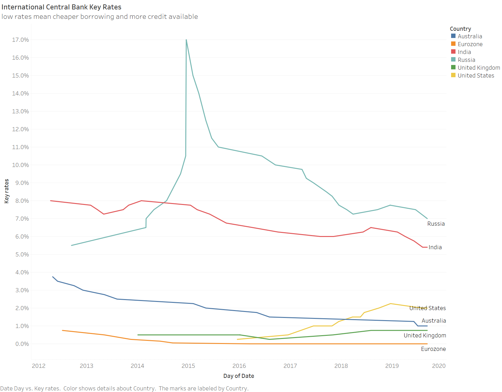
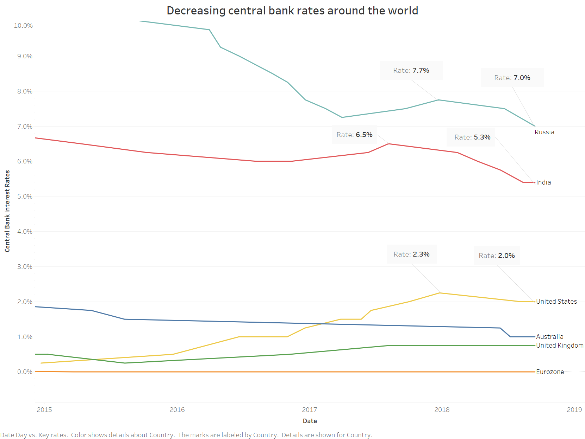

[back](https://portfolio.jakobs.dev)
### Critique by design

(please note: I'm still having some issues embedding the visualizations due to account issues, for now static images will be used untill I get that fixed)

In the following part of the portfolio, I will be giving critique on a comically bad visualization by the New York Times in their article from 09/18/2019 about [Why the Fed Lowered Interest Rates Again](https://www.nytimes.com/interactive/2019/09/18/business/economy/fed-second-rate-cut.html). The visualization is one that tries to show the reader everything and conveys nothing. It is a futile attempt to support the text in a meaningful and somewhat 'interesting to the eye' manner, but it failed to impress. 

Original visualization: 

[source](https://www.nytimes.com/interactive/2019/09/18/business/economy/fed-second-rate-cut.html)

## Personal critique
My main point of critique on was that the chart wanted to show too much, but said very little about the data we are actually interested in. After doing some reasearch, the thing that stood out is that the data seems very biased. I looked at various data sources, and they all imply that the recent 'drops' are not that significant compared to the overall trends. Are they trying to manipulate the data? In the very least it is easy for the reader to overestimate the downward trend. The visualization is quite confusing to look at at first, the reader of the article will not know what is the most important data or what the data represents exactly. The most confusing part is adding the GDP, it gives some information about the economical status of a country, but that information is not at all useful for the article, and most NYT readers will have a general idea about that anyway. The bolding of certain countries does not add much value, instead it is an attempt to 'repair' mistakes in the visualization. It quickly becomes clear that there is a downward trend in the rates, but the paragraphs after the graph don't explain the purpose of this information fully. The trend is what is important, and that is what I will attempt to show in better detail in my visualization.

## Gathering the data
The article did not seem to show a source for the data, so I improvised. In order to recreate this chart I used [this](https://countryeconomy.com/key-rates) website to scrape the relevant data for the key central bank rates. The data scraped corresponded correctly. After some fiddling around in excel I was able to create a datasheet which was parseable by Tableau. The next step was to make a draft of my visualization. 

## Wireframe a solution & external critique 
I chose not to draw the wireframe since I wanted to be able to get accurate feedback, and I felt that sketching the visualization might influence the view of the respondent. The wireframe I created was made in tableau with the gathered data. 

[data source](https://countryeconomy.com/key-rates)

I spoke to two peers about my work, both have analytical backgrounds but no real data viz. backgrounds, which I think helped me to get the external views I needed. My approach was an open question about 'feedback regarding the following visualization', I followed up with showing the original one and asking for feedback on mine again. This gave me valueable insights, especially regarding fitting the visualization with the article purpose. 

I got the following responses: 

*Respondent 1:* I dont fully understand the title and subtitle, what am I looking at? 
The lines are clear but I think making the values more distinct would help (I believe he meant adding indicators). *After showing the original article:* 'but you're showing a different ..(story) with this graph than the one in the article, the article is about a decreasing rate, and that does not show in your visualization' *- I agreed with this, and this is something I had to change.* 

*Respondent 2:* I don't really see clear changes in Australia or the UK, is that intended? What is a "key" rate? tip: don't show both the legend and the names (I overlooked this). *After looking at the original article:* if youre trying to show changes in rate, it might be unclear because the russia bar is quite high. 

## Final visualization
The main change I made was decreasing the range of the date-axis. This way, the range of the y-axis could be decreased as well, and the recent trends are more visible. In order to fit the story of the article, I added indicators to show the recent downwards trend (again, which I still find a bit misleading). The changes in rates is also made more visible by the indicators. This is conform the feedback of the first respondent. I updated the chart title, subtitle and axes names in accordance to my feedback. Some other minor font and layout changes were made to declutter and improve the ease of understanding the data. Final result: 

[data source](https://countryeconomy.com/key-rates)

I'm happy with the result. One can see the recent changes and trends in central bank rates with just a quick glance. There are a few things I'm not 100% happy with yet. I wasn't able to find a way to **bold** the America line and title (something which I will ask next lecture). Another thing I'm unsure about is the date; I wanted to keep the X axis fairly free from data clutter, but maybe I shouldve added a little more detailed date indicators. Overall the result is much better fitting for the story which the original article wanted to convey. Still, I felt like NYT fitted the data to what they wanted people to see, instead what the data might actually represent.. Hopefully you agree with my changes made, thanks for reading! 
Jakob

[back](https://portfolio.jakobs.dev)

