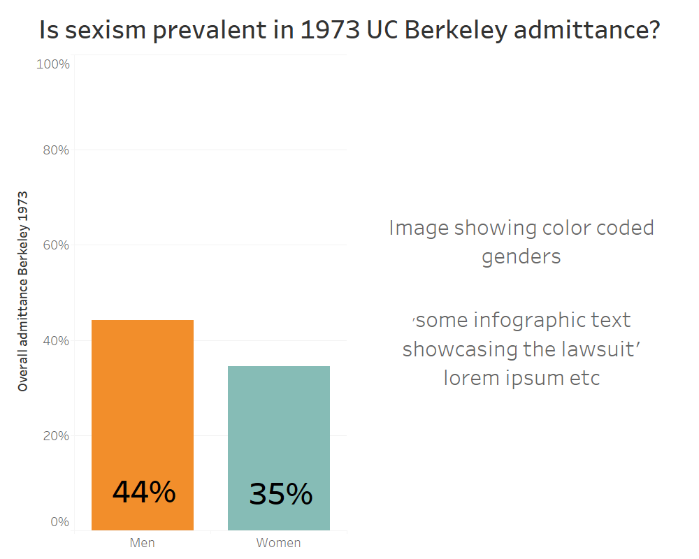
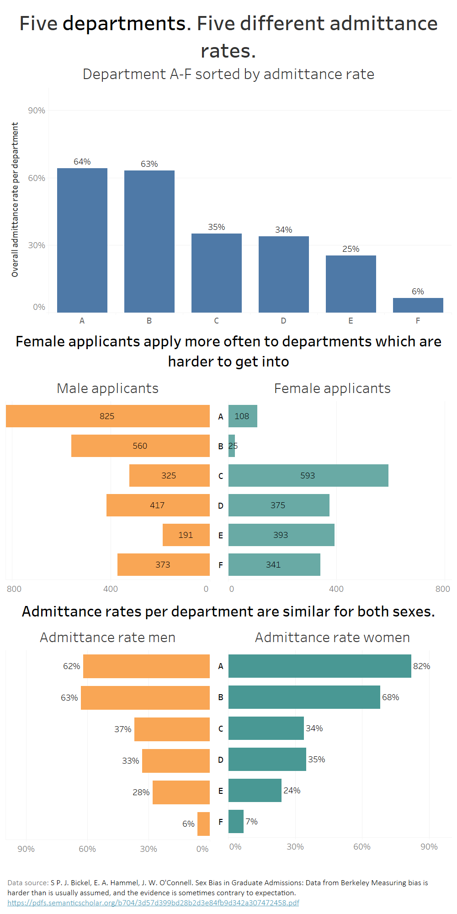
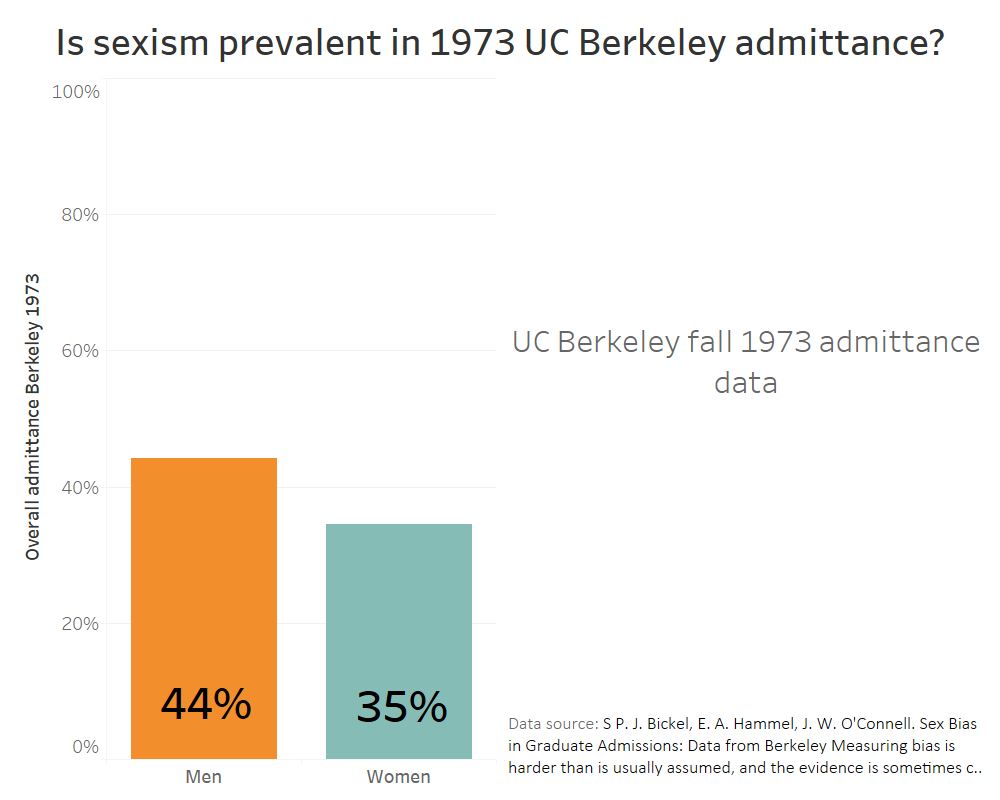
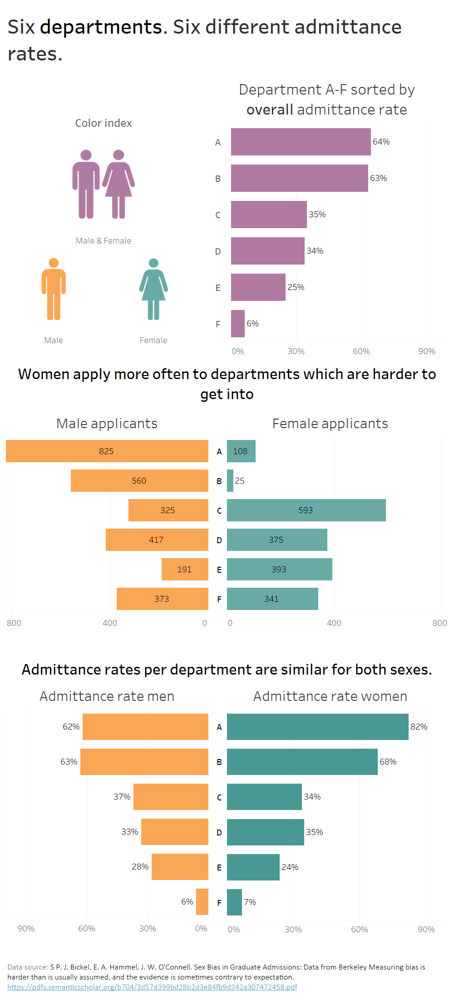
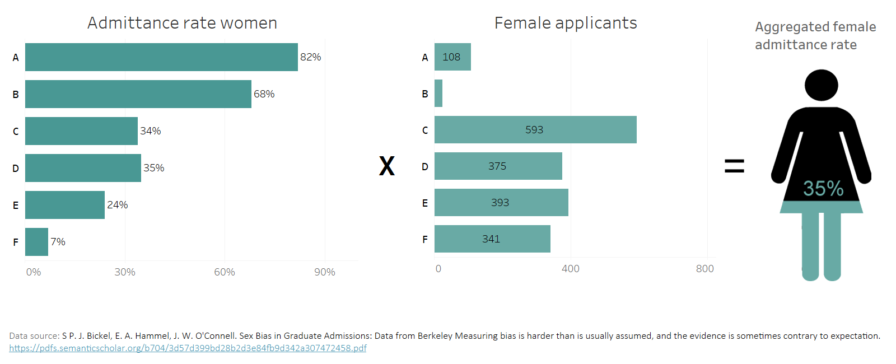
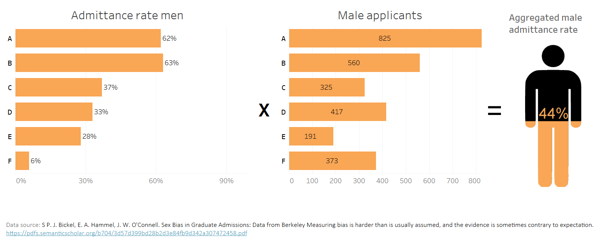

[Back](https://portfolio.jakobs.dev)
# Final project - finding truth in statistics - part 1

## You can find the final project [here](https://carnegiemellon.shorthandstories.com/serlier/index.html)

### Project outline & proposal
For my final project I will be taking a look at common statistical fallacies and exploring them by creating visualizations. These visualizations will hopefully contribute to our insights regarding these fallacies, and allow us to prevent us from applying them in our daily and proffesional lives. The idea of this project has greatly been influenced by the works of [Daniel Kahneman](https://kahneman.socialpsychology.org/), especially his book [thinking fast and slow](https://en.wikipedia.org/wiki/Thinking,_Fast_and_Slow) which I recommend everyone who is interested in such subjects to read. 

Key statistical fallicies I am to explore are the Simpson's paradox, regression to the mean, availability, the gamblers fallacy, and false causal statistical relationships (due to third variables). 

Lastly, I want to dedicate a section to fallacies in media; often enough one can find themselves looking a skewed bar or pie chart in a political-scented news channel. I want to see how badly the charts respresent the data and what can be improved to decrease the {..} it has on the viewer. 

### Story Arc
The story arc will be introduced with allowing the reader to fall for a statistical fallacy themselves. They will be asked to find a cause for the statistical truth that 'highly intelligent women tend to marry less intelligent men, why?'. Any seasoned statistician should of course realize that this is due to regression to the mean. Hopefully this example will grab the readers' attention. During the middle section of the story, I will go over the other fallacies and explain their implications in real life situations (i.e. Berkeley Lawsuit). Before I convey my departing message, I will show how media often conveys statisitics wrongly, often for the purpose to mislead their audience. I will end up by giving the readers the message that statistics & data are interpretable in various (often wrong) ways, and one might be swayed to use statistics & visualizations in their favour, but to think about the implications that that will bring. 

### Choosing the methodology 
For the purpose of the final project, I will be creating a page using shorthand as a platform. I will use a combination of rawgraphs.io, datawrapper.de and tableau as visualization tools, as well as Adobe Illustrator for possible final touches & other visualizations that I deem neccessary to convey the story.

### Finding datasets:
The datasets I will be using are mostly relevant to show the reader what the implications of statistical fallacies are, and therefore the actual datasets are less relevant than the message that is conveyed by the visualization. I'm exploring different datasets from publications regarding these statistical fallacies since on most of these fallacies, research has extensively been done. 

Disclaimer; the datasets I have shown below are not the final datasets I will be using, since I'm currently still researching the topics and am constantly finding interesting data sources. 

For the availability heuristic I currently plan on scraping the data from [this research paper](https://pdfs.semanticscholar.org/1c2b/6ad0bc7336747c1d39ee4c8a9011cdf3a21f.pdf) titled "How Do People Judge Risks:
Availability Heuristic, Affect Heuristic, or Both?". However, I might choose a different dataset later on. I can use the data from the research to show the impact of the availability heuristic on ones perception of statistics, this will probably be done using a bar graph. 

For the gamblers fallacy I am planning to scrape the data from [this paper](https://www.stat.berkeley.edu/~aldous/157/Papers/croson.pdf), and explore the fallacy further by showcasing the statistics of probably during gambling. This will be done by creating my own dataset. 

For false causal statistical relationships there are many datasets available to get the point across, especially when using the infamous causaution vs correlation example. [This website](https://www.tylervigen.com/spurious-correlations) shows interesting "spurious correlations" with sources, I'm looking into finding a similar relationship on my own but I haven't had success yet. 

A specific dataset for regression to the mean is not relevant, since it will be a vizualisation explaining the effects of correlation. Any dataset with correlation will suffice, and I have not yet decided which dataset will be used. 

[Dataset](/Simpsonsparadox.xlsx) showcasing Simpson's paradox using the [UC Berkeley Lawsuit](https://medium.com/@dexter.shawn/how-uc-berkeley-almost-got-sued-because-of-lying-data-aaa5d641f571)

As for the final section, statistical vizual fallacies in media, I have not chosen the specific data visualizations I will be improving upon, but plenty can be found on the subreddit [dataisugly](https://www.reddit.com/r/dataisugly/)

### Sketches: 
For 3 out of 6 subjects I aim to explore, I have decided how to respresent the data. The sketches below will be an indicator of the final representation. 

First graph Simpson's paradox used to show the difference in acceptance rates: 

[source](https://en.wikipedia.org/wiki/Simpson%27s_paradox)

Showing the actual acceptance rate per subject: 

No source - approximation

Regression to the mean: singling out a single case for explanation: 

Example media comparison: 
I would show the original media post and compare it to the improved visualization, and explore the implications the original image has on the interpretation of the image. 

Improved the design so that the bar chart is actually on scale: 
<iframe title="Sonntagsfrage nationalratswahl 2019 (%)" aria-label="Column Chart" id="datawrapper-chart-BbmQP" src="//datawrapper.dwcdn.net/BbmQP/1/" scrolling="no" frameborder="0" style="width: 0; min-width: 100% !important; border: none;" height="219"></iframe>

[data source](https://www.reddit.com/r/dataisugly/comments/d8ob0d/percentages_are_hard/)

# Part II: final project
I decided to decrease the scope of the project after thinking about it and initial feedback from my peers. The story now consists of three elements; the regression to the mean example, the Simpsons Paradox and media statistical fallacies. The focus is on the first two, as the final one will be constructed during the finalization of the project website. 

### target audience
My target audience are people with some general knowledge or experience in statistics & visualizations, and those who are able to or want to think critically. I would say my target audience would fall in line with the average New York Times reader.  

### in-detail storyboard
I have created the website where I will be presenting the final project. 

Please note that this is just an indicator of the final version of the project, and the data visualizations/sources/text area's are not final (as I will probably be making changes during this&following weeks). The website was used as a storyboard visualisation for my interviewees. 
[storyboard](https://preview.shorthand.com/K0jOnPXPOvScs055)

#### Visualizations
I sketched the four main visualizations for the key two parts of my story. In the sketches, the information regarding the titles/lables/sources is less relevant to me than the type of visualization, and wether it supports the visualization. These will therefore not be included in the questions for the interviewees.

I decided to show the difference in acceptance rate using a barchart, and the simpsons paradox by showcasing the correlation between acceptance rate per department and percentage of female applicants. These wireframes will be shown to my interview audience with the key question being; does it support the story?

There are 3 key takeaways in the story. 
The first being: 
#### False stories are sometimes created by forgetting to think about statistics or data. 

The second key takeaway is: 
#### Data can sometimes give rise to a story which might not be in line with reality. 

The last takeaway is: 
#### When visualizations are used to create a story, one should think about why the creator is trying to tell that story. 

With the final message being: 
#### Stories, data and visualizations do not always allign or create a picture of reality. In the end, you are responsible for thinking for yourself and creating that picture of reality. 

Visualizations I showed to my interviewees: 
[imgur link](https://imgur.com/a/bXjOHad)

#### roughly the story I told the interviewees: 
Today we're going to look at 3 different way data and their interpreted stories do not allign; lets start with a question; 

(PART 1 of story) 
Highly intelligent women tend to mary men who are less intelligent than they are.

why?

Daniel kahneman, nobel prize winner in economics claims this not to be a causal relationship but one of pure statistics. Lets take a look at why this might be. 

Youre at a bar, and youre an exceptionally smart individual. You are a statistical outlier. You see someone else at the bar who looks interesting. At this moment you're not comparing your IQ's, you just want to have good fun. Here regression to the mean comes to play; you're an outlier, the chances he is a higher outlier is lower than. This is a biased approach to this 'problem'. Here I showcase and explain the statistics)

(PART 2 of story) 
As we have seen, we sometimes try to create a story before thinking about or data statistics, and this can be dangerous as we have just seen. But what if we take a look where statistics create the story which is wrong? 

(Here I showcase and the statistics regarding the Berkely case)

## user-research protocol
The key aspects I will try to uncover during the interviews are
	Do the examples in the story fit the story? 
	Do the visualizations add value to the story?
	What might be confusing about the visualizations?
	What would you have done differently in these visualisations? 
	Do you feel like there is a clear message at the end of the story? 
	
I start my interview by stating the following questions: 
//I'm going to tell you a story which is supported by visualizations, could you tell me how and in what these graphics help underline the story?

Follow-up questions might be: 
//What part of the graphics were confusing to you? 
//If you were to retell this story, what would you change? 

## individual interview 1
Ricardo, a MISM student & friend: 
//I'm going to tell you a story which is supported by visualizations, could you tell me how and in what these graphics help underline the story?

Response: 
Part 1a/1b/1c. Looks good, I like it.  You want to include the source of this data. Also put a note in the assumptions. Youre making a huge assumption. 

//Do you think it supports the story?

Response: 
For visualization 2a: what is the acceptance rate? It is unclear what this means. There should be a note saying what this means. 
What is 1973? (its the year). It should be more clear that it is from one year. 

I dont like the regression visualization  because basically the regerssion has a lot of noise and I cannot conclude something because of the high variance. The significance is too low to conclude something. The viz does not support my conclusion. MAybe you should consider showing the variance in the mean of acceptance rate. 
	TMI if I add the values of the specific sectors. 

After asking the initial questions, Ricardo stated that the 
## individual interview 2
Ken, an employee at the CS department at CMU:

//I'm going to tell you a story which is supported by visualizations, could you tell me how and in what these graphics help underline the story?

Response: 
Title: youre doing a comparison between what people think it says 'data,', and what it actually says. If you want to be clearer about it, say 'between' instead of 'in'. 

First thing: youre making an assumption; highly intelligent people drink in bars. Youre making an assumption about people in the bar. The fact that youre in a bar has no statistical significance on the people there. Your intelligence isnt related to being in a bar. Being in a bar is a third variable which youre not taking into account. 

'Solution': Lets acknowledge; we dont have perfect data, this is an example and third variables are left out. 

Correlation graph: I'm  not a fan. It is not super clear. Percentage of female applicants and department acceptance rate... is it for seperate departments?  X axis, is it only females accepted or everyone accepted? (Everyone, key point). I have a problem beause you're overloading this graph. Department acceptance rates: you've got multiple departments with multiple acceptance rates. Change label to admittance rate per deparment and for both sexes (overall acceptance rate per deparment). And for the y axis change it to female applicatants per department

## individual interview 3
//I'm going to tell you a story which is supported by visualizations, could you tell me how and in what these graphics help underline the story?

Response: 
	'what do you mean by stories?'. 

(In regards to the first 'question') So that means the reverse is true too?Since its true on 'both ' sides, it is not really controversial. The face value makes it look like its shallow, but is isnt really. The 'one out of twenty people ' is a good visualization to showcase this. 

The bellcurve is fitting. I understand that.

(When looking at tableau version of the correlation graph) What do the sizes mean? Too many things. X y and size is confusing. 
	Maybe break it up into two graphs? 

A bar graph again might be better. Per deparment the acceptance rate of women. 
	The graph is unclear. Doesn't support the story very well. You have to look at it for a while. 

The whole story is a bit confusing. I understand what you're saying. 

Show both women and men acceptance rates are the same per department then you can see it better. 

## Insights for changes made to sketches, storyboards & wireframes
Well.. I'm not happy with the results. My story all over the place and my interviewees have had a hard time understanding the storyline. I feared this might be the case since I'm trying to convey multiple messages at once, and coming up with a frankensteins' monster of a conclusion. This isn't working right now, so things have to change. 

In order to fit my project within the timeframe of the final presentation, I've been struggling with keeping the stories short and to the point. The problem is, since they're 'paradoxes' and 'fallacies', they are inherently tough to understand even for an educated audience. This caused my story to be going from left to right, jumping from assumptions to conlusions.The process of trying to streamline this has not been an enjoyable one, and I've been spending most of my time finding obscure examples which might fit both the story and the timeframe. In the full project on shorthand I will have the chance to underline my thoughts and assumptions, but in the presentation I will not. 

The main change will be that I will be completely separating my final project and my presentation. I will create a seperate page on shorthand for the presentation which will focus on only ONE example. This page will be included (the content will be copied) to my main shorthand page for the project. *The 1973 Berkeley case will now be my main focus for the project & presentation* in order to make it a coherent story. 

Changes that will be made to the project and presentation:
- Presentation: 
	- The berkeley 1973 admittance rate case will be the prime subject of my presentation. I have chosen this because I think this case showcases the underlying thought I'm trying to convey the best. My project story arc will have a different ending message than the presentation. I am thinking of using the famous 'There are three kinds of lies: lies, damned lies, and statistics' line popularized my Mark Twain as my ending message for the presentation. This fits the apparent Simpsons Paradox well. 
	- I should no longer define it as statistics in the presentation story arc. I can explain this in the project, and I should define the relationship between statistics, data, visualizations and storytelling. 
	
- Project: 
	- I need to vocalize the various assumptions I make better, and showcase that I'm showing examples not 'truths'.  
	- In order to show the relationship between a data and a story, I need to visualize this. This is mainly for the presentation, as my audience needs to quickly grasp that they don't allign at all times.  
	- For the project I will take the time to type out the assumptions, as I want the final project to read like a well thought out article. 
	- I'm thining to completely remove the other story arcs and focussing on just the one, and maybe looking at how it is now (2019). 
	
Visualizations:
	- The bell curve for the first part of the story seems to work. I'm keeping this in together with the '1 in 20' visualization. 
	- The bar graph for the Berkeley case needs to be supported by numbers to make it more clear what it showcases. I will add a table in the graph
	- Sources needs to be properly added to the final versions which will be made in Tableau
	- Titles needs to be improved upon for all visualizations to tell the story. The reader goes from reading the title to trying to understand the graph, I need to focus on that. 
	- The current visualization for the negative correlation between female applicants and acceptance rate is unclear. I need to split up what I'm trying to say and make more clear what the axis are. I have a hard time explaining it, that means that the audience will have an even harder time grasping it. 

I have focussed on improving the visualizations to support the Berkeley case as this will be the key part of my presentation. I'm still working on the improvements but I'm very happy with the results so far. This is how I've changed the correlation graph to an actual story: 
#### improved visualization after feedback 1: 

#### improved visualization after feedback 2: 

# Part III & IV: final project
#### Work, final decisions, observations &* audience
A major change has been made from the last iteration of the final project; the full focus is now on the 1973 Berkeley acceptance rate case. This is because I observed the audience to find 3 story arcs too much. The fact that we're dealing withn the Simpson's Paradox is something which I deemed less significant, and has been made a small element on the story instead of the main element. 

In the first feedback round, it was clear to me that my original correlation plot wasn't working and wasn't enough to tell the story. In the additional in-class feedback session, it became clear that the first bar graph from the last wireframe in section II wasn't clear enough. I added a male and female bathroom sign, and flipped the axis to make it more coherent. The work was made in Tableau, with certain emelemnts (the bathroom signs) edited in Adobe Illustrator. 

The intended audience was formulated to be an average New York Times reader in part II of the final project. As my view regarding the project has shifted, so has my view of the intended audience. Since the focus has been on multiple fallacies before, and is now on explaining a single fallacy, the average knowledge from the audience regarding statistics and visualizations has been reduced. Simple knowledge about barcharts and percentages is enough to understand the story. 

The intended audience is therefore those who are interested in learning more about statistical fallacies, as well as those who are just looking for an 'interesting and fun read'. I believe that I succeeded in creating the visualizations accessible for the general public and understanding. Sex bias stories get a lot of attention in media as of a few years, but this story underlines that sexism and sex bias is sometimes *not* the case. Hopefully the audience expecting a bashdown on 'males who get admitted more often' are surprised by the 'twist' of the story, and are therefore interested in learning more about statistics, data and stories. 

#### Executive summary
In the fall of 1973, the UC Berkeley admittance rates between sexes were significantly different. The question arose whether or not this is a case of gender bias, discrimination, or if this is caused by other factors. It turns out the aggregated data tells a different story from the non-aggregated data. This was a case of the Simpson's Paradox, as it turned out women tended to apply to departments which were diffcult to get into, more often. The admittance rates were quite similiar if looked at on a per-department basis. This shows that statistics and data can't always be trusted. Call to action: "There are three type of lies: lies, damned lies and statistics" -Mark Twain. Think critically. 

#### Major elements
The story arc consists of three major visual elements to support the general story. It starts with the 44% 35% visualization to showcase the aggregated 'fallacy-fied' data: 

Next, it shows the main visualization which showcases the statistical fallacy. 

Finally, the key visualizations to get back to the aggregated data, which encloses the story arc in a circle. In case the audience member has not yet had their 'oh! I see'-moment, these visualizations should incur that. 

#### Final work
*Final story link:*

You can find the final project [here](https://carnegiemellon.shorthandstories.com/serlier/index.html).
**important note:** I intend to remove the 'overview' section after the presentation, as I only intend it to be used for easier explanation during the presentation. 

*References:*

For the dataset I used data gathered from [wikipedia](https://en.wikipedia.org/wiki/Simpson%27s_paradox) and from [this article](https://pdfs.semanticscholar.org/b704/3d57d399bd28b2d3e84fb9d342a307472458.pdf). [The paper](https://pdfs.semanticscholar.org/b704/3d57d399bd28b2d3e84fb9d342a307472458.pdf) was also used as a reference for creating some elements of the general storyline.

The following [Pexels photo](https://www.pexels.com/photo/accomplishment-ceremony-education-graduation-267885/) was added to the shorthand. The following illustrations were used: [male bathroom sign](https://upload.wikimedia.org/wikipedia/en/b/bb/Male_Bathroom_Symbol.png) and [female bathroom sign](https://upload.wikimedia.org/wikipedia/commons/e/e3/Toilet_women.svg)

The visualizations were created with a combination of Adobe Illustrator and Tableau. 

[Back](https://portfolio.jakobs.dev)
